# CardioOncoPredict

**Looking for the earliest electrical sign of anthracycline cardiotoxicity: microvolt T-wave alternans, extracted from the ECG with signal processing and a multimodal neural network.**

[](https://github.com/podpirovlab/multimodal-cardiotoxicity-ai/actions)


**[Try the live tool →](https://podpirovlab.github.io/multimodal-cardiotoxicity-ai/)** · [Русская версия](README.ru.md) · [Roadmap](ROADMAP.md)

> **Disclaimer.** CardioOncoPredict is a research and education prototype. It is not a medical
> device, has no clinical validation and no regulatory clearance. It must not be used to make
> diagnostic or treatment decisions. Section [11](#11-limitations-and-ethics) states exactly what has and has not been shown.

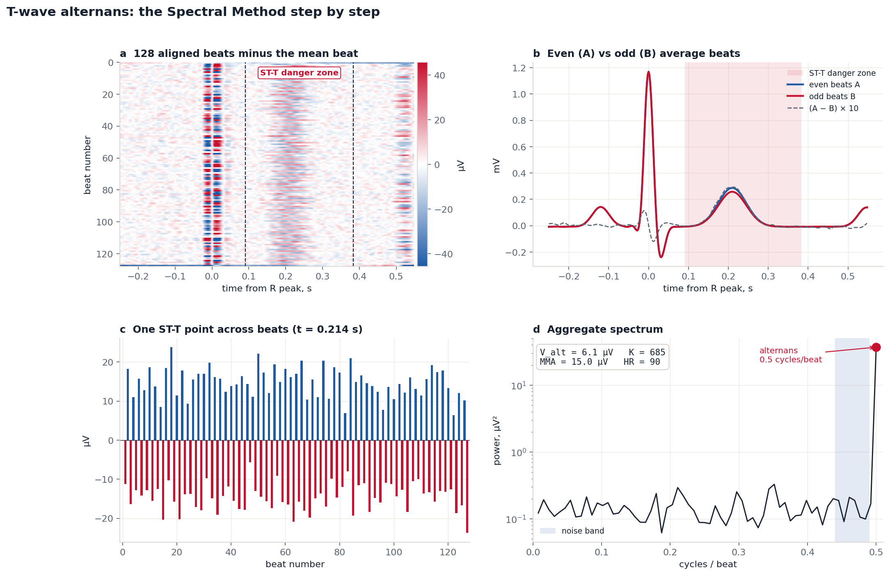

---

## Contents

**[Try it on a real ECG](#try-it-on-a-real-ecg)** — upload EDF/CSV, PhysioNet data, patient context, FHIR export, lead anatomy

1. [Summary](#1-summary)
2. [Medicine and biochemistry: how anthracyclines injure the heart](#2-medicine-and-biochemistry-how-anthracyclines-injure-the-heart)
3. [Physics: from ion channels to the voltage on the skin](#3-physics-from-ion-channels-to-the-voltage-on-the-skin)
4. [Mathematics and signal processing](#4-mathematics-and-signal-processing)
5. [Computer science: the multimodal neural network](#5-computer-science-the-multimodal-neural-network)
6. [Deployment: edge devices, federated learning, hospital systems](#6-deployment-edge-devices-federated-learning-hospital-systems)
7. [What has been verified so far](#7-what-has-been-verified-so-far)
8. [Repository map](#8-repository-map)
9. [How to run everything](#9-how-to-run-everything)
10. [What changed in version 0.3](#10-what-changed-in-version-03)
11. [Limitations and ethics](#11-limitations-and-ethics)
12. [References](#12-references)

---

## Try it on a real ECG

The [live tool](https://podpirovlab.github.io/multimodal-cardiotoxicity-ai/) runs the analysis below entirely in your browser — nothing you upload leaves your device or touches a server.

**What it needs:** one lead of ECG, at least ~2 minutes long. The Spectral Method looks at 128 beats ([§4.4](#44-the-spectral-method-for-t-wave-alternans)); a standard 10-second clinical ECG only has about 12, so it will load but the tool will tell you there isn't enough to measure alternans reliably.

**File formats:**
- **EDF / EDF+** — read directly in the browser (`assets/js/edf.js`, no server). If the file has more than one channel, a dropdown lets you pick which one is the ECG lead.
- **CSV / TXT** — one column of numbers, in mV or µV, with the sampling rate typed in by hand.

**Getting a real recording from PhysioNet:**
- [T-Wave Alternans Challenge Database](https://physionet.org/content/twadb/1.0.0/) — Holter-length real and simulated recordings built specifically for testing TWA detectors.
- [PTB-XL](https://physionet.org/content/ptb-xl/1.0.3/) — 21,799 real clinical ECGs (used for training in [§5.4](#54-data-ptb-xl)), but only 10 seconds each, so on its own it's too short for TWA. Good for checking the tool runs correctly on a real waveform.

Both ship as WFDB (`.dat` + `.hea`), which the browser can't read directly — convert one lead to CSV first:

```bash
pip install wfdb
python scripts/wfdb_to_csv.py records100/00000/00001_lr --lead II --out ecg.csv
```

Then upload `ecg.csv` and set the sampling rate the script prints on the upload form.

**Patient context and the FHIR export.** Age, sex and cumulative anthracycline dose next to the upload are optional. They don't change the TWA numbers — the analysis only ever looks at the ECG — they exist so the "Export FHIR report" button can attach them to a downloadable `DiagnosticReport` JSON alongside the measurement (same structure as `cardioonco/fhir.py`, [§6.3](#63-hl7-fhir-r4)). The dose field also shows where that number falls on the population dose–response curve from [§2.1](#21-the-clinical-scale-of-the-problem) — a group statistic, not a prediction for that one patient.

**Which lead sees which wall.** The 12 ECG leads look at the heart from 12 directions:

| Wall | Leads that see it best |
|---|---|
| Septum | V1, V2 |
| Anterior wall | V3, V4 |
| Lateral wall | I, aVL, V5, V6 |
| Inferior wall | II, III, aVF |

aVR doesn't localise to a wall and is left out, as usual. Anthracycline injury is typically diffuse across the ventricle rather than confined to one wall, so this table is about ECG anatomy, not about where any particular patient's damage is — the tool does not try to localise anything.

---

## 1. Summary

**Problem.** Anthracyclines (doxorubicin, epirubicin) are among the most effective anticancer drugs, but they injure heart muscle in a dose-dependent way. At a cumulative doxorubicin dose of 550 mg/m², about a quarter of patients develop heart failure [1]. Current monitoring relies on echocardiography, which detects damage only once the ejection fraction has already fallen.

**Hypothesis.** Injury to cardiomyocyte ion channels should disturb *repolarisation* before it disturbs *contraction*. One sensitive marker of unstable repolarisation is **T-wave alternans (TWA)**: an every-other-beat change of the ST-T segment by 1–100 µV. That is 0.01–1 mm on paper ECG, too small to see but measurable mathematically.

**What this repository contains:**

| Layer | What it does | Where |
|---|---|---|
| Physics model | Synthetic 12-lead ECG from a moving cardiac dipole, with controllable microvolt alternans and realistic noise | `cardioonco/synth.py` |
| Signal processing | Zero-phase filtering, Pan–Tompkins R-peak detection, beat alignment | `cardioonco/preprocess.py` |
| TWA mathematics | Spectral Method (V_alt, K-score) and Modified Moving Average, unit-tested | `cardioonco/twa.py` |
| Neural network | 1D ResNet over 12 leads + age/sex branch, fused by an outer (tensor) product | `cardioonco/model.py` |
| Training on real ECGs | Full PTB-XL pipeline (21,799 clinical ECGs): patient-wise split, bootstrap CIs, ONNX export | `train_ptbxl.py` |
| Interoperability | HL7 FHIR R4 `DiagnosticReport` with valid LOINC / HL7 codes | `cardioonco/fhir.py` |
| Web lab | The same TWA algorithm ported to JavaScript and run live in the browser | `index.html`, `assets/js/dsp.js` |
| Figures | Every figure in this README is generated by code | `scripts/make_figures.py` |

---

## 2. Medicine and biochemistry: how anthracyclines injure the heart

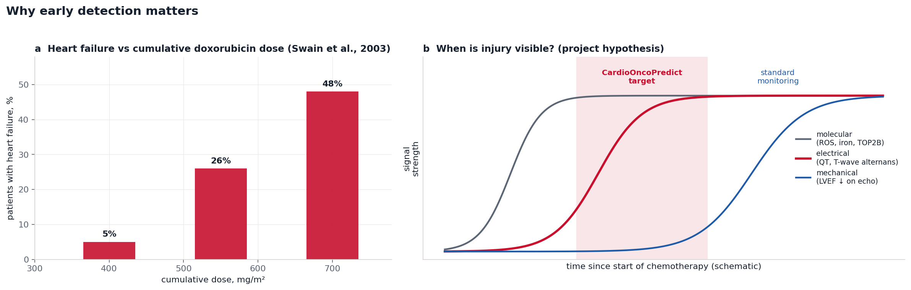

### 2.1 The clinical scale of the problem

- Heart-failure incidence rises steeply with cumulative doxorubicin dose: **5% at 400 mg/m², 26% at 550 mg/m², 48% at 700 mg/m²** (retrospective analysis of three trials, Swain et al. [1]).
- In a prospective cohort of **2,625** anthracycline-treated patients, cardiotoxicity occurred in about **9%**, and **98%** of cases appeared within the first year. Most patients who were detected early and treated recovered heart function fully or partially [2].
- The 2022 ESC cardio-oncology guidelines define *cancer-therapy-related cardiac dysfunction* by a fall in LV ejection fraction, a relative fall in global longitudinal strain (GLS) above 15%, or a rise of troponin / natriuretic peptides [3]. None of these uses the fine structure of the ECG.

### 2.2 Molecular mechanisms (chemistry and biology)

Doxorubicin is an anthracycline: a planar tetracyclic **quinone** ring system attached to an amino sugar (daunosamine). Its anticancer action is DNA intercalation and poisoning of topoisomerase IIα in dividing cells. In the heart, several mechanisms act together:

1. **Topoisomerase IIβ (TOP2B).** Cardiomyocytes express TOP2B. Doxorubicin traps TOP2B–DNA complexes, causing double-strand breaks and suppressing genes for mitochondrial biogenesis. Deleting TOP2B in mouse cardiomyocytes protects them [4].
2. **Redox cycling of the quinone.** One-electron reduction by mitochondrial complex I and other reductases turns the quinone into a semiquinone radical, which passes the electron to oxygen:

   $$\mathrm{Q} + e^- \rightarrow \mathrm{Q}^{\bullet-}, \qquad \mathrm{Q}^{\bullet-} + \mathrm{O_2} \rightarrow \mathrm{Q} + \mathrm{O_2}^{\bullet-}$$

   Superoxide dismutates to hydrogen peroxide: $2\,\mathrm{O_2^{\bullet-}} + 2\mathrm{H^+} \rightarrow \mathrm{H_2O_2} + \mathrm{O_2}$. The heart is especially vulnerable because it is rich in mitochondria and relatively poor in catalase.
3. **Iron and the Fenton reaction.** Doxorubicin binds iron and disturbs iron handling; mitochondrial Fe²⁺ accumulates. Fe²⁺ turns peroxide into the extremely reactive hydroxyl radical:

   $$\mathrm{Fe^{2+}} + \mathrm{H_2O_2} \rightarrow \mathrm{Fe^{3+}} + \mathrm{OH^-} + {}^{\bullet}\mathrm{OH}$$

4. **Ferroptosis.** Hydroxyl radicals start chain peroxidation of polyunsaturated phospholipids in membranes. When glutathione peroxidase 4 (GPX4) can no longer repair lipid peroxides, cells die by iron-dependent *ferroptosis*. Fang et al. showed that doxorubicin cardiomyopathy in mice is largely ferroptotic and is reduced by iron chelation or ferroptosis inhibitors [5].
5. **Calcium handling.** The metabolite doxorubicinol and oxidative stress impair SERCA2a and ryanodine receptors (RyR2), so Ca²⁺ cycling becomes unstable from beat to beat [6].

### 2.3 From molecules to electricity

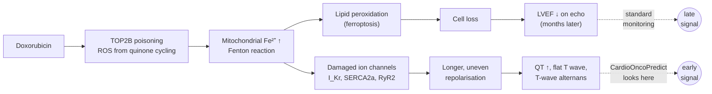

Damaged membranes and oxidised channel proteins change the ionic currents that end the action potential (Section 3). Clinically, anthracyclines are associated with QTc prolongation, ST-T changes, reduced QRS voltage and arrhythmias. **The specific link between anthracyclines and microvolt TWA is the hypothesis this project is built to test.** It is biologically plausible but not yet established; Section 11 discusses this.

---

## 3. Physics: from ion channels to the voltage on the skin

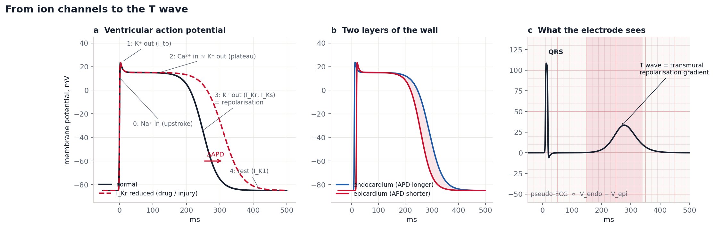

### 3.1 The membrane is a battery

Each ion species tends to its **Nernst equilibrium potential**:

$$E_X = \frac{RT}{zF}\ln\frac{[X]_{out}}{[X]_{in}}$$

At body temperature (310 K) $RT/F \approx 26.7$ mV. For potassium ($[K^+]_{out}=4$ mM, $[K^+]_{in}=140$ mM): $E_K = 26.7 \cdot \ln(4/140) \approx -95$ mV. For sodium (145 and 10 mM): $E_{Na} \approx +71$ mV. The resting cardiomyocyte sits near $E_K$ because at rest mostly K⁺ channels (I_K1) are open.

### 3.2 The action potential is a current balance

The membrane is a capacitor $C_m$ (about 1 µF/cm²) in parallel with ion channels. Charge conservation (the Hodgkin–Huxley formalism [7]) gives

$$C_m \frac{dV}{dt} = -\left(I_{Na} + I_{to} + I_{CaL} + I_{Kr} + I_{Ks} + I_{K1} + \dots\right),\qquad I_X = g_X(V,t)\,(V - E_X)$$

The phases in panel **a** of the figure above: **0** Na⁺ rushes in (upstroke); **1** transient K⁺ outflow (I_to); **2** plateau, where Ca²⁺ inflow balances K⁺ outflow; **3** repolarisation by the delayed-rectifier K⁺ currents I_Kr (the hERG channel) and I_Ks; **4** rest. Reducing $g_{Kr}$ (dashed curve) slows phase 3 and **prolongs the action-potential duration (APD)**. That is the cellular origin of a long QT interval.

### 3.3 Why there is a T wave at all

The endocardium (inner layer) repolarises later than the epicardium (outer layer). During phase 3 the two layers are at different potentials, so current flows across the wall. A distant electrode records approximately the difference $V_{endo}(t)-V_{epi}(t)$ (panel **c**), a "pseudo-ECG" [8]. **The T wave is the voltage gradient of repolarisation across the wall.** Anything that changes repolarisation unevenly changes the T wave.

### 3.4 The heart as a current dipole: Einthoven's triangle

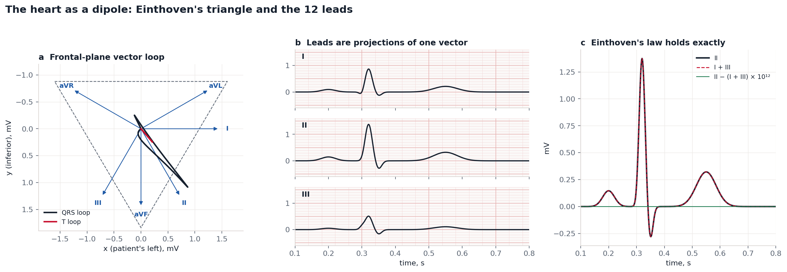

Seen from far away, the whole heart's activity is approximately one time-varying **current dipole** $\mathbf{p}(t)$ in a conducting medium (the torso, conductivity $\sigma$). The potential at distance $r$ in direction $\hat{\mathbf r}$ is

$$\varphi(\mathbf r) = \frac{1}{4\pi\sigma}\,\frac{\mathbf p\cdot\hat{\mathbf r}}{r^2}$$

so every ECG lead measures a **projection** of the same vector: $V_{lead}(t) = \mathbf e_{lead}\cdot\mathbf H(t)$. Einthoven's limb leads point at 0° (I), 60° (II) and 120° (III); the augmented leads follow from them (aVR = −(I+II)/2, aVL = (I−III)/2, aVF = (II+III)/2), and the precordial leads V1–V6 look at the heart in the horizontal plane. Because $\mathbf e_{II} = \mathbf e_{I} + \mathbf e_{III}$, **Einthoven's law II = I + III** holds exactly. Panel **c** checks it numerically: the residual is at floating-point precision (10⁻¹⁶ mV). The synthetic 12-lead ECG used in this repository (`generate_12lead`) is built this way.

### 3.5 Why the T wave alternates: a period-doubling bifurcation

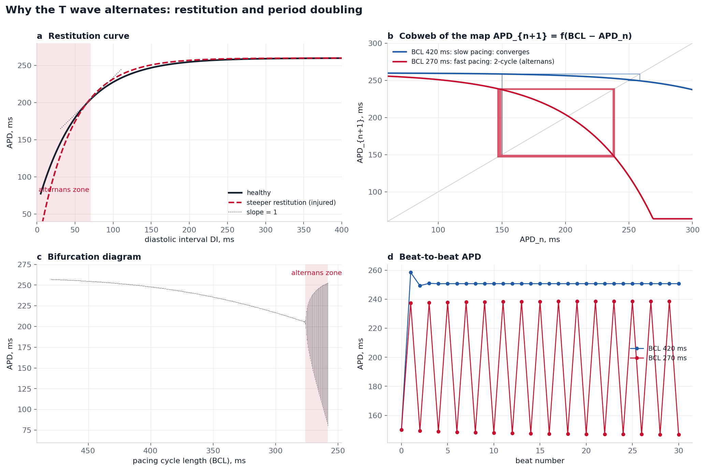

The duration of the next action potential depends on how long the cell rested before it, the **diastolic interval** DI. This *restitution* relation is well described by an exponential:

$$\mathrm{APD}_{n+1} = f(\mathrm{DI}_n) = \mathrm{APD}_{max} - A\,e^{-\mathrm{DI}_n/\tau}, \qquad \mathrm{DI}_n = \mathrm{BCL} - \mathrm{APD}_n$$

where BCL is the cycle length (60 000 / heart rate, in ms). This is a one-dimensional **iterated map**. Let $\mathrm{APD}^*$ be its fixed point and $\delta_n = \mathrm{APD}_n - \mathrm{APD}^*$ a small perturbation. Linearising:

$$\delta_{n+1} \approx -f'(\mathrm{DI}^*)\,\delta_n$$

The minus sign flips the perturbation on every beat: long, short, long, short. If the restitution slope $f'(\mathrm{DI}^*) < 1$ the oscillation dies out; if $f'(\mathrm{DI}^*) > 1$ it grows into a stable **2-cycle**. That is a period-doubling bifurcation, and it is **alternans** [9, 10]. The figure shows (a) the restitution curve and the region where its slope exceeds 1, (b) the cobweb diagram of the map converging at BCL 420 ms and locking into a 2-cycle at BCL 270 ms, (c) the bifurcation diagram over BCL, and (d) APD beat by beat.

Two consequences matter for this project:

- **Heart rate matters.** Faster rates shorten DI and push the system onto the steep part of the curve. That is why clinical TWA tests raise the heart rate to about 105–110 bpm with exercise [11].
- **Injury makes the curve steeper.** Impaired Ca²⁺ cycling and reduced repolarisation reserve steepen restitution (red dashed curve), so alternans appears at lower heart rates. Alternating APD in the tissue appears on the ECG as an alternating T wave.

### 3.6 The physics of noise

The electrode also records things that are not the heart:

| Source | Frequency | Typical size | Remedy |
|---|---|---|---|
| Breathing, electrode drift | 0.1–0.5 Hz | 0.1–1 mV | 0.5 Hz high-pass |
| Mains interference | 50 Hz (60 Hz in the Americas) | 10–500 µV | low-pass below 50 Hz, notch |
| Skeletal muscle (EMG) | 20–500 Hz, broadband | 10–100 µV | low-pass 40 Hz, averaging over beats |

The alternans we look for (1–20 µV) is **smaller than all of these**. It can be recovered only because it has one exact property that noise lacks: it repeats with period exactly 2 beats. Section 4.4 turns this into mathematics.

---

## 4. Mathematics and signal processing

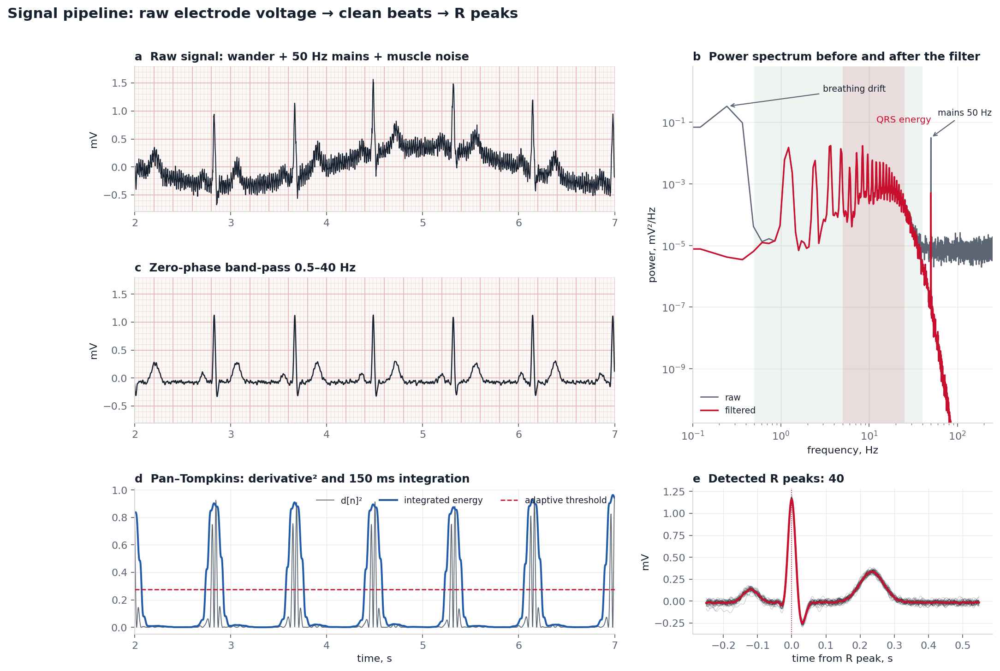

### 4.1 Sampling and quantisation

An analogue-to-digital converter samples the voltage at rate $f_s$: $x[n] = V(n/f_s)$. The Nyquist–Shannon theorem requires $f_s > 2 f_{max}$. The diagnostic ECG band extends to about 150 Hz, so 500 Hz is standard; the neural network uses the 100 Hz PTB-XL version because its classes are defined by features below 50 Hz. PTB-XL stores 16-bit integers with 1 µV per step [12]; the physical value is $V = (X_{raw} - \text{baseline})/\text{gain}$.

### 4.2 Zero-phase Butterworth filtering

An $N$-th order Butterworth low-pass has the maximally flat magnitude response

$$|H(f)|^2 = \frac{1}{1 + (f/f_c)^{2N}}$$

It is implemented as an IIR difference equation $y[n] = \sum_k b_k x[n-k] - \sum_{k\ge1} a_k y[n-k]$. Any causal filter delays different frequencies by different amounts, and that would distort the ST-T shape we want to measure. **filtfilt** runs the filter forward, reverses the output, runs it again and reverses back. In the frequency domain this multiplies by $H(e^{j\omega})\,\overline{H(e^{j\omega})} = |H(e^{j\omega})|^2$: a real, non-negative response with **exactly zero phase**. Panel **b** of the figure above shows the power spectrum before and after the filter: breathing drift below 0.5 Hz and the 50 Hz mains line are removed, while QRS energy (5–25 Hz) is kept.

### 4.3 Pan–Tompkins R-peak detection

Following Pan and Tompkins [13]: band-pass 5–15 Hz (where QRS energy is concentrated), differentiate $d[n] = x[n+1]-x[n-1]$, square $e[n] = d[n]^2$ (positive, and it emphasises steep slopes), integrate over a 150 ms moving window (about one QRS width), then pick peaks above an adaptive threshold (30% of the 99th percentile) with a 250 ms refractory period (the heart cannot beat faster than about 240 bpm). Each peak is then moved to the true maximum of the filtered ECG within ±60 ms. On the synthetic tests the detector finds every beat and reproduces heart rate within 3% at 55, 75 and 110 bpm (`tests/test_twa.py`).

### 4.4 The Spectral Method for T-wave alternans

**Step 1: build the beat matrix.** Align $N = 128$ consecutive beats on their R peaks. Take the ST-T window $[R + 0.10\,s,\; R + 0.42\,s]$, scaled by $\sqrt{RR/0.8}$ because the QT interval shortens with heart rate (Bazett). Subtract each beat's own median to remove residual drift. The result is a matrix $s_k[n]$: beat $n$, sample $k$ inside the window.

**Step 2: a time series for every point of the T wave.** For fixed $k$, the sequence $s_k[0], s_k[1], \dots, s_k[N-1]$ is the value of the same point of the T wave, beat after beat. Remove its mean and compute the periodogram:

$$P_k(f) = \left|\frac{1}{N}\sum_{n=0}^{N-1} s_k[n]\,e^{-2\pi i f n}\right|^2,\qquad f = 0, \tfrac{1}{N}, \dots, \tfrac12\ \text{cycles/beat}$$

**Step 3: why alternans appears at exactly 0.5.** At $f = 1/2$: $e^{-2\pi i n/2} = e^{-i\pi n} = (-1)^n$. So for a pure alternating series $s[n] = a(-1)^n$:

$$P(0.5) = \left|\frac1N\sum_n a(-1)^n(-1)^n\right|^2 = \left|\frac1N \cdot N a\right|^2 = a^2$$

All the alternans power collects in one frequency bin, and $\sqrt{P(0.5)} = a$ recovers the amplitude exactly. This is checked in `test_pure_alternating_series_gives_exact_amplitude`.

**Step 4: why 128 beats beat the noise.** For white noise of variance $\sigma^2$, every bin has expected value $\mathbb E[P(f)] = \sigma^2/N$. The noise floor **falls as 1/N** while the alternans peak $a^2$ stays constant. With 128 beats, the signal-to-noise ratio in power improves 128-fold (about 21 dB) compared with a single beat. This is how a 5 µV signal is recovered from 30 µV of noise.

**Step 5: aggregate and decide.** Average the spectra over all $L$ samples of the window, $P(f) = \frac1L\sum_k P_k(f)$. Estimate the noise from a reference band $B = [0.44, 0.49]$ cycles/beat, then

$$V_{alt} = \sqrt{P(0.5) - \mu_B},\qquad K = \frac{P(0.5) - \mu_B}{\sigma_B}$$

The conventional criterion for significant alternans is $V_{alt} \ge 1.9\,\mu V$ **and** $K \ge 3$ [11, 14]. In this implementation $V_{alt}$ is the RMS alternans over the whole ST-T window. We also report `v_alt_peak_uv`, the alternans amplitude at the single most alternating sample; on synthetic data it recovers the injected amplitude within 15%.

In the figure at the top of this README: (a) the 128×L beat matrix minus the mean beat, where alternans appears as a red/blue checkerboard inside the ST-T danger zone; (b) even and odd average beats; (c) one ST-T sample flipping up and down beat after beat; (d) the aggregate spectrum with a sharp peak at 0.5 cycles/beat far above the noise band.

### 4.5 When can alternans be measured? The detection map

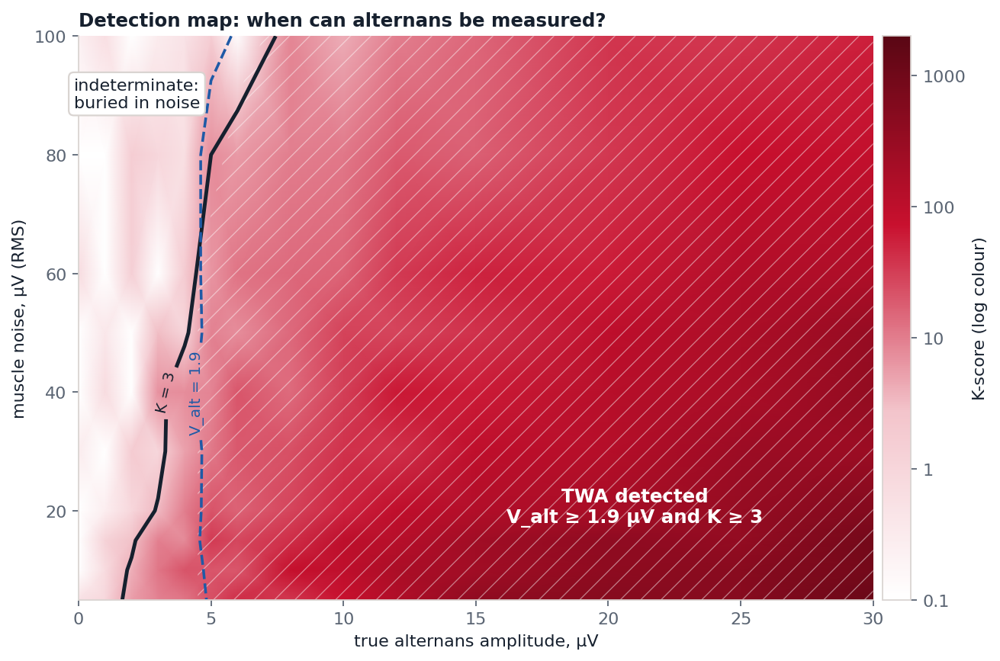

The map is the result of 560 complete analyses (14 alternans amplitudes × 10 noise levels × 4 random recordings, median K). The black line is $K = 3$, the blue dashed line $V_{alt} = 1.9\,\mu V$; the hatched region satisfies both. With good electrode contact (noise ≤ 20 µV) alternans of about 5 µV is reliably detected. With heavy muscle noise, the threshold rises. This is a quantitative statement about the method's sensitivity, and it defines the hardware requirement: **a wearable monitor for this purpose needs an input noise level of roughly 20 µV RMS or less.**

### 4.6 Modified Moving Average (cross-check)

The MMA method [15] keeps two running templates, one for even beats (A) and one for odd beats (B), and updates each with a limited step:

$$A_n = A_{n-1} + \operatorname{clip}\!\left(\frac{\text{beat}_n - A_{n-1}}{8},\,\pm 32\,\mu V\right)$$

Alternans is $\max_k |A_k - B_k| / 2$ over the ST-T window. The step limit makes MMA robust to a single noisy beat or an ectopic beat. Two independent estimators that agree give more confidence than one.

### 4.7 Time–frequency view: the complex Morlet wavelet

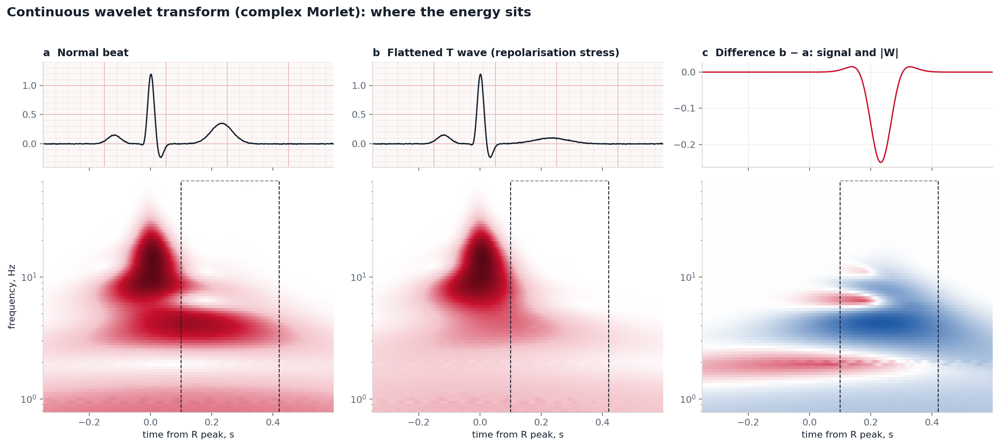

The Fourier transform says *which* frequencies are present but not *when*. The continuous wavelet transform answers both:

$$W(a,b) = \frac{1}{\sqrt a}\int x(t)\,\psi^*\!\left(\frac{t-b}{a}\right)dt,\qquad \psi(t) = \frac{1}{\sqrt{\pi B}}\,e^{2\pi i C t}\,e^{-t^2/B}$$

This is the complex Morlet wavelet (`cmor1.5-1.0`: B = 1.5, C = 1.0). A Gaussian envelope reaches the lower bound of the time–frequency uncertainty relation $\Delta t\,\Delta\omega \ge \tfrac12$, so Morlet wavelets are as sharp in time and frequency together as physics allows. The scalogram $|W|$ shows the QRS as a burst at 8–30 Hz and the T wave as energy at 2–6 Hz. Panel **c** shows that flattening the T wave removes energy exactly in the ST-T window at low frequency, a pattern a neural network can learn.

### 4.8 Statistics for honest evaluation

- **ROC-AUC** equals the probability that a randomly chosen positive case gets a higher score than a randomly chosen negative case (the Mann–Whitney interpretation [16]). 0.5 is chance, 1.0 is perfect.
- **95% confidence intervals** come from 1,000 bootstrap resamples of the test set (2.5th and 97.5th percentiles).
- **The decision threshold** is chosen on the validation fold by maximising Youden's $J = \text{sensitivity} + \text{specificity} - 1$, and then applied unchanged to the test fold. Tuning on the test set would inflate the results.
- **Patient-wise split.** PTB-XL's folds never put the same patient in both training and test sets. Otherwise the model could recognise the person instead of the disease.

---

## 5. Computer science: the multimodal neural network

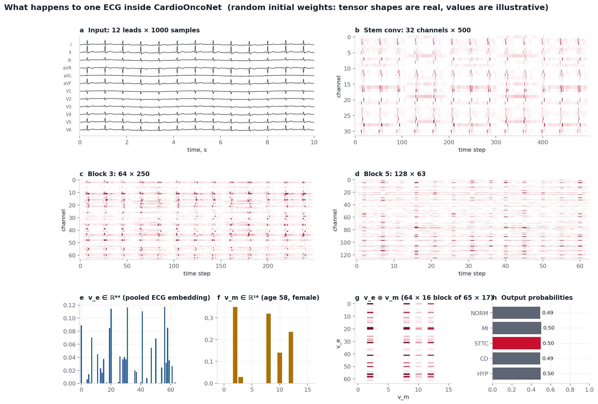

### 5.1 Architecture

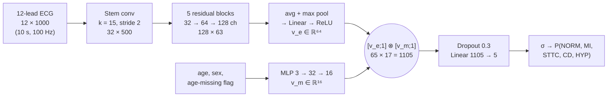

**1D convolution.** Each output channel $c$ slides a learned kernel across all 12 leads:

$$y_c[t] = b_c + \sum_{l=1}^{12}\sum_{j=0}^{K-1} w_{c,l,j}\; x_l[s\,t + j - \lfloor K/2\rfloor]$$

Early layers learn local shapes (QRS slopes, T-wave curvature); deeper layers with stride 2 see longer context. Five blocks reduce the time axis from 1000 to 63 while the channel count grows from 12 to 128.

**Residual blocks** [17] compute $y = \mathrm{ReLU}(x + F(x))$, where $F$ is conv → BatchNorm → ReLU → dropout → conv → BatchNorm. The identity path lets gradients flow through deep networks. **BatchNorm** normalises each channel to zero mean and unit variance over the batch, then rescales with learned $\gamma, \beta$. **Global pooling** concatenates the time average and the time maximum of every channel, so the embedding captures both typical morphology and the most extreme event.

### 5.2 Bilinear (tensor) fusion: why multiply instead of concatenate

The same ECG finding means different things in different patients: T-wave flattening is more worrying in a 30-year-old than in an 80-year-old. With plain concatenation $[v_e; v_m]$ followed by a linear layer, the score is a *sum* of ECG and metadata effects, so no interaction is possible. The outer product creates **every pairwise product** $v_{e,i}\,v_{m,j}$. Appending a constant 1 to each vector first (the Tensor Fusion Network trick [18]) keeps the unimodal terms as well:

$$z = \begin{bmatrix} v_e \\ 1\end{bmatrix} \otimes \begin{bmatrix} v_m \\ 1\end{bmatrix} = \begin{bmatrix} v_e v_m^\top & v_e \\ v_m^\top & 1 \end{bmatrix} \in \mathbb R^{65\times17}$$

The flattened 1105-dimensional vector contains the interactions, the ECG-only features, the metadata-only features and a constant. The fused model therefore contains the concatenation model as a special case and cannot be worse than it in expressive power.

**Parameter count** (computed by `count_parameters`): ECG encoder 567,296; metadata MLP 656; fusion head 1105 × 5 + 5 = 5,530; **total 573,482** (2.3 MB in float32).

### 5.3 Learning

**Loss.** Each of the 5 classes is an independent yes/no question (an ECG can show both MI and ST-T change), so the loss is binary cross-entropy on logits $z$:

$$\mathcal L = -\frac1C\sum_{c=1}^{C}\Big[w_c\, y_c \log\sigma(z_c) + (1-y_c)\log\big(1-\sigma(z_c)\big)\Big],\qquad \sigma(z)=\frac{1}{1+e^{-z}}$$

The positive weight $w_c = \sqrt{(1-\pi_c)/\pi_c}$ (capped) compensates for rare classes with prevalence $\pi_c$. A useful identity: $\partial \mathcal L/\partial z_c = \sigma(z_c) - y_c$ for $w_c = 1$. The gradient is simply "prediction minus truth", and back-propagation carries it through the fusion product via the product rule: $\partial z_{ij}/\partial v_{e,i} = v_{m,j}$.

**Optimiser.** AdamW [19] keeps running means of the gradient and of its square, $m_t = \beta_1 m_{t-1} + (1-\beta_1)g_t$ and $v_t = \beta_2 v_{t-1} + (1-\beta_2)g_t^2$, and updates $\theta \leftarrow \theta - \eta\,\hat m_t/(\sqrt{\hat v_t}+\epsilon) - \eta\lambda\theta$ with decoupled weight decay $\lambda = 0.01$. The learning rate follows a **one-cycle** schedule (warm-up, then cosine decay). Gradients are clipped to norm 1. Training stops early when validation macro-AUC has not improved for 8 epochs.

**Physiological data augmentation.** During training each ECG is randomly scaled in amplitude (±10%, electrode contact), given baseline wander (0.3 Hz, breathing) and white noise (20 µV, EMG). The network learns to ignore exactly the artefacts listed in Section 3.6.

### 5.4 Data: PTB-XL

PTB-XL [12] contains **21,799** clinical 12-lead, 10-second ECGs from **18,869** patients, annotated by up to two cardiologists with SCP-ECG statements, which aggregate into 5 diagnostic super-classes: **NORM** (normal), **MI** (myocardial infarction), **STTC** (ST/T change), **CD** (conduction disturbance) and **HYP** (hypertrophy). We use the official split: folds 1–8 for training, 9 for validation, 10 for testing. Published deep-learning baselines reach a macro-AUC around 0.93 on this task [20]; that is the target for a correct pipeline.

**Why PTB-XL if it has no chemotherapy data?** No public ECG dataset labelled for anthracycline cardiotoxicity exists at this scale. PTB-XL is used to show that the network and training code work on real clinical ECGs, and the **STTC** class (repolarisation abnormalities) is the closest available proxy for the electrical phenotype we care about. The model will then be adapted (fine-tuned) to cardio-oncology data once a clinical partner provides it (see [ROADMAP.md](ROADMAP.md)).

> **Training status:** the full training script is implemented and tested end-to-end on a miniature dataset in the PTB-XL format (`tests/test_train_smoke.py`). The run on the full PTB-XL has not been done yet, so **no real accuracy numbers are claimed here**. After running `train_ptbxl.py`, `runs/ptbxl/metrics.json` and `runs/ptbxl/roc_test.png` will contain the test-set AUCs with 95% CIs, and this section will be updated with them.

---

## 6. Deployment: edge devices, federated learning, hospital systems

### 6.1 Wearables: ONNX and INT8

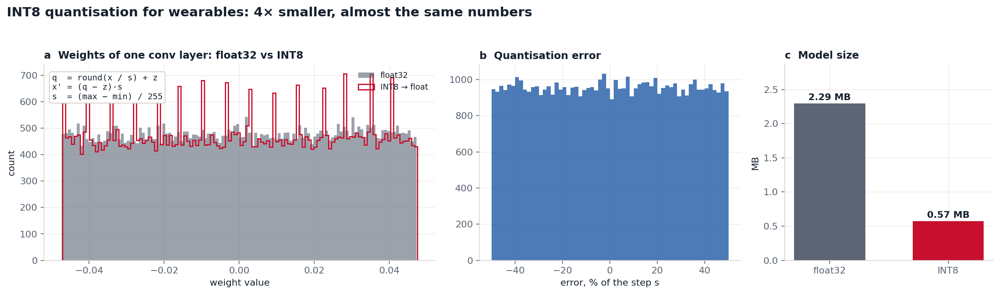

The trained network is exported to **ONNX**, an open format that runs in phones, browsers (onnxruntime-web) and microcontrollers. Weights are then quantised to 8-bit integers with an affine map:

$$q = \operatorname{round}(x/s) + z,\qquad \hat x = (q - z)\,s,\qquad s = \frac{x_{max}-x_{min}}{255}$$

The rounding error is uniform in $[-s/2, s/2]$ (panel b), while the model shrinks from 2.29 MB to 0.57 MB [21]. Accuracy after quantisation must be re-measured on the test set; that is part of the roadmap.

### 6.2 Federated learning

ECGs are sensitive personal data and usually cannot leave a hospital. In **federated averaging** (FedAvg) [22], each hospital $k$ trains on its own $n_k$ records and sends only model weights $W_k$; the server combines them

$$W_{global} = \sum_{k=1}^{K}\frac{n_k}{n}\,W_k,\qquad n = \sum_k n_k$$

and sends $W_{global}$ back. `federated_fhir_core.py` demonstrates the aggregation step. A real deployment would add secure aggregation and differential privacy, since weights alone can leak information.

### 6.3 HL7 FHIR R4

Results are written as a FHIR `DiagnosticReport` so they can enter an electronic health record. `cardioonco/fhir.py` uses only real codes for standard concepts: category **EC** (Electrocardiac) from HL7 table v2-0074, code **LOINC 11524-6** "EKG study", UCUM units (`uV`). Project-specific measurements (K-score, model probabilities) are coded in a clearly named *local* code system instead of invented codes that look official. Every report is tagged `research-only` and has status `preliminary`.

---

## 7. What has been verified so far

| Claim | Evidence | Status |
|---|---|---|
| A pure alternating series gives $V_{alt} = a$ exactly | `test_pure_alternating_series_gives_exact_amplitude` | ✅ |
| R-peak detection is correct at 55 / 75 / 110 bpm | `test_r_peak_detection` | ✅ |
| No false TWA without alternans (K < 3) | `test_no_alternans_is_negative` | ✅ |
| $V_{alt}$ grows monotonically; peak estimator recovers 40 µV within 15% | `test_strong_alternans_is_positive_and_monotonic` | ✅ |
| Browser (JS) and Python give the same heart rate, V_alt (±10%) and decision | `tests/test_js_parity.py` | ✅ |
| Training pipeline runs end to end and exports ONNX | `tests/test_train_smoke.py` | ✅ |
| Einthoven's law holds in the synthetic 12-lead model | Figure 3c (residual ≈ 10⁻¹⁶ mV) | ✅ |
| Network accuracy on real ECGs (PTB-XL test fold) | `train_ptbxl.py` | ⏳ to run |
| TWA is associated with anthracycline cardiotoxicity | needs a clinical cohort | ❌ not yet studied |

Python vs JavaScript on the same synthetic signal (seed 3, 50 Hz hum 20 µV):

| Injected alternans | Noise | Python V_alt / K | JavaScript V_alt / K |
|---|---|---|---|
| 0 µV | 15 µV | 0.00 / −1.2 | 0.00 / −1.8 |
| 5 µV | 10 µV | 1.91 / 9.8 | 1.93 / 12.3 |
| 20 µV | 15 µV | 7.97 / 152 | 7.98 / 195 |
| 20 µV | 60 µV | 7.12 / 52 | 7.27 / 65 |

V_alt agrees within 2%. K differs more because it divides by the spread of only six noise-band bins, which is sensitive to small filter differences. Both implementations reach the same decision in every case.

---

## 8. Repository map

```
cardioonco/            core library (tested)
  synth.py             synthetic single-lead and 12-lead (dipole) ECG with alternans
  preprocess.py        Butterworth filtfilt, notch, Pan–Tompkins
  twa.py               Spectral Method, MMA, full analysis pipeline
  model.py             CardioOncoNet: 1D ResNet + MLP + tensor fusion
  fhir.py              HL7 FHIR R4 DiagnosticReport
train_ptbxl.py         training / evaluation on PTB-XL (bootstrap CIs, ONNX export)
predict.py             analyse one ECG file → JSON + FHIR
app.py                 Gradio TWA laboratory (python app.py)
scripts/
  download_ptbxl.sh    fetch PTB-XL from PhysioNet (1.7 GB)
  make_figures.py      regenerate every figure in docs/figures/{en,ru}
tests/                 pytest: maths, detector, JS parity, training smoke test
index.html, ru.html    the web lab (GitHub Pages), assets/js/dsp.js = JS port of the maths
main_model.py          step-by-step NumPy walkthrough of bilinear fusion (teaching)
advanced_model.py      earlier PyTorch teaching model, EDF reader, 3D mesh
export_edge_onnx.py    earlier ONNX / INT8 export example
federated_fhir_core.py FedAvg demonstration + FHIR example
```

---

## 9. How to run everything

```bash
git clone https://github.com/podpirovlab/multimodal-cardiotoxicity-ai.git
cd multimodal-cardiotoxicity-ai
python -m venv .venv && source .venv/bin/activate
pip install -r requirements.txt pytest

python -m pytest -q                       # all tests
python predict.py --demo --alternans 20   # TWA analysis of a synthetic Holter strip
python app.py                             # interactive lab at http://localhost:7860
python scripts/make_figures.py            # regenerate all figures

# real data (about 1.7 GB download, 20–60 min training on a laptop; Apple Silicon uses the GPU via mps)
bash scripts/download_ptbxl.sh
python train_ptbxl.py --data data/ptb-xl --epochs 30 --export-onnx
cp runs/ptbxl/metrics.json assets/metrics.json   # the website shows the metrics automatically
python scripts/make_figures.py --only 08 --checkpoint runs/ptbxl/model.pt
```

---

## 10. What changed in version 0.3

An internal review of version 0.2 found several places where the project claimed more than it did. They were fixed:

| Before | After |
|---|---|
| The web demo and `app.py` showed a fixed "93.42% risk" chosen by a drop-down menu | Every number is computed from the signal by the TWA algorithm |
| The demo recommended "reduce doxorubicin by 15%, start dexrazoxane" | Removed: a research prototype must not give treatment advice |
| FHIR report used invented LOINC/SNOMED codes and a genetics category | Real LOINC 11524-6 and HL7 v2-0074 "EC"; local codes clearly labelled |
| README described a *complex* Morlet transform while the code used the real `morl` wavelet | The complex Morlet `cmor1.5-1.0` is used and explained |
| The 3D heart highlighted a "ferroptosis focus" on one wall | Now teaches lead anatomy and states that anthracycline injury is diffuse |
| A "ROC-AUC" was computed on random synthetic labels | Replaced by a real PTB-XL evaluation pipeline with bootstrap CIs |
| No automated tests of the mathematics | 10 tests, including exact-amplitude and JS/Python parity checks |

---

## 11. Limitations and ethics

- **The central hypothesis is unproven.** QT prolongation and ST-T changes are described after anthracyclines, but microvolt TWA as an *early* marker of anthracycline cardiotoxicity has not been established. This project provides the tools to test it; it does not claim the answer.
- **TWA needs long recordings.** The Spectral Method needs about 128 beats (roughly 2 minutes), ideally at a raised heart rate. A routine 10-second ECG contains about 12 beats. Practical use would need Holter or exercise recordings.
- **The network has not been trained on real data yet**, and PTB-XL has no chemotherapy information. Its STTC class is a proxy, not the target.
- **Synthetic signals are simplified.** The dipole model ignores torso inhomogeneity and electrode placement variation; the alternans is injected as a clean amplitude modulation, whereas real TWA can vary in phase and shape.
- **Not a medical device.** No ethics approval, clinical validation or regulatory clearance. Any clinical study would require ethics-committee approval, informed consent and de-identified data.
- **Fairness.** PTB-XL comes from one German centre. A model trained on it may perform worse on other populations and devices; external validation is required.

---

## 12. References

1. Swain SM, Whaley FS, Ewer MS. Congestive heart failure in patients treated with doxorubicin: a retrospective analysis of three trials. *Cancer*. 2003;97(11):2869–2879.
2. Cardinale D, Colombo A, Bacchiani G, et al. Early detection of anthracycline cardiotoxicity and improvement with heart failure therapy. *Circulation*. 2015;131(22):1981–1988.
3. Lyon AR, López-Fernández T, Couch LS, et al. 2022 ESC Guidelines on cardio-oncology. *European Heart Journal*. 2022;43(41):4229–4361.
4. Zhang S, Liu X, Bawa-Khalfe T, et al. Identification of the molecular basis of doxorubicin-induced cardiotoxicity. *Nature Medicine*. 2012;18(11):1639–1642.
5. Fang X, Wang H, Han D, et al. Ferroptosis as a target for protection against cardiomyopathy. *PNAS*. 2019;116(7):2672–2680.
6. Octavia Y, Tocchetti CG, Gabrielson KL, et al. Doxorubicin-induced cardiomyopathy: from molecular mechanisms to therapeutic strategies. *J Mol Cell Cardiol*. 2012;52(6):1213–1225.
7. Hodgkin AL, Huxley AF. A quantitative description of membrane current and its application to conduction and excitation in nerve. *J Physiol*. 1952;117(4):500–544.
8. Yan GX, Antzelevitch C. Cellular basis for the normal T wave and the electrocardiographic manifestations of the long-QT syndrome. *Circulation*. 1998;98(18):1928–1936.
9. Nolasco JB, Dahlen RW. A graphic method for the study of alternation in cardiac action potentials. *J Appl Physiol*. 1968;25(2):191–196.
10. Weiss JN, Karma A, Shiferaw Y, et al. From pulsus to pulseless: the saga of cardiac alternans. *Circulation Research*. 2006;98(10):1244–1253.
11. Verrier RL, Klingenheben T, Malik M, et al. Microvolt T-wave alternans: physiological basis, methods of measurement, and clinical utility. *J Am Coll Cardiol*. 2011;58(13):1309–1324.
12. Wagner P, Strodthoff N, Bousseljot RD, et al. PTB-XL, a large publicly available electrocardiography dataset. *Scientific Data*. 2020;7:154. Goldberger AL, et al. PhysioBank, PhysioToolkit, and PhysioNet. *Circulation*. 2000;101(23):e215–e220.
13. Pan J, Tompkins WJ. A real-time QRS detection algorithm. *IEEE Trans Biomed Eng*. 1985;32(3):230–236.
14. Rosenbaum DS, Jackson LE, Smith JM, et al. Electrical alternans and vulnerability to ventricular arrhythmias. *N Engl J Med*. 1994;330(4):235–241. Smith JM, Clancy EA, Valeri CR, et al. Electrical alternans and cardiac electrical instability. *Circulation*. 1988;77(1):110–121.
15. Nearing BD, Verrier RL. Modified moving average analysis of T-wave alternans to predict ventricular fibrillation with high accuracy. *J Appl Physiol*. 2002;92(2):541–549.
16. Hanley JA, McNeil BJ. The meaning and use of the area under a receiver operating characteristic (ROC) curve. *Radiology*. 1982;143(1):29–36.
17. He K, Zhang X, Ren S, Sun J. Deep residual learning for image recognition. *CVPR*. 2016.
18. Zadeh A, Chen M, Poria S, Cambria E, Morency LP. Tensor Fusion Network for multimodal sentiment analysis. *EMNLP*. 2017.
19. Loshchilov I, Hutter F. Decoupled weight decay regularization. *ICLR*. 2019.
20. Strodthoff N, Wagner P, Schaeffter T, Samek W. Deep learning for ECG analysis: benchmarks and insights from PTB-XL. *IEEE J Biomed Health Inform*. 2021;25(5):1519–1528.
21. Jacob B, Kligys S, Chen B, et al. Quantization and training of neural networks for efficient integer-arithmetic-only inference. *CVPR*. 2018.
22. McMahan HB, Moore E, Ramage D, Hampson S, Agüera y Arcas B. Communication-efficient learning of deep networks from decentralized data. *AISTATS*. 2017.
23. McSharry PE, Clifford GD, Tarassenko L, Smith LA. A dynamical model for generating synthetic electrocardiogram signals. *IEEE Trans Biomed Eng*. 2003;50(3):289–294.
24. Torrence C, Compo GP. A practical guide to wavelet analysis. *Bull Am Meteorol Soc*. 1998;79(1):61–78.
25. Attia ZI, Kapa S, Lopez-Jimenez F, et al. Screening for cardiac contractile dysfunction using an artificial intelligence–enabled electrocardiogram. *Nature Medicine*. 2019;25(1):70–74.

---

**Author:** Petya ([@podpirovlab](https://github.com/podpirovlab)), high-school student researcher. The code was developed with the help of AI coding assistants (Claude); every result in this document is reproducible with the commands in Section 9 and checked by the test suite.

**Citation:**

```bibtex
@software{cardiooncopredict,
  author = {podpirovlab},
  title  = {CardioOncoPredict: microvolt T-wave alternans and multimodal deep learning
            for early detection of anthracycline cardiotoxicity (research prototype)},
  year   = {2026},
  url    = {https://github.com/podpirovlab/multimodal-cardiotoxicity-ai}
}
```

Released under the [MIT License](LICENSE).
