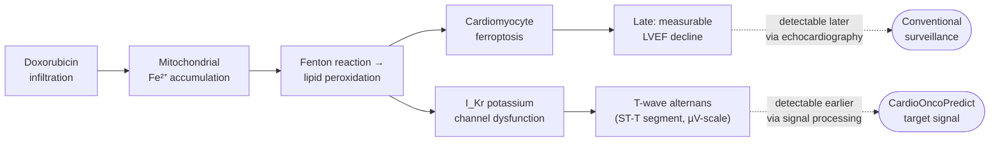
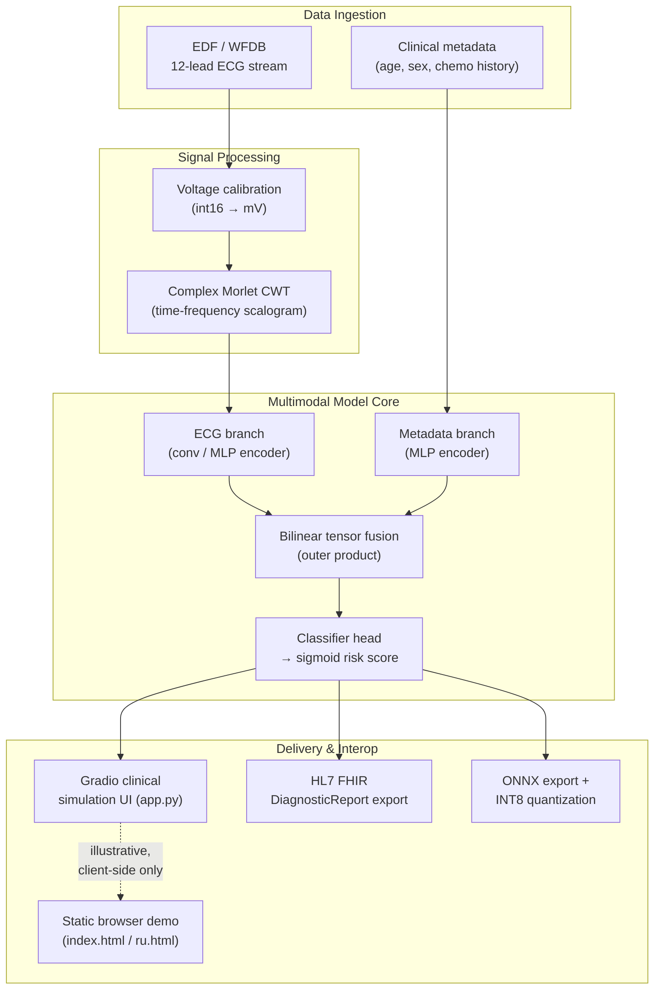
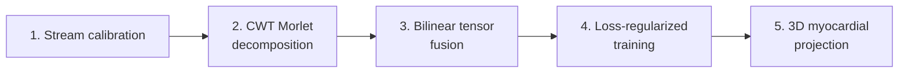
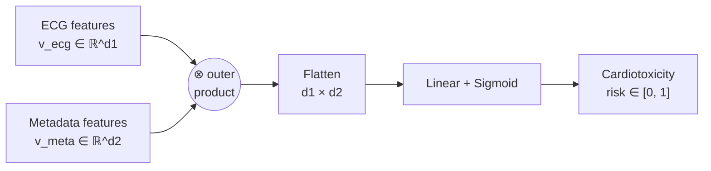

# 🩺 CardioOncoPredict

**A multimodal edge-AI research prototype for early detection of subclinical anthracycline-induced cardiotoxicity from ECG signals.**


---

> ⚠️ **Disclaimer — please read first.** CardioOncoPredict is an **educational and research
> engineering prototype**. It is trained and demonstrated on **synthetic ECG waveforms**, has
> **not** been validated against real patient outcomes, and holds **no regulatory clearance**
> (FDA, CE, or otherwise). Nothing in this repository constitutes medical advice or a diagnostic
> device. See [§11 Limitations & Ethical Considerations](#11-limitations--ethical-considerations)
> for the full scope and honest boundaries of this work.

---

## Table of Contents

1. [Abstract](#1-abstract)
2. [Clinical Motivation](#2-clinical-motivation)
3. [System Architecture](#3-system-architecture)
4. [Signal Processing Pipeline](#4-signal-processing-pipeline)
5. [Model Architecture: Bilinear Multimodal Fusion](#5-model-architecture-bilinear-multimodal-fusion)
6. [Federated Learning & FHIR Interoperability](#6-federated-learning--fhir-interoperability)
7. [Edge Deployment (ONNX / INT8)](#7-edge-deployment-onnx--int8)
8. [Repository Structure](#8-repository-structure)
9. [Getting Started](#9-getting-started)
10. [Illustrative Results](#10-illustrative-results)
11. [Limitations & Ethical Considerations](#11-limitations--ethical-considerations)
12. [Roadmap](#12-roadmap)
13. [Selected References](#13-selected-references)
14. [Citing This Repository](#14-citing-this-repository)
15. [License](#15-license)

---

## 1. Abstract

Anthracycline chemotherapy agents (e.g., doxorubicin) remain first-line treatment for many
cancers, but cause cumulative, dose-dependent cardiomyocyte injury. Standard surveillance —
serial echocardiography measuring Left Ventricular Ejection Fraction (LVEF) — only flags damage
*after* substantial, often irreversible tissue loss has already occurred. **CardioOncoPredict**
explores whether a multimodal model combining electrophysiological ECG features with patient
metadata can flag microvolt-scale repolarization abnormalities *before* mechanical dysfunction is
measurable, shifting surveillance from reactive to proactive. This repository packages that idea
as an end-to-end, reproducible engineering pipeline: signal processing → multimodal neural fusion
→ interactive clinical-simulation UI → federated-learning simulation → edge deployment — built
as a portfolio-grade demonstration of applied ML engineering for biomedical signal analysis.

## 2. Clinical Motivation

Doxorubicin and related anthracyclines are believed to injure cardiomyocytes in part through a
non-apoptotic, iron-dependent cell death pathway known as **ferroptosis**: intracellular iron
accumulation drives Fenton-reaction-mediated lipid peroxidation of membrane phospholipids,
disrupting ion channel function — including cardiac potassium channels (I<sub>Kr</sub>) — well
before contractile failure is detectable on echocardiography (Octavia et al., 2012; Fang et al.,
2019).

One of the earliest observable electrophysiological correlates of this membrane-level stress is
**T-wave alternans (TWA)** — beat-to-beat microvolt fluctuations in the ST-T segment of the ECG,
long associated with ventricular electrical instability (Narayan, 2006). Because TWA operates at
the microvolt scale, it is invisible to unaided visual inspection of a printed ECG strip, but is,
in principle, recoverable through time-frequency signal decomposition.

**The working hypothesis of this project:** a model that jointly reasons over (a) fine-grained
spectral features of the ST-T segment and (b) patient-level clinical context (age, sex, treatment
history) can act as an early-warning layer, complementing — not replacing — echocardiographic
surveillance recommended by current cardio-oncology guidelines (Zamorano et al., 2016).



## 3. System Architecture

The project is organized as four loosely-coupled subsystems that share a common signal
representation:



## 4. Signal Processing Pipeline

The production-oriented core (`advanced_model.py`, `export_edge_onnx.py`) processes raw
biomedical telemetry through five deterministic stages:



**Stage 1 — Calibration.** Raw voltage is ingested as 16-bit signed little-endian integers,
consistent with the PhysioNet PTB-XL specification (Wagner et al., 2020), and rescaled to
physical millivolts:

$$V(t) = \frac{X_{\text{raw}}(t) - \text{Baseline}}{\text{Gain}}$$

At a sampling frequency $f_s = 250\ \text{Hz}$, the discrete time step is
$\Delta t = 1/f_s = 4\ \text{ms}$.

**Stage 2 — Time-frequency decomposition.** To resolve non-stationary, sub-millivolt
fluctuations in the repolarization window, the 1D signal is transformed into a 2D energy
scalogram via a Continuous Wavelet Transform using a complex Morlet basis
(Addison, 2005), which achieves the minimal joint time–frequency uncertainty
$\Delta t \cdot \Delta \omega \geq \tfrac{1}{2}$:

$$\psi(t) = \pi^{-1/4} e^{i\omega_0 t} e^{-t^2/2}, \qquad
W(a, b) = \frac{1}{\sqrt{a}} \sum_{n=0}^{N-1} x[n] \cdot \psi^*\!\left(\frac{n\Delta t - b}{a}\right)$$

**Stage 3 — Bilinear tensor fusion.** ECG-branch features $v_{\text{ecg}} \in \mathbb{R}^{d_1}$
and metadata-branch features $v_{\text{meta}} \in \mathbb{R}^{d_2}$ are combined via an outer
product rather than simple concatenation, so the model can learn interaction terms between every
ECG feature and every clinical variable:

$$V_{\text{fusion}} = v_{\text{ecg}} \otimes v_{\text{meta}} \in \mathbb{R}^{d_1 \times d_2},
\qquad \hat{y} = \sigma\!\left(\mathbf{w}^\top \operatorname{vec}(V_{\text{fusion}}) + b\right)$$

**Stage 4 — Training objective.** The classifier is optimized with binary cross-entropy:

$$\mathcal{L}_{\text{BCE}} = -\big[y \log \hat{y} + (1-y)\log(1-\hat{y})\big]$$

**Stage 5 — Spatial projection.** Predicted risk is mapped onto a parametric 3D mesh of the left
ventricle (`generate_3d_heart_mesh` in `advanced_model.py`) so a clinician can visually localize
which anatomical wall the flagged ECG leads correspond to (anterior / inferior–apex / lateral).

## 5. Model Architecture: Bilinear Multimodal Fusion

The repository intentionally contains **three implementations of increasing complexity**, kept
side by side for pedagogical transparency rather than merged into one file:

| File | Framework | Purpose | Fusion dimensionality |
|---|---|---|---|
| `main_model.py` | Pure NumPy | Step-by-step walkthrough of the forward pass, for readers who want to see every matrix operation explicitly | $2 \times 2$ (toy scale) |
| `advanced_model.py` | PyTorch `nn.Module` | Trainable reference model (`EnhancedCardioOncoNet`) with EDF ingestion, ROC-AUC evaluation, and 3D visualization | $8 \times 8$ |
| `export_edge_onnx.py` | PyTorch → ONNX | Deployment-scale model (`BilinearMultimodalFusionNet`) sized for real 120-coefficient CWT feature vectors, exported and INT8-quantized for edge/wearable inference | $32 \times 32$ |

All three share the same **bilinear fusion** principle described in §4; they differ only in
input feature width and whether weights are randomly initialized (illustrative) or intended to be
trained on real cohort data (future work — see [§12 Roadmap](#12-roadmap)).



## 6. Federated Learning & FHIR Interoperability

Because ECG datasets are sensitive and typically siloed within individual hospitals,
`federated_fhir_core.py` demonstrates two interoperability building blocks a real deployment
would need:

- **FedAvg simulation** — a from-scratch NumPy implementation of Federated Averaging
  (McMahan et al., 2017), the standard algorithm for aggregating model weights trained locally at
  multiple institutions without any raw patient data leaving the source hospital:

  $$W_{\text{global}} = \sum_{k=1}^{K} \frac{N_k}{N_{\text{total}}} \, W_k$$

- **HL7 FHIR export** — generates a spec-shaped `DiagnosticReport` resource
  (LOINC / SNOMED-coded) so a risk score could, in principle, be written back into a hospital's
  Electronic Health Record system using the HL7 FHIR interoperability standard.

Both are simulations over synthetic weights/identifiers — no real federated training run or EHR
integration has been performed.

## 7. Edge Deployment (ONNX / INT8)

`export_edge_onnx.py` traces `BilinearMultimodalFusionNet` and exports it to ONNX
(opset 14, dynamic batch axis), then applies dynamic INT8 quantization via
`onnxruntime.quantization`. The goal is a model small and fast enough to run inference on
resource-constrained edge hardware (e.g., a Holter monitor or smartwatch class device) rather
than requiring a round-trip to a cloud API — relevant for continuous, ambulatory monitoring
between hospital visits.

```bash
python export_edge_onnx.py
# → model_base.onnx          (full-precision)
# → model_quantized.onnx     (INT8, edge-ready)
```

## 8. Repository Structure

| Path | Description |
|---|---|
| [`main_model.py`](main_model.py) | Pure-NumPy pedagogical walkthrough of the forward pass |
| [`advanced_model.py`](advanced_model.py) | PyTorch reference model, EDF loader, ROC-AUC eval, 3D mesh generation |
| [`export_edge_onnx.py`](export_edge_onnx.py) | Deployment-scale model + ONNX export + INT8 quantization |
| [`federated_fhir_core.py`](federated_fhir_core.py) | FedAvg simulation + HL7 FHIR `DiagnosticReport` generator |
| [`app.py`](app.py) | Gradio interactive clinical-simulation dashboard |
| [`index.html`](index.html) / [`ru.html`](ru.html) | Static, dependency-free browser demo (client-side JS only), served via GitHub Pages |
| [`Dockerfile`](Dockerfile) | Container image that installs dependencies and launches `app.py` |
| [`requirements.txt`](requirements.txt) | Python dependencies |

## 9. Getting Started

```bash
# 1. Clone and enter the repository
git clone https://github.com/podpirovlab/multimodal-cardiotoxicity-ai.git
cd multimodal-cardiotoxicity-ai

# 2. Install dependencies (a virtual environment is recommended)
python -m venv .venv && source .venv/bin/activate   # Windows: .venv\Scripts\activate
pip install -r requirements.txt

# 3a. Run the interactive Gradio dashboard
python app.py                       # opens http://localhost:7860

# 3b. Or step through the pure-NumPy pedagogical demo
python main_model.py

# 3c. Or build the PyTorch reference model / evaluate synthetic ROC-AUC
python advanced_model.py
```

**Docker:**

```bash
docker build -t cardiooncopredict .
docker run -p 7860:7860 cardiooncopredict
```

**Zero-install browser demo:** open [`index.html`](index.html) (English) or
[`ru.html`](ru.html) (Russian) directly, or visit the version published via GitHub Pages:
**https://podpirovlab.github.io/multimodal-cardiotoxicity-ai/**

## 10. Illustrative Results

`advanced_model.py::calculate_system_roc_auc()` computes a ROC-AUC curve over **synthetically
generated** labels and scores (fixed random seed) purely to demonstrate the evaluation
methodology the project would use on a real cohort — scikit-learn's `roc_curve` / `auc`, plotted
against a random-classifier baseline. **This number does not reflect real diagnostic
performance** and must not be quoted as such; no model in this repository has been trained or
evaluated on real patient ECGs.

## 11. Limitations & Ethical Considerations

Presented candidly, in the spirit of honest engineering communication:

- **No real patient data.** All ECG signals used throughout the repository (`main_model.py`,
  `app.py`, `advanced_model.py`'s fallback path) are synthetically generated from parametric
  Gaussian approximations of the PQRST complex, not sourced from PhysioNet, PTB-XL, or any
  hospital system. `pyedflib` integration exists to *parse* real EDF files if supplied locally,
  but none ship with this repository.
- **No trained weights.** Every neural network in this repository is randomly initialized at
  runtime and never trained to convergence on labeled data. Reported "risk percentages" in the
  Gradio and browser demos are **scripted illustrative scenarios** tied to the selected input
  toggle, not live model inference — this is stated explicitly in the UI.
- **No clinical validation, no regulatory status.** This project has not been reviewed by an IRB,
  has not undergone clinical trial evaluation, and holds no FDA/CE/other regulatory clearance. It
  must never be used to inform real treatment or dosing decisions.
- **No PHI.** All patient identifiers, hospital names, and FHIR resources in the code are
  synthetic placeholders and do not reference real individuals or institutions.
- **Scope of contribution.** This is best understood as a systems/engineering portfolio project —
  an integrated demonstration of signal processing, multimodal deep learning, interoperability
  standards, and edge deployment applied to a real and important clinical problem — rather than a
  validated clinical research contribution.

## 12. Roadmap

- [ ] Train and validate `advanced_model.py` on a real, IRB-approved, de-identified ECG cohort
      (e.g., PTB-XL) with clinically confirmed cardiotoxicity outcomes.
- [ ] Replace scripted demo verdicts in `app.py` / `index.html` / `ru.html` with genuine live
      inference from a trained checkpoint.
- [ ] Add automated unit tests for the signal-processing and fusion math.
- [ ] Benchmark the quantized ONNX model's latency/accuracy trade-off on real edge hardware.
- [ ] Formal FHIR conformance testing against a sandbox EHR (e.g., HAPI FHIR test server).

## 13. Selected References

- Octavia, Y., Tocchetti, C.G., Gabrielson, K.L., et al. (2012). *Doxorubicin-induced
  cardiomyopathy: from molecular mechanisms to therapeutic strategies.* Journal of Molecular and
  Cellular Cardiology, 52(6), 1213–1225.
- Fang, X., Wang, H., Han, D., et al. (2019). *Ferroptosis as a target for protection against
  cardiomyopathy.* PNAS, 116(7), 2672–2680.
- Narayan, S.M. (2006). *T-wave alternans and the susceptibility to ventricular arrhythmias.*
  Journal of the American College of Cardiology, 47(2), 269–281.
- Zamorano, J.L., Lancellotti, P., Rodriguez Muñoz, D., et al. (2016). *2016 ESC Position Paper on
  cancer treatments and cardiovascular toxicity.* European Heart Journal, 37(36), 2768–2801.
- Wagner, P., Strodthoff, N., Bousseljot, R.D., et al. (2020). *PTB-XL, a large publicly available
  electrocardiography dataset.* Scientific Data, 7, 154.
- Addison, P.S. (2005). *Wavelet transforms and the ECG: a review.* Physiological Measurement,
  26(5), R155.
- McMahan, H.B., Moore, E., Ramage, D., Hampson, S., y Arcas, B.A. (2017). *Communication-Efficient
  Learning of Deep Networks from Decentralized Data.* AISTATS.
- HL7 International. *HL7 FHIR (Fast Healthcare Interoperability Resources) Specification.*
  https://www.hl7.org/fhir/

## 14. Citing This Repository

```bibtex
@misc{cardiooncopredict,
  author = {podpirovlab},
  title  = {CardioOncoPredict: A Multimodal Edge-AI Research Prototype for
            Subclinical Anthracycline Cardiotoxicity Detection},
  year   = {2026},
  url    = {https://github.com/podpirovlab/multimodal-cardiotoxicity-ai}
}
```

## 15. License

Released under the [MIT License](LICENSE).
