# CardioOncoPredict

**Research software that measures microvolt T-wave alternans in ECG recordings, to test whether it is an early electrical sign of anthracycline cardiotoxicity. The question is open; this repository builds and checks the tools to answer it.**

[](https://github.com/podpirovlab/multimodal-cardiotoxicity-ai/actions)
[](https://doi.org/10.5281/zenodo.23090355)


**[Try the live tool →](https://podpirovlab.github.io/multimodal-cardiotoxicity-ai/)** · [Русская версия](README.ru.md) · [Roadmap](ROADMAP.md)

> **Disclaimer.** CardioOncoPredict is a research and education prototype. It is not a medical
> device, has no clinical validation and no regulatory clearance. It must not be used to make
> diagnostic or treatment decisions. Section [11](#11-limitations-and-ethics) states exactly what has and has not been shown.

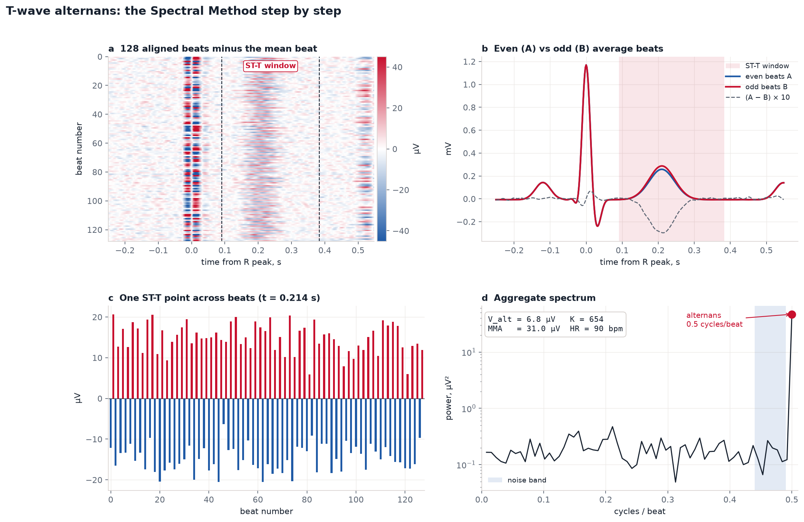

---

## Contents

1. [Summary](#1-summary), including [what has been shown so far](#what-has-been-shown-so-far)

**[Try it on a real ECG](#try-it-on-a-real-ecg)** — built-in real recording, upload EDF/BDF/CSV, PhysioNet data, research metadata, JSON export, lead anatomy

2. [Medicine and biochemistry: how anthracyclines injure the heart](#2-medicine-and-biochemistry-how-anthracyclines-injure-the-heart)
3. [Physics: from ion channels to the voltage on the skin](#3-physics-from-ion-channels-to-the-voltage-on-the-skin)
4. [Mathematics and signal processing](#4-mathematics-and-signal-processing)
5. [Computer science: the multimodal neural network](#5-computer-science-the-multimodal-neural-network)
6. [Deployment: edge devices, federated learning, hospital systems](#6-deployment-edge-devices-federated-learning-hospital-systems)
7. [What has been verified so far](#7-what-has-been-verified-so-far), including [the PhysioNet TWA challenge](#71-check-against-the-physionet-twa-challenge)
8. [Repository map](#8-repository-map)
9. [How to run everything](#9-how-to-run-everything)
10. [What changed between versions](#10-what-changed-between-versions)
11. [Limitations and ethics](#11-limitations-and-ethics)
12. [References](#12-references)

---

## 1. Summary

**Problem.** Anthracyclines (doxorubicin, epirubicin) are among the most effective anticancer drugs, but they injure heart muscle in a dose-dependent way. At a cumulative doxorubicin dose of 550 mg/m², about a quarter of patients develop heart failure [1]. Monitoring relies on imaging and blood tests [3]: the left-ventricular ejection fraction falls only after substantial injury, while strain imaging and troponin catch earlier stages but need echo expertise or repeated blood samples. A cheap marker from a standard ECG would complement them — if one exists.

**Hypothesis.** Injury to cardiomyocyte ion channels should disturb *repolarisation* before it disturbs *contraction*. One sensitive marker of unstable repolarisation is **T-wave alternans (TWA)**: an every-other-beat change of the ST-T segment by 1–100 µV. That is 0.01–1 mm on paper ECG, too small to see but measurable mathematically.

### What has been shown so far

| Question | Result | Status | Where |
|---|---|---|---|
| Does the method find microvolt alternans in synthetic ECGs? | 5 µV of alternans found in 10 of 12 recordings with 5 µV of white noise and in 8 of 12 with 20 µV; no false positives up to 20 µV of noise | ✅ | [§4.5](#45-when-can-alternans-be-measured-the-detection-map) |
| Does the R-peak detector find real heartbeats? | MIT-BIH Arrhythmia Database: 99.73% of annotated beats found, 99.92% of detections correct; 99.50% / 99.93% on a second database at 128 Hz | ✅ | [§4.3](#43-r-peak-detection) |
| Do the browser and Python versions agree? | The same outcome and reason on every test signal; V_alt within 10% | ✅ | [§7](#7-what-has-been-verified-so-far) |
| Does it agree with the PhysioNet 2008 TWA challenge? | Kendall τ = 0.43 over 100 recordings (the organisers' significance line is 0.436); 0.48 on the synthetic ones, 0.08 on held-out real ones | ⚠️ synthetic only | [§7.1](#71-check-against-the-physionet-twa-challenge) |
| Does the neural network work on real clinical ECGs? | PTB-XL test macro-AUC 0.921, the published level of 0.92–0.93 | ✅ proxy task | [§5.4](#54-data-ptb-xl) |
| Does adding age and sex to the network help? | +0.0007 AUC, 95% CI [−0.003, +0.004] | ❌ no measurable gain | [§5.4](#54-data-ptb-xl) |
| Is TWA an early sign of anthracycline cardiotoxicity? | Not studied yet: it needs ECGs of patients before and during treatment | open | [§11](#11-limitations-and-ethics) |

### What this repository contains

| Layer | What it does | Where |
|---|---|---|
| Physics model | Synthetic 12-lead ECG from a moving cardiac dipole, with controllable microvolt alternans, white noise, baseline wander and mains hum | `cardioonco/synth.py` |
| Signal processing | Zero-phase filtering, R-peak detection checked on 126 cardiologist-annotated records, removal of false beats, shared R peaks across leads | `cardioonco/preprocess.py` |
| TWA mathematics | Beat alignment, ectopy control, Spectral Method (V_alt, K-score) over the whole recording, Modified Moving Average, three outcomes; checked on the PhysioNet challenge ([§7.1](#71-check-against-the-physionet-twa-challenge)) | `cardioonco/twa.py` |
| Neural network | 1D ResNet over 12 leads + age/sex branch, fused by an outer (tensor) product | `cardioonco/model.py` |
| Training pipeline | Trained on PTB-XL (21,799 clinical ECGs): patient-wise split, test macro-AUC 0.921 with bootstrap CIs, ONNX export ([§5.4](#54-data-ptb-xl)) | `train_ptbxl.py`, `models/ptbxl-1.0/` |
| Interoperability | HL7 FHIR R4 `DiagnosticReport` with valid LOINC / HL7 codes | `cardioonco/fhir.py` |
| Web tool | The same TWA algorithm in JavaScript, run in the browser; EDF/BDF/CSV upload; 3D lead anatomy | `index.html`, `assets/js/` |
| Figures | Every figure in this README is generated by code | `scripts/make_figures.py` |

---

## Try it on a real ECG

The [live tool](https://podpirovlab.github.io/multimodal-cardiotoxicity-ai/) runs the analysis below entirely in your browser — nothing you upload leaves your device or touches a server.

**No ECG at hand?** "Open a real ECG" loads record twa36 of the PhysioNet TWA challenge, a real 12-lead recording from the PTB database ([`assets/samples/`](assets/samples/README.md), ODC-By licence). Your own file can be chosen or dropped onto the upload box. After the first visit the page works offline and can be installed as an app; the result can be printed or saved as PDF from the button next to the JSON export.

**What it needs:** one lead of ECG with at least 64 usable beats (about a minute); the method's standard is 128 beats, about two minutes. The Spectral Method looks at 128 beats at a time ([§4.4](#44-the-spectral-method-for-t-wave-alternans)); a longer file is scanned in 128-beat windows from start to end. A standard 10-second clinical ECG only has about 12 beats, so the tool refuses it rather than call it normal.

**Three possible answers**, following the Spectral Method's clinical rules [11]: *alternans criterion met* (≥ 1.9 µV, K ≥ 3, heart rate ≤ 110, noise ≤ 1.8 µV in some window), *no significant alternans* (nothing significant, and at least one clean window at ≥ 105 bpm), and *indeterminate* with the reason — too noisy, too many ectopic beats, alternans only above 110 bpm, or a heart rate that never reached 105. Those rules were written for exercise tests, so a resting recording without alternans comes out indeterminate, not negative. One simplification: the clinical rule asks for alternans *sustained* for at least a minute; here one significant 128-beat window stands in for that (below 110 bpm such a window lasts more than a minute).

**File formats:**
- **EDF / EDF+ and BDF / BDF+** — read directly in the browser (`assets/js/edf.js`, no server). If the file has more than one channel, a dropdown lets you pick the lead; a channel labelled with a standard lead name ("ECG II", "V3") is recognised. Discontinuous EDF+D files are refused, because beats on either side of a gap would break the even/odd order.
- **CSV / TXT** — one column of numbers, in mV or µV, with the sampling rate typed in by hand. Both "0.123,0.456" and the Russian/European "0,123;0,456" are read.

**Getting a real recording from PhysioNet:**
- [T-Wave Alternans Challenge Database](https://physionet.org/content/twadb/1.0.0/) — 100 two-minute recordings, real and simulated, built for testing TWA detectors; [§7.1](#71-check-against-the-physionet-twa-challenge) uses it to check this algorithm.
- [PTB-XL](https://physionet.org/content/ptb-xl/1.0.3/) — 21,799 real clinical ECGs (used for training in [§5.4](#54-data-ptb-xl)), but only 10 seconds each, so on its own it's too short for TWA. Good for checking the tool runs correctly on a real waveform.

Both ship as WFDB (`.dat` + `.hea`), which the browser can't read directly — convert one lead to CSV first:

```bash
pip install wfdb
python scripts/wfdb_to_csv.py records100/00000/00001_lr --lead II --out ecg.csv
```

Then upload `ecg.csv` and type the sampling rate that the script prints into the form.

**Research metadata and the JSON export.** Age, sex and cumulative doxorubicin dose next to the upload are optional and never enter the analysis, which looks only at the ECG. They are added to the downloadable research JSON (FHIR `DiagnosticReport` format, same structure as `cardioonco/fhir.py`, [§6.3](#63-hl7-fhir-r4)) only when the "add these fields" box is ticked. Next to the dose field the page quotes the population figures from [§2.1](#21-the-clinical-scale-of-the-problem) as a reference; it does not place the patient on that curve or predict anything for them.

**Which lead sees which wall.** The 12 ECG leads look at the heart from 12 directions:

| Wall | Leads that see it best |
|---|---|
| Septum | V1, V2 |
| Anterior wall | V3, V4 |
| Lateral wall | I, aVL, V5, V6 |
| Inferior wall | II, III, aVF |

aVR doesn't localise to a wall and is left out, as usual. The web tool shows the same mapping on a rotatable 3D heart, and when an uploaded file names its lead the model turns to that lead's side. Anthracycline injury is typically diffuse across the ventricle rather than confined to one wall, so this is ECG anatomy, not a map of anyone's damage — the tool does not try to localise anything.

---

## 2. Medicine and biochemistry: how anthracyclines injure the heart

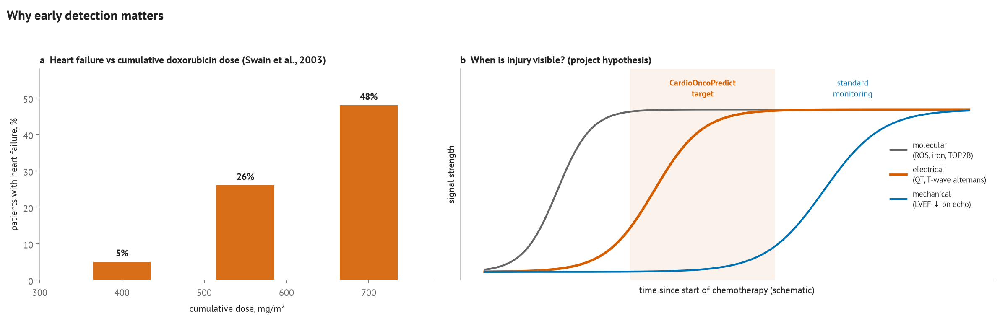

### 2.1 The clinical scale of the problem

- Heart-failure incidence rises steeply with cumulative doxorubicin dose: **5% at 400 mg/m², 26% at 550 mg/m², 48% at 700 mg/m²** (retrospective analysis of three trials, Swain et al. [1]).
- In a prospective cohort of **2,625** anthracycline-treated patients, cardiotoxicity occurred in about **9%**, and **98%** of cases appeared within the first year. Most patients who were detected early and treated recovered heart function fully or partially [2].
- The 2022 ESC cardio-oncology guidelines define *cancer-therapy-related cardiac dysfunction* by a fall in LV ejection fraction, a relative fall in global longitudinal strain (GLS) above 15%, or a rise of troponin / natriuretic peptides [3]. None of these uses the fine structure of the ECG.
- That structure carries information: a neural network applied to the ordinary 12-lead ECG detects a weak left ventricle (ejection fraction ≤ 35%) with an AUC of 0.93 [25]. Whether the ECG can show earlier, subclinical anthracycline injury is not known.

### 2.2 Molecular mechanisms (chemistry and biology)

Doxorubicin is an anthracycline: a planar tetracyclic **quinone** ring system attached to an amino sugar (daunosamine). Its anticancer action is DNA intercalation and poisoning of topoisomerase IIα in dividing cells. In the heart, several mechanisms act together:

1. **Topoisomerase IIβ (TOP2B).** Cardiomyocytes express TOP2B. Doxorubicin traps TOP2B–DNA complexes, causing double-strand breaks and suppressing genes for mitochondrial biogenesis. Deleting TOP2B in mouse cardiomyocytes protects them [4].
2. **Redox cycling of the quinone.** One-electron reduction by mitochondrial complex I and other reductases turns the quinone into a semiquinone radical, which passes the electron to oxygen:

   $$\mathrm{Q} + e^- \rightarrow \mathrm{Q}^{\bullet-}, \qquad \mathrm{Q}^{\bullet-} + \mathrm{O_2} \rightarrow \mathrm{Q} + \mathrm{O_2}^{\bullet-}$$

   Superoxide dismutates to hydrogen peroxide: $`2\,\mathrm{O_2^{\bullet-}} + 2\mathrm{H^+} \rightarrow \mathrm{H_2O_2} + \mathrm{O_2}`$. The heart is especially vulnerable because it is rich in mitochondria and relatively poor in catalase.
3. **Iron and the Fenton reaction.** Doxorubicin binds iron and disturbs iron handling; mitochondrial Fe²⁺ accumulates. Fe²⁺ turns peroxide into the extremely reactive hydroxyl radical:

   $$\mathrm{Fe^{2+}} + \mathrm{H_2O_2} \rightarrow \mathrm{Fe^{3+}} + \mathrm{OH^-} + {}^{\bullet}\mathrm{OH}$$

4. **Ferroptosis.** Hydroxyl radicals start chain peroxidation of polyunsaturated phospholipids in membranes. When glutathione peroxidase 4 (GPX4) can no longer repair lipid peroxides, cells die by iron-dependent *ferroptosis*. Fang et al. showed that doxorubicin cardiomyopathy in mice is largely ferroptotic and is reduced by iron chelation or ferroptosis inhibitors [5].
5. **Calcium handling.** The metabolite doxorubicinol and oxidative stress impair SERCA2a and ryanodine receptors (RyR2), so Ca²⁺ cycling becomes unstable from beat to beat [6].

### 2.3 From molecules to electricity

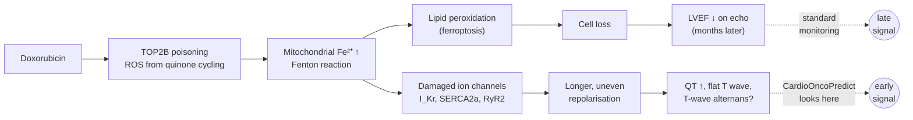
```mermaid
flowchart LR
    A["Doxorubicin"] --> B["TOP2B poisoning<br/>ROS from quinone cycling"]
    B --> C["Mitochondrial Fe²⁺ ↑<br/>Fenton reaction"]
    C --> D["Lipid peroxidation<br/>(ferroptosis)"]
    C --> E["Damaged ion channels<br/>I_Kr, SERCA2a, RyR2"]
    E --> F["Longer, uneven<br/>repolarisation"]
    F --> G["QT ↑, flat T wave,<br/>T-wave alternans?"]
    D --> H["Cell loss"]
    H --> I["LVEF ↓ on echo<br/>(months later)"]
    G -.->|"CardioOncoPredict<br/>looks here"| J(("early<br/>signal"))
    I -.->|"standard<br/>monitoring"| K(("late<br/>signal"))
```

Damaged membranes and oxidised channel proteins change the ionic currents that end the action potential (Section 3). Clinically, anthracyclines are associated with QTc prolongation, ST-T changes, reduced QRS voltage and arrhythmias. **The specific link between anthracyclines and microvolt TWA is the hypothesis this project is built to test.** It is biologically plausible but not established. The closest evidence is indirect. In mice, two weeks after doxorubicin, isolated hearts showed beat-to-beat alternans of the calcium transient, the cellular process behind TWA, together with a fall in ejection fraction — at the same time as the mechanical damage, not before it [29]. Single human stem-cell-derived cardiomyocytes treated with doxorubicin developed mechanical alternans [30]. In one patient with leukaemia, alternans of the T-U wave large enough to see appeared after chemotherapy with the anthracyclines daunorubicin and aclarubicin, together with low potassium, which can cause it on its own [31]. A PubMed search on 3 October 2026 for `alternans AND (anthracycline* OR doxorubicin OR epirubicin OR daunorubicin)` returned four records: these three and a case series of electrical alternans caused by pericardial effusion. None measured microvolt TWA in patients receiving anthracyclines. Section 11 discusses this.

---

## 3. Physics: from ion channels to the voltage on the skin

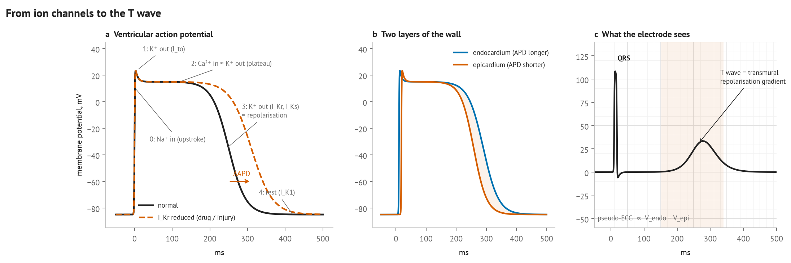

### 3.1 The membrane is a battery

Each ion species tends to its **Nernst equilibrium potential**:

```math
E_X = \frac{RT}{zF}\ln\frac{[X]_{out}}{[X]_{in}}
```

At body temperature (310 K) $`RT/F \approx 26.7`$ mV. For potassium ($`[K^+]_{out}=4`$ mM, $`[K^+]_{in}=140`$ mM): $`E_K = 26.7 \cdot \ln(4/140) \approx -95`$ mV. For sodium (145 and 10 mM): $`E_{Na} \approx +71`$ mV. The resting cardiomyocyte sits near $`E_K`$ because at rest mostly K⁺ channels (I_K1) are open.

### 3.2 The action potential is a current balance

The membrane is a capacitor $`C_m`$ (about 1 µF/cm²) in parallel with ion channels. Charge conservation (the Hodgkin–Huxley formalism [7]) gives

```math
C_m \frac{dV}{dt} = -\left(I_{Na} + I_{to} + I_{CaL} + I_{Kr} + I_{Ks} + I_{K1} + \dots\right),\qquad I_X = g_X(V,t)\,(V - E_X)
```

The phases in panel **a** of the figure above: **0** Na⁺ rushes in (upstroke); **1** transient K⁺ outflow (I_to); **2** plateau, where Ca²⁺ inflow balances K⁺ outflow; **3** repolarisation by the delayed-rectifier K⁺ currents I_Kr (the hERG channel) and I_Ks; **4** rest. Reducing $`g_{Kr}`$ (dashed curve) slows phase 3 and **prolongs the action-potential duration (APD)**. That is the cellular origin of a long QT interval.

### 3.3 Why there is a T wave at all

The endocardium (inner layer) repolarises later than the epicardium (outer layer). During phase 3 the two layers are at different potentials, so current flows across the wall. A distant electrode records approximately the difference $`V_{endo}(t)-V_{epi}(t)`$ (panel **c**), a "pseudo-ECG" [8]. **The T wave is the voltage gradient of repolarisation across the wall.** Anything that changes repolarisation unevenly changes the T wave.

### 3.4 The heart as a current dipole: Einthoven's triangle

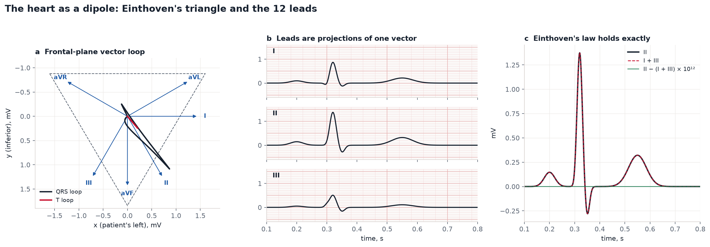

Seen from far away, the whole heart's activity is approximately one time-varying **current dipole** $`\mathbf{p}(t)`$ in a conducting medium (the torso, conductivity $`\sigma`$). The potential at distance $`r`$ in direction $`\hat{\mathbf r}`$ is

```math
\varphi(\mathbf r) = \frac{1}{4\pi\sigma}\,\frac{\mathbf p\cdot\hat{\mathbf r}}{r^2}
```

so every ECG lead measures a **projection** of the same vector, the *heart vector* $`\mathbf H(t) \propto \mathbf p(t)`$: $`V_{lead}(t) = \mathbf e_{lead}\cdot\mathbf H(t)`$. Einthoven's limb leads point at 0° (I), 60° (II) and 120° (III); the augmented leads follow from them (aVR = −(I+II)/2, aVL = (I−III)/2, aVF = (II+III)/2), and the precordial leads V1–V6 look at the heart in the horizontal plane. Because $`\mathbf e_{II} = \mathbf e_{I} + \mathbf e_{III}`$, **Einthoven's law II = I + III** holds exactly. Panel **c** checks the arithmetic: the residual is at floating-point precision (10⁻¹⁶ mV). That is a check of the construction, not evidence about real hearts. The synthetic 12-lead ECG used in this repository (`generate_12lead`) is built this way, a simplified relative of the dynamical ECG model of McSharry et al. [23]; its noise is added to each lead separately, so the identity holds for the clean signal only.

### 3.5 Why the T wave alternates: a period-doubling bifurcation

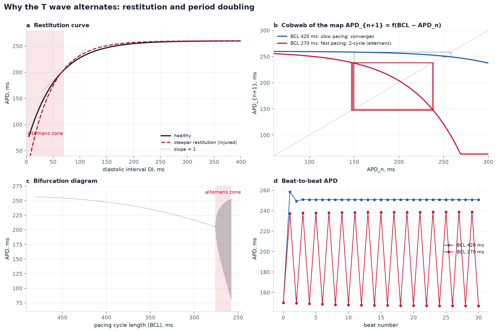

The duration of the next action potential depends on how long the cell rested before it, the **diastolic interval** DI. This *restitution* relation is well described by an exponential:

```math
\mathrm{APD}_{n+1} = f(\mathrm{DI}_n) = \mathrm{APD}_{max} - A\,e^{-\mathrm{DI}_n/\tau}, \qquad \mathrm{DI}_n = \mathrm{BCL} - \mathrm{APD}_n
```

where BCL is the cycle length (60 000 / heart rate, in ms). This is a one-dimensional **iterated map**. Let $`\mathrm{APD}^*`$ be its fixed point and $`\delta_n = \mathrm{APD}_n - \mathrm{APD}^*`$ a small perturbation. Linearising:

```math
\delta_{n+1} \approx -f'(\mathrm{DI}^*)\,\delta_n
```

The minus sign flips the perturbation on every beat: long, short, long, short. If the restitution slope $`f'(\mathrm{DI}^*) < 1`$ the oscillation dies out; if $`f'(\mathrm{DI}^*) > 1`$ it grows into a stable **2-cycle**. That is a period-doubling bifurcation, and it is **alternans** [9, 10]. The figure shows (a) the restitution curve and the region where its slope exceeds 1, (b) the cobweb diagram of the map converging at BCL 420 ms and locking into a 2-cycle at BCL 270 ms, (c) the bifurcation diagram over BCL, and (d) APD beat by beat.

Two consequences matter for this project:

- **Heart rate matters.** Faster rates shorten DI and push the system onto the steep part of the curve. That is why clinical TWA tests raise the heart rate to about 105–110 bpm with exercise [11].
- **Injury can make the curve steeper.** Impaired Ca²⁺ cycling and reduced repolarisation reserve can steepen restitution (red dashed curve), so alternans appears at lower heart rates. Restitution is the simplest picture; alternans can also start in the cell's calcium cycling without a steep APD restitution [10]. Alternating APD in the tissue appears on the ECG as an alternating T wave.

### 3.6 The physics of noise

The electrode also records things that are not the heart:

| Source | Frequency | Typical size | Remedy |
|---|---|---|---|
| Breathing, electrode drift | 0.1–0.5 Hz | 0.1–1 mV | 0.5 Hz high-pass |
| Mains interference | 50 Hz (60 Hz in the Americas) | 10–500 µV | low-pass below 50 Hz, notch |
| Skeletal muscle (EMG) | 20–500 Hz, broadband | 10–100 µV | low-pass 40 Hz, averaging over beats |

The alternans we look for (1–20 µV) is **smaller than all of these**. It can be recovered only because it has one exact property that noise lacks: it repeats with period exactly 2 beats. Section 4.4 turns this into mathematics.

---

## 4. Mathematics and signal processing

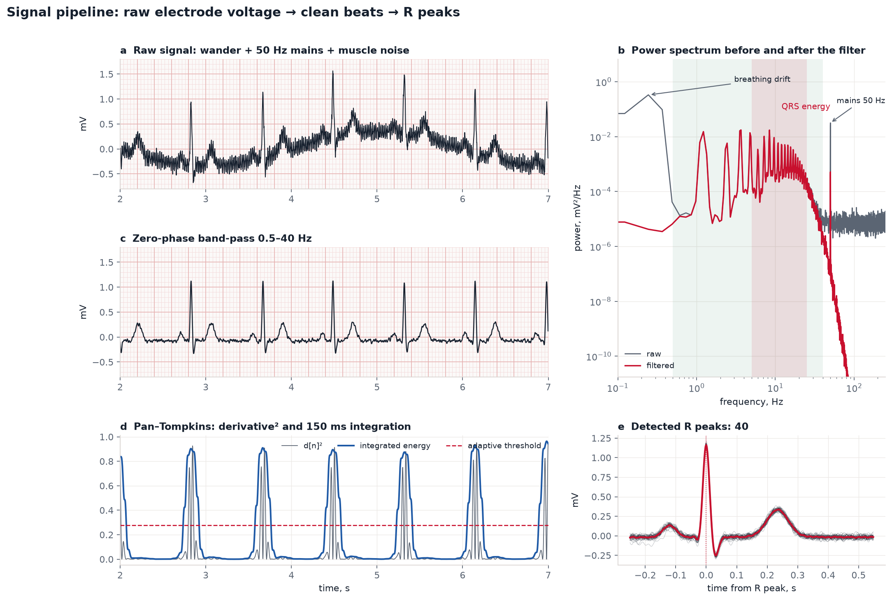

### 4.1 Sampling and quantisation

An analogue-to-digital converter samples the voltage at rate $`f_s`$: $`x[n] = V(n/f_s)`$. The Nyquist–Shannon theorem requires $`f_s > 2 f_{max}`$. The diagnostic ECG band extends to about 150 Hz, so 500 Hz is standard; the neural network uses the 100 Hz PTB-XL version, as the published PTB-XL benchmarks do [20]. PTB-XL stores 16-bit integers with 1 µV per step [12]; the physical value is $`V = (X_{raw} - \text{baseline})/\text{gain}`$.

### 4.2 Zero-phase Butterworth filtering

An $`N`$-th order Butterworth low-pass has the maximally flat magnitude response

```math
|H(f)|^2 = \frac{1}{1 + (f/f_c)^{2N}}
```

It is implemented as an IIR difference equation $`y[n] = \sum_k b_k x[n-k] - \sum_{k\ge1} a_k y[n-k]`$. Any causal filter delays different frequencies by different amounts, and that would distort the ST-T shape we want to measure. **filtfilt** runs the filter forward, reverses the output, runs it again and reverses back. In the frequency domain this multiplies by $`H(e^{j\omega})\,\overline{H(e^{j\omega})} = |H(e^{j\omega})|^2`$: a real, non-negative response with **exactly zero phase**. Panel **b** of the figure above shows the power spectrum before and after the filter: breathing drift below 0.5 Hz is removed and QRS energy (5–25 Hz) is kept. The 50 Hz mains line lies just above the 40 Hz edge, so at 500 Hz sampling it is weakened about 60-fold in power, not removed (60 Hz mains about 1,200-fold). The pipeline applies no separate notch filter; `preprocess.notch` exists for recordings that need one.

### 4.3 R-peak detection

**Method.** The detector follows Elgendi [32]: band-pass the ECG at 8–20 Hz (zero phase), square it, and compute two moving averages of the squared signal, one as long as a QRS complex (97 ms) and one as long as a heartbeat (611 ms). Wherever the short average stays above the long one plus 0.08 times the mean of the squared signal for at least 97 ms, that block is a QRS. The comparison is local: each beat is judged against the energy around it, not against the largest beats of the recording. Each block's peak is then moved to the largest |ECG| sample from 120 ms before to 60 ms after it, and two detections closer than 250 ms are one beat (the heart cannot beat faster than about 240 bpm). All constants are the paper's; none was tuned here. Panel **d** of the figure above shows the two averages and the blocks.

**Evaluation on real annotated ECGs.** `scripts/validate_rpeaks.py` scores the detector against cardiologists' beat annotations with the matching rule of ANSI/AAMI EC57 [36]: a detection is correct within 150 ms of an annotated beat. Sensitivity is the share of real beats found; precision is the share of detections that are real beats.

| Detector | MIT-BIH Arrhythmia [33]: 48 records, 360 Hz | Supraventricular Arrhythmia [34]: 78 records, 128 Hz |
|---|---|---|
| Up to v1.1: one fixed threshold | 90.69% / 99.96% | 93.29% / 99.94% |
| Pan–Tompkins adaptive thresholds [13], tried and rejected | 99.24% / 99.50% | 99.34% / 99.30% |
| **This version, Python** | **99.73% / 99.92%** | **99.50% / 99.93%** |
| This version, browser code | 99.76% / 99.92% | 99.70% / 99.91% |
| NeuroKit2 0.2.13 [35], for reference | 98.87% / 98.31% | 99.03% / 99.73% |

Each cell is sensitivity / precision on the first lead of every record, with whole records scored and the ventricular-flutter episode of record 207 left out; per-record counts are in [`docs/results/`](docs/results/). The two implementations differ slightly because their filters are built differently (§7).

Until version 1.1 the detector used one threshold for the whole recording, and on real arrhythmias that failed badly: where ectopic beats were much larger than normal ones it missed whole minutes of normal beats (record 228: 1,684 of 1,688). The adaptive thresholds of the original Pan–Tompkins paper [13] fixed most of that but lost every small beat of a synthetic bigeminy whose ectopic beats were three times larger; Elgendi's local comparison finds them (`test_small_beats_next_to_large_beats_are_found`). Both published methods were scored on both databases before one was chosen, so the second database is not an untouched test set. Two limits remain: when the large beats of a bigeminy are ten times larger the small ones are still missed, and three noisy or multiform-ectopy records (203, 106, 105) hold half of the remaining MIT-BIH errors. On the 66 development recordings of the PhysioNet TWA challenge the new detector changed one TWA estimate, by 0.03 µV, and no ranking (§7.1). On the synthetic tests it finds every beat and reproduces heart rate within 3% at 55, 75 and 110 bpm (`tests/test_twa.py`).

For TWA one wrong beat is worse than a small error in timing, because it flips the even/odd order of every beat after it, so three clean-up steps follow (each tested in `tests/test_twa.py`). A detection that splits one normal R-R interval in two and does not look like a QRS (correlation with the median QRS below 0.9) is removed; this is how a tall, sharp T wave counted as a beat is caught [27]. A gap of about two R-R intervals gets a flagged placeholder, so a missed beat does not flip the order. In a multi-lead recording all leads share the R peaks of the lead the others agree with most. Finally each beat is shifted by up to ±20 ms to the position where its QRS best matches the median QRS (cross-correlation).

### 4.4 The Spectral Method for T-wave alternans

**Step 1: build the beat matrix.** Align $`N = 128`$ consecutive beats on their R peaks. Take the ST-T window $`[R + 0.10\,s,\; R + 0.42\,s]`$, scaled by $`\sqrt{RR/0.8}`$ because the QT interval shortens with heart rate (Bazett). Measure every beat from its own isoelectric PR segment (80 to 40 ms before R) to remove residual drift. The result is a matrix $`s_k[n]`$: beat $`n`$, sample $`k`$ inside the window.

**Step 2: a time series for every point of the T wave.** For fixed $`k`$, the sequence $`s_k[0], s_k[1], \dots, s_k[N-1]`$ is the value of the same point of the T wave, beat after beat. Remove its mean and compute the periodogram:

```math
P_k(f) = \left|\frac{1}{N}\sum_{n=0}^{N-1} s_k[n]\,e^{-2\pi i f n}\right|^2,\qquad f = 0, \tfrac{1}{N}, \dots, \tfrac12\ \text{cycles/beat}
```

**Step 3: why alternans appears at exactly 0.5.** At $`f = 1/2`$: $`e^{-2\pi i n/2} = e^{-i\pi n} = (-1)^n`$. So for a pure alternating series $`s[n] = a(-1)^n`$:

```math
P(0.5) = \left|\frac1N\sum_n a(-1)^n(-1)^n\right|^2 = \left|\frac1N \cdot N a\right|^2 = a^2
```

All the alternans power collects in one frequency bin, and $`\sqrt{P(0.5)} = a`$ recovers the amplitude exactly. This is checked in `test_pure_alternating_series_gives_exact_amplitude`.

**Step 4: why 128 beats beat the noise.** For white noise of variance $`\sigma^2`$, every bin has expected value $`\mathbb E[P(f)] = \sigma^2/N`$. The noise floor **falls as 1/N** while the alternans peak $`a^2`$ stays constant. With 128 beats, the signal-to-noise ratio in power improves 128-fold (about 21 dB) compared with a single beat. That is why alternans of a few microvolts can be found under tens of microvolts of noise (§4.5).

**Step 5: aggregate and decide.** Average the spectra over all $`L`$ samples of the window, $`P(f) = \frac1L\sum_k P_k(f)`$. Estimate the noise from a reference band $`B = [0.44, 0.49]`$ cycles/beat, then

```math
V_{alt} = \sqrt{P(0.5) - \mu_B},\qquad K = \frac{P(0.5) - \mu_B}{\sigma_B}
```

The conventional criterion for significant alternans is $`V_{alt} \ge 1.9\,\mu V`$ **and** $`K \ge 3`$ [11, 14]. In this implementation $`V_{alt}`$ is the RMS alternans over the whole ST-T window. We also report `v_alt_peak_uv`, the alternans amplitude at the single most alternating sample; on synthetic data it recovers the injected amplitude within 15%.

In the figure at the top of this README: (a) the 128×L beat matrix minus the mean beat, where alternans appears as a red/blue checkerboard inside the ST-T window; (b) even and odd average beats; (c) one ST-T sample flipping up and down beat after beat; (d) the aggregate spectrum with a sharp peak at 0.5 cycles/beat far above the noise band. The bright stripes at the QRS in panel (a) are not alternans: at 500 Hz each R peak falls up to half a sample off the sampling grid, and on the steep QRS that is tens of microvolts. They are random from beat to beat, so they do not build up at 0.5 cycles/beat, and the ST-T window excludes the QRS anyway.

**Step 6: the whole recording and the decision.** A longer recording is scanned in 128-beat windows every 16 beats. In each window, beats whose R-R interval is more than 20% off the neighbouring intervals, or whose shape correlates below 0.9 with the median beat, are replaced by the median of the beats of the same parity, so the ABAB order survives an ectopic beat [28]; a window with more than 10% such beats is not used. The result follows the clinical rules [11]: *alternans criterion met* if some window has $`V_{alt} \ge 1.9\,\mu V`$ and $`K \ge 3`$ at a heart rate of at most 110 bpm with noise of at most 1.8 µV; *no significant alternans* if no window is significant and at least one clean window reaches 105 bpm; otherwise *indeterminate*, with the reason. The clinical rule asks for alternans sustained for at least a minute; a single 128-beat window, which lasts over a minute below 110 bpm, stands in for that.

### 4.5 When can alternans be measured? The detection map

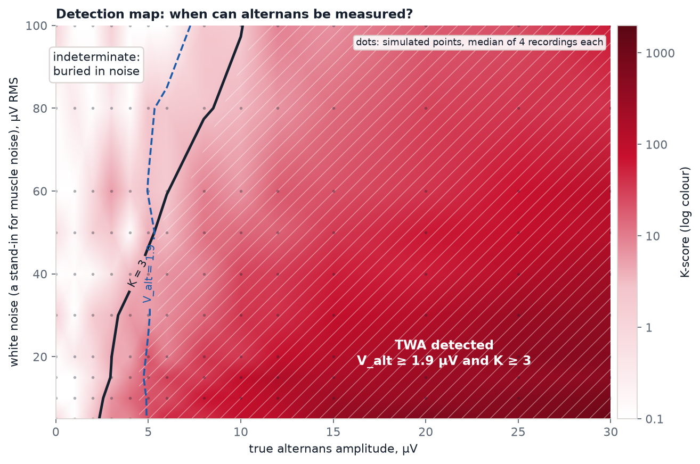

The map is the result of 560 complete analyses (14 alternans amplitudes × 10 noise levels × 4 random recordings, median K and $`V_{alt}`$). The black line is $`K = 3`$, the blue dashed line $`V_{alt} = 1.9\,\mu V`$; the hatched region satisfies both. Because $`V_{alt}`$ is an RMS over the whole ST-T window, here about 40% of the alternans at the T-wave peak, the 1.9 µV line sits near 5 µV of injected alternans even without noise.

Medians hide how often the method is right, so the same question was asked again with 12 recordings per point:

| White noise | No alternans: called significant | 3 µV | 5 µV |
|---|---|---|---|
| 5 µV | 0 of 12 | 0 of 12 | 10 of 12 |
| 20 µV | 0 of 12 | 0 of 12 | 8 of 12 |
| 60 µV | 1 of 12 | 3 of 12 | 5 of 12 |
| 100 µV | 1 of 12 | 3 of 12 | 3 of 12 |

Up to about 20 µV of noise, 5 µV of alternans is found in most recordings and nothing is found where there is none. By 60 µV the method starts to miss alternans and, occasionally, to report it where there is none. Under this simple model a recording device would need an input noise of roughly 20 µV RMS or less. Real muscle noise is not white and not stationary, so the real requirement has to be measured on real recordings.

**Sampling rate.** Clinical ECGs are sampled at 500 Hz or more, many Holter recorders at 128–250 Hz, and a Polar H10 chest strap at 130 Hz. At 130 Hz one sample lasts 7.7 ms, too coarse to superimpose beats to a microvolt. Since version 1.3, a recording sampled below 400 Hz is therefore interpolated by an integer factor to at least 500 Hz before the analysis (polyphase interpolation, as `scipy.signal.resample_poly`; the browser code computes the same filter to within 10⁻¹⁵). With 24 synthetic recordings per cell at 108 bpm (`scripts/simulate_sampling_rate.py`):

| Sampling | White noise | No alternans: called positive | 5 µV found | 10 µV found |
|---|---|---|---|---|
| 500 Hz | 20 µV | 0 of 24 | 24 of 24 | 24 of 24 |
| 250 Hz, interpolated to 500 Hz | 20 µV | 0 of 24 | 24 of 24 | 24 of 24 |
| 130 Hz, as recorded (up to 1.2) | 20 µV | 2 of 24 | 14 of 24 | 19 of 24 |
| 130 Hz, interpolated to 520 Hz | 20 µV | 1 of 24 | 22 of 24 | 24 of 24 |

With 5 µV of noise every rate found all alternans and called nothing positive without it. Interpolation cannot restore information the coarse sampling never recorded; what it fixes is the alignment of beats. A chest strap is therefore usable at rest with good skin contact, not during exercise, where its noise is far higher.

### 4.6 Modified Moving Average (cross-check)

The MMA method [15] keeps two running templates, one for even beats (A) and one for odd beats (B), and updates each with a limited step:

```math
A_n = A_{n-1} + \mathrm{clip}\!\left(\frac{\text{beat}_n - A_{n-1}}{8},\,\pm 32\,\mu V\right)
```

$`\mathrm{TWA}_{MMA}`$ is $`\max_k |A_k - B_k|`$ over the ST-T window: the full even-minus-odd difference, the scale on which clinical MMA cut-points such as 47 µV are defined, and about twice $`V_{alt}`$ for pure alternans. The step limit makes MMA robust to a single noisy or ectopic beat. It is reported next to the Spectral Method, but the two are not interchangeable: on the PhysioNet challenge records MMA agreed with the reference far worse than the Spectral Method did (§7.1).

### 4.7 Time–frequency view: the complex Morlet wavelet

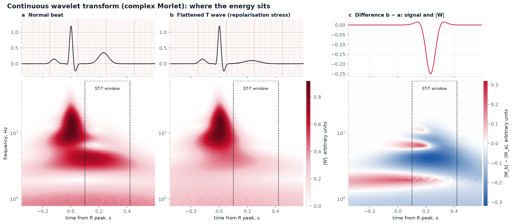

The Fourier transform says *which* frequencies are present but not *when*. The continuous wavelet transform answers both:

```math
W(a,b) = \frac{1}{\sqrt a}\int x(t)\,\psi^*\!\left(\frac{t-b}{a}\right)dt,\qquad \psi(t) = \frac{1}{\sqrt{\pi B}}\,e^{2\pi i C t}\,e^{-t^2/B}
```

This is the complex Morlet wavelet (`cmor1.5-1.0`: B = 1.5, C = 1.0) [24]. A Gaussian envelope reaches the lower bound of the time–frequency uncertainty relation $`\Delta t\,\Delta\omega \ge \tfrac12`$, so Morlet wavelets are as sharp in time and frequency together as physics allows. The scalogram $`|W|`$ shows the QRS as a burst at 8–30 Hz and the T wave as energy at 2–6 Hz. Panel **c** shows that flattening the T wave removes energy in the ST-T window at 3–6 Hz, while the wider, flatter wave keeps a little at about 2 Hz. Each beat is transformed on its own, on a flat baseline, so the slowest wavelets do not pick up the heart rate from neighbouring beats. The network in Section 5 works on the raw signal, not on this transform; the scalogram is a way to see what it has to work with.

### 4.8 Statistics for honest evaluation

- **ROC-AUC** equals the probability that a randomly chosen positive case gets a higher score than a randomly chosen negative case (the Mann–Whitney interpretation [16]). 0.5 is chance, 1.0 is perfect.
- **95% confidence intervals** come from 1,000 bootstrap resamples of the test set (2.5th and 97.5th percentiles).
- **The decision threshold** is chosen on the validation fold by maximising Youden's $`J = \text{sensitivity} + \text{specificity} - 1`$, and then applied unchanged to the test fold. Tuning on the test set would inflate the results.
- **Patient-wise split.** PTB-XL's folds never put the same patient in both training and test sets. Otherwise the model could recognise the person instead of the disease.

---

## 5. Computer science: the multimodal neural network

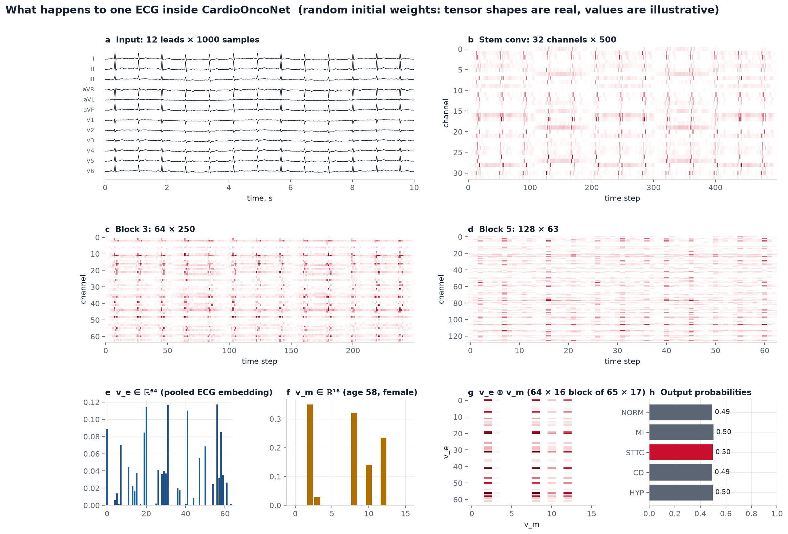

### 5.1 Architecture

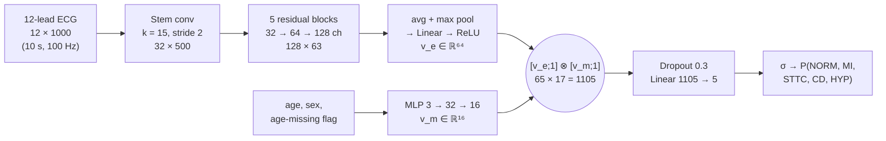
```mermaid
flowchart LR
    X["12-lead ECG<br/>12 × 1000<br/>(10 s, 100 Hz)"] --> S["Stem conv<br/>k = 15, stride 2<br/>32 × 500"]
    S --> R["5 residual blocks<br/>32 → 64 → 128 ch<br/>128 × 63"]
    R --> P["avg + max pool<br/>→ Linear → ReLU<br/>v_e ∈ ℝ⁶⁴"]
    M["age, sex,<br/>age-missing flag"] --> MLP["MLP 3 → 32 → 16<br/>v_m ∈ ℝ¹⁶"]
    P --> F(("[v_e;1] ⊗ [v_m;1]<br/>65 × 17 = 1105"))
    MLP --> F
    F --> H["Dropout 0.3<br/>Linear 1105 → 5"]
    H --> O["σ → P(NORM, MI,<br/>STTC, CD, HYP)"]
```

**1D convolution.** Each output channel $`c`$ slides a learned kernel across all 12 leads:

```math
y_c[t] = b_c + \sum_{l=1}^{12}\sum_{j=0}^{K-1} w_{c,l,j}\; x_l[s\,t + j - \lfloor K/2\rfloor]
```

Early layers learn local shapes (QRS slopes, T-wave curvature); deeper layers with stride 2 see longer context. Five blocks reduce the time axis from 1000 to 63 while the channel count grows from 12 to 128.

**Residual blocks** [17] compute $`y = \mathrm{ReLU}(x + F(x))`$, where $`F`$ is conv → BatchNorm → ReLU → dropout → conv → BatchNorm. The identity path lets gradients flow through deep networks. **BatchNorm** normalises each channel to zero mean and unit variance over the batch, then rescales with learned $`\gamma, \beta`$. **Global pooling** concatenates the time average and the time maximum of every channel, so the embedding captures both typical morphology and the most extreme event.

### 5.2 Bilinear (tensor) fusion: why multiply instead of concatenate

The same ECG finding can mean different things in different patients, for example at different ages. With plain concatenation $`[v_e; v_m]`$ followed by a linear layer, the score is a *sum* of ECG and metadata effects, so no interaction is possible. The outer product creates **every pairwise product** $`v_{e,i}\,v_{m,j}`$. Appending a constant 1 to each vector first (the Tensor Fusion Network trick [18]) keeps the unimodal terms as well:

```math
z = \begin{bmatrix} v_e \\ 1\end{bmatrix} \otimes \begin{bmatrix} v_m \\ 1\end{bmatrix} = \begin{bmatrix} v_e v_m^\top & v_e \\ v_m^\top & 1 \end{bmatrix} \in \mathbb R^{65\times17}
```

The flattened 1105-dimensional vector contains the interactions, the ECG-only features, the metadata-only features and a constant. The fused model therefore contains the concatenation model as a special case and cannot be worse than it in expressive power.

**Parameter count** (computed by `count_parameters`): ECG encoder 567,296; metadata MLP 656; fusion head 1105 × 5 + 5 = 5,530; **total 573,482** (2.3 MB in float32).

### 5.3 Learning

**Loss.** Each of the 5 classes is an independent yes/no question (an ECG can show both MI and ST-T change), so the loss is binary cross-entropy on logits $`z`$:

```math
\mathcal L = -\frac1C\sum_{c=1}^{C}\Big[w_c\, y_c \log\sigma(z_c) + (1-y_c)\log\big(1-\sigma(z_c)\big)\Big],\qquad \sigma(z)=\frac{1}{1+e^{-z}}
```

The positive weight $`w_c = \sqrt{(1-\pi_c)/\pi_c}`$ (capped) compensates for rare classes with prevalence $`\pi_c`$. A useful identity: $`\partial \mathcal L/\partial z_c = (\sigma(z_c) - y_c)/C`$ for $`w_c = 1`$. The gradient is simply "prediction minus truth", and back-propagation carries it through the fusion product via the product rule: $`\partial z_{ij}/\partial v_{e,i} = v_{m,j}`$.

**Optimiser.** AdamW [19] keeps running means of the gradient and of its square, $`m_t = \beta_1 m_{t-1} + (1-\beta_1)g_t`$ and $`v_t = \beta_2 v_{t-1} + (1-\beta_2)g_t^2`$, and updates $`\theta \leftarrow \theta - \eta\,\hat m_t/(\sqrt{\hat v_t}+\epsilon) - \eta\lambda\theta`$ with decoupled weight decay $`\lambda = 0.01`$. The learning rate follows a **one-cycle** schedule (warm-up, then cosine decay). Gradients are clipped to norm 1. Training stops early when validation macro-AUC has not improved for 8 epochs.

**Data augmentation.** During training each standardised ECG is scaled in amplitude (standard deviation 10%, like changing electrode contact), given a 0.3 Hz baseline wave of up to 0.1 standard deviations and white noise of 0.02 standard deviations. Because the inputs are standardised per lead, these are relative units: mild versions of the artefacts in Section 3.6, not their full size.

### 5.4 Data: PTB-XL

PTB-XL [12] contains **21,799** clinical 12-lead, 10-second ECGs from **18,869** patients, annotated by up to two cardiologists with SCP-ECG statements, which aggregate into 5 diagnostic super-classes: **NORM** (normal), **MI** (myocardial infarction), **STTC** (ST/T change), **CD** (conduction disturbance) and **HYP** (hypertrophy). We use the official split: folds 1–8 for training, 9 for validation, 10 for testing; ECGs with no diagnostic super-class are left out, as in the published benchmarks. The published deep-learning models reach a macro-AUC of 0.92–0.93 on this task [20]; that is the target for a correct pipeline.

**Why PTB-XL if it has no chemotherapy data?** No public ECG dataset labelled for anthracycline cardiotoxicity exists at this scale. PTB-XL is used to show that the network and training code work on real clinical ECGs, and the **STTC** class (repolarisation abnormalities) is the closest available proxy for the electrical phenotype we care about. The model will then be adapted (fine-tuned) to cardio-oncology data once a clinical partner provides it (see [ROADMAP.md](ROADMAP.md)).

**Results.** One training run (seed 42, 17,084 / 2,146 / 2,158 ECGs; best validation macro-AUC 0.926 at epoch 16, early stop at 24) on an Apple Silicon laptop. The test fold was used once, after training had finished. 95% CIs are from 1,000 bootstrap resamples of the test fold; the threshold for sensitivity and specificity was fixed on the validation fold (Youden's J) before testing.

| Class | Test AUC [95% CI] | Sensitivity | Specificity |
|---|---|---|---|
| NORM | 0.943 [0.934, 0.951] | 0.92 | 0.82 |
| MI | 0.917 [0.906, 0.929] | 0.81 | 0.86 |
| STTC | 0.934 [0.923, 0.946] | 0.87 | 0.83 |
| CD | 0.915 [0.899, 0.932] | 0.82 | 0.89 |
| HYP | 0.895 [0.874, 0.915] | 0.86 | 0.76 |
| **Macro average** | **0.921** | | |

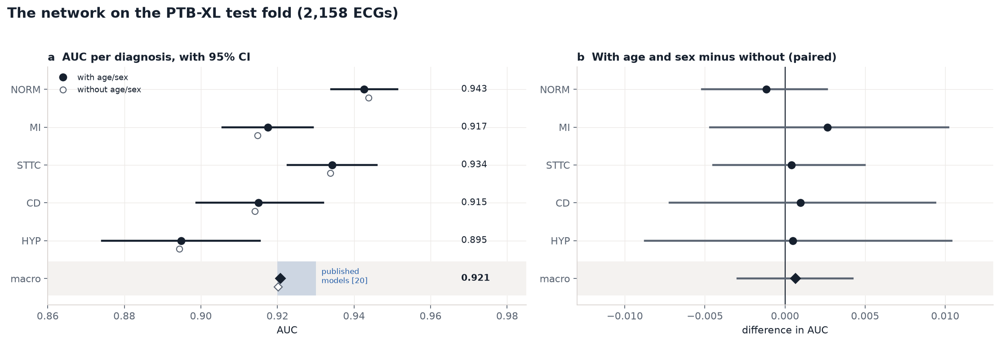

The ROC curves themselves are in [`models/ptbxl-1.0/roc_test.png`](models/ptbxl-1.0/roc_test.png). So the pipeline reaches the published level: it is correct, but not better than existing models, and was never meant to be. The trained weights, ONNX copy and full metrics are in [`models/ptbxl-1.0/`](models/ptbxl-1.0/README.md) under CC BY 4.0, with their SHA-256 checksums; `tests/test_released_model.py` checks that they load and that the ONNX copy computes the same outputs.

**Does the age/sex fusion help? Not here.** The same network trained with age and sex set to zero (`--no-meta`) reached 0.920. On the same 2,158 test ECGs the difference is **+0.0007, 95% CI [−0.003, +0.004]** (paired bootstrap with 2,000 resamples, `scripts/compare_ptbxl_runs.py`), and every per-class CI includes zero. For these five diagnoses the ECG already carries the information; metadata may matter more for cardiotoxicity, where dose and age are known risk factors [1], but that is a hypothesis, not a result. Each model was trained once, so the spread between random seeds is not measured.

---

## 6. Deployment: edge devices, federated learning, hospital systems

### 6.1 Wearables: ONNX and INT8

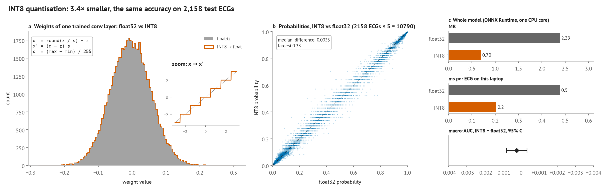

This section is a plan, not a result: the network is trained on PTB-XL ([§5.4](#54-data-ptb-xl)), but the web tool does not use it (the browser runs only the TWA signal processing), and no wearable runs it. `train_ptbxl.py --export-onnx` writes the trained network to **ONNX**, an open format that ONNX Runtime can execute on phones and in browsers (onnxruntime-web). A wearable microcontroller would need a further conversion to a microcontroller runtime. To fit such devices, weights can be quantised to 8-bit integers with an affine map [21]:

```math
q = \mathrm{round}(x/s) + z,\qquad \hat x = (q - z)\,s,\qquad s = \frac{x_{max}-x_{min}}{255}
```

The figure quantises one layer of the trained network (panel a); the rounding error is uniform in $`[-s/2, s/2]`$ (panel b). For the whole network the arithmetic is simple: 573,482 weights take 2.29 MB as 32-bit floats and 0.57 MB as 8-bit integers. The whole model has not been quantised (`legacy/export_edge_onnx.py` does it for a toy network); its accuracy after quantisation would have to be measured again on the test set.

### 6.2 Federated learning

ECGs are sensitive personal data and usually cannot leave a hospital. In **federated averaging** (FedAvg) [22], each hospital $`k`$ trains on its own $`n_k`$ records and sends only model weights $`W_k`$; the server combines them

```math
W_{global} = \sum_{k=1}^{K}\frac{n_k}{n}\,W_k,\qquad n = \sum_k n_k
```

and sends $`W_{global}`$ back. `legacy/federated_fhir_core.py` demonstrates the aggregation step. A real deployment would add secure aggregation and differential privacy, since weights alone can leak information.

### 6.3 HL7 FHIR R4

FHIR is the format hospital systems use to exchange results, so the tool can export its output as a FHIR `DiagnosticReport` for research pipelines. The export is research data and must not be filed in a patient's record. `cardioonco/fhir.py` uses only real codes for standard concepts: category **EC** (Electrocardiac) from HL7 table v2-0074, code **LOINC 11524-6** "EKG study", UCUM units (`uV`). Project-specific measurements (K-score, model probabilities) are coded in a clearly named *local* code system instead of invented codes that look official. Every report is tagged `research-only` and has status `preliminary`.

---

## 7. What has been verified so far

| Claim | Evidence | Status |
|---|---|---|
| A pure alternating series gives $`V_{alt} = a`$ exactly | `test_pure_alternating_series_gives_exact_amplitude` | ✅ |
| R-peak detection is correct at 55 / 75 / 110 bpm | `test_r_peak_detection` | ✅ |
| R-peak detection on real annotated ECGs: 99.73% / 99.92% (MIT-BIH), 99.50% / 99.93% (SVDB) | `scripts/validate_rpeaks.py`, [§4.3](#43-r-peak-detection) | ✅ |
| Small beats next to large ectopic beats are found, in Python and in the browser | `test_small_beats_next_to_large_beats_are_found`, `test_js_finds_small_beats_next_to_large_ones` | ✅ |
| No false TWA without alternans (K < 3) | `test_no_alternans_is_not_called_positive` | ✅ |
| $`V_{alt}`$ grows monotonically; peak estimator recovers 40 µV within 15% | `test_strong_alternans_is_positive_and_monotonic` | ✅ |
| Browser (JS) and Python give the same heart rate, V_alt (±10%), outcome and reason | `tests/test_js_parity.py` | ✅ |
| A T wave mistaken for a beat is removed; a missed beat does not flip the ABAB phase | `test_extra_detection_on_t_wave_is_removed`, `test_missed_beat_keeps_abab_parity` | ✅ |
| Too-short recordings are refused, not called negative | `test_short_recording_is_refused_not_called_negative` | ✅ |
| Agreement with the PhysioNet 2008 TWA challenge reference | `scripts/validate_twadb.py`, [§7.1](#71-check-against-the-physionet-twa-challenge) | ⚠️ partial |
| Training pipeline runs end to end; the exported ONNX model gives the same outputs as PyTorch in ONNX Runtime | `tests/test_train_smoke.py` | ✅ |
| The synthetic 12-lead model obeys Einthoven's law (by construction; an arithmetic check) | Figure 3c (residual ≈ 10⁻¹⁶ mV) | ✅ |
| Network accuracy on real ECGs: test macro-AUC 0.921, at the published level of 0.92–0.93 [20] | `models/ptbxl-1.0/metrics.json`, [§5.4](#54-data-ptb-xl) | ✅ |
| Age/sex fusion improves the PTB-XL diagnoses | `models/ptbxl-1.0/comparison_meta_vs_nometa.json`: +0.0007 [−0.003, +0.004] | ❌ no measurable gain |
| TWA is associated with anthracycline cardiotoxicity | needs a clinical cohort | ❌ not yet studied |

Python vs JavaScript on the same synthetic signal (128 beats at 75 bpm, seed 3, 50 Hz hum 20 µV); V_alt / K / outcome:

| Injected alternans | Noise | Python | JavaScript |
|---|---|---|---|
| 0 µV | 15 µV | 0.00 / −1.3 / indeterminate | 0.00 / −1.7 / indeterminate |
| 5 µV | 10 µV | 2.15 / 16.6 / positive | 1.97 / 13.5 / positive |
| 20 µV | 15 µV | 8.78 / 260 / positive | 8.45 / 246 / positive |
| 20 µV | 60 µV | 9.91 / 25.3 / indeterminate | 9.09 / 30.2 / indeterminate |

The two filters are built differently (a 4th-order Butterworth in Python, biquads in the browser), so V_alt differs by up to 9%. The outcome and its reason are the same in every case. The first row is indeterminate rather than negative because 75 bpm is below the 105 bpm the method requires for a negative result.

### 7.1 Check against the PhysioNet TWA challenge

The [T-Wave Alternans Challenge Database](https://physionet.org/content/challenge-2008/1.0.0/) [26] has 100 two-minute recordings: 68 real ECGs from five PhysioNet databases and 32 simulated ones. There is no true alternans amplitude to compare with. What exists is a reference ranking of the 100 records, built from the median rank given by the 19 entries that told the simulated records with much and little alternans apart, and agreement with it is scored by Kendall's rank correlation τ. Those 19 entries scored between 0.451 and 0.911 against it, a comparison that favours them because the reference is their own consensus; the organisers called a score above 0.436 significant ([final scores](https://physionet.org/files/challenge-2008/1.0.0/final-scores)).

`scripts/validate_twadb.py` runs the whole pipeline on every lead and ranks the records by the median over leads of the significance-gated amplitude: in each lead, the largest V_alt among 128-beat windows with K ≥ 3, or 0 if there is none.

| Version | All 100 | Synthetic (32) | Real, held out (34) |
|---|---|---|---|
| 0.4 — first 128 beats, one fixed window | 0.095 (p = 0.16) | 0.14 | 0.04 |
| 0.6 (and 1.0–1.1, same algorithm) | **0.43** (p ≈ 10⁻⁸ against no association) | 0.48 | 0.08 (p = 0.59) |

The 0.43 of version 0.6 is just below the organisers' 0.436 line and below every one of the 19 entries that formed the reference.

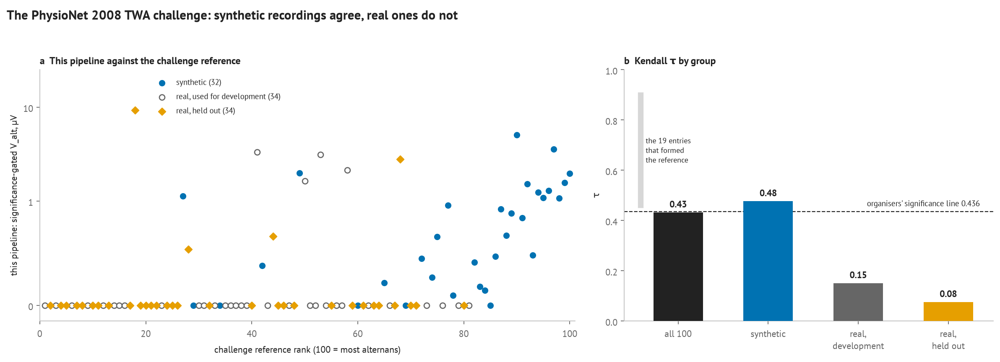

Panel a shows where the 0.43 comes from: on the synthetic recordings (blue) the estimate rises with the reference rank, while almost every real recording gets 0, that is, no 128-beat window with significant alternans. The per-record values are in [`docs/results/twadb_v0.6.0.csv`](docs/results/twadb_v0.6.0.csv), with the challenge reference ranks (ODC-By).

What changed between them, in order of effect:

1. **Beats that are not beats.** On several synthetic records the T wave is taller and sharper than the QRS, and the detector counted it as a beat. One extra beat flips the even/odd order of every beat after it, and the alternans cancels out. Detections that split one normal R-R interval in two and don't look like a QRS are now removed [27]; a gap of two R-R intervals gets a placeholder so the order survives a missed beat; the leads of one recording share one set of R peaks.
2. **Ectopy control that flagged everything.** The window used to compare beat shapes ran 0.5 s past the R peak, which at 128 bpm reaches into the next beat, so almost every beat looked abnormal. It now ends where the ST-T window ends, and R-R intervals are compared with their neighbours instead of the whole-recording median, so a slowly drifting heart rate is not mistaken for ectopy.
3. **The baseline.** Each beat's ST-T segment was centred on its own median, which removes part of the alternans. It is now measured from the PR segment, as usual for the method.
4. **Beat alignment** by QRS cross-correlation, and a record-level estimate taken as the median over leads, so one noisy lead cannot carry a record.

**How the numbers were kept honest.** Changes were first made on the 32 synthetic records alone. Version 0.5 was then frozen and run once on the 68 real records: τ = 0.00. After that the real records were split in half by source database with a fixed seed. Version 0.6 was developed on one half and run once on the other. That second half is the "held out" column. It is not perfectly clean, because the τ of version 0.5 over all 68 real records had already been seen.

**What this means.** The overall agreement comes from two things: telling the simulated recordings with alternans apart from the real ones, and ordering the simulated ones. On real ECGs the ranking does not agree with the 2008 consensus beyond chance. Even the plain difference between the average even and odd beat does not (τ ≈ 0.01 on the development half), so part of the gap may lie in the reference itself, which is an average of other algorithms and not measured truth. Either way, this project has **not** shown that its TWA estimate tracks alternans in real patients; that needs recordings with a known answer, such as paced or exercise tests.

Data: PhysioNet Challenge 2008, Open Data Commons Attribution License v1.0; cite Moody [26] and Goldberger et al. (PhysioNet). To reproduce:

```bash
python -c "import wfdb; wfdb.dl_database('twadb', dl_dir='data/twadb')"
curl -o data/twadb/reference-ranks https://physionet.org/files/challenge-2008/1.0.0/reference-ranks
curl -o data/twadb/about-records.txt https://physionet.org/files/challenge-2008/1.0.0/about-records.txt
python scripts/validate_twadb.py
```

---

## 8. Repository map

```
cardioonco/            core library (tested; `pip install .` needs only numpy and scipy)
  synth.py             synthetic single-lead and 12-lead (dipole) ECG with alternans
  preprocess.py        Butterworth filtfilt, notch, R-peak detection (Elgendi), false-beat removal, shared R peaks
  twa.py               Spectral Method, MMA, whole-recording windows, three outcomes
  model.py             CardioOncoNet: 1D ResNet + MLP + tensor fusion
  fhir.py              HL7 FHIR R4 DiagnosticReport
train_ptbxl.py         training / evaluation on PTB-XL (bootstrap CIs, ONNX export)
models/ptbxl-1.0/      the trained network: PyTorch + ONNX weights, metrics, model card (CC BY 4.0)
predict.py             analyse one ECG file → JSON + FHIR
app.py                 Gradio TWA laboratory (python app.py)
scripts/
  download_ptbxl.sh    fetch PTB-XL from PhysioNet (1.7 GB zip, both sampling rates)
  fetch_ptbxl_100hz.py fetch only the 100 Hz records training needs (~0.5 GB, SHA-256 checked)
  compare_ptbxl_runs.py paired bootstrap comparison of two trained models on the same test ECGs
  wfdb_to_csv.py       convert one lead of a PhysioNet WFDB record to CSV for the web tool
  make_figures.py      regenerate every figure in docs/figures/{en,ru}
  validate_twadb.py    score the pipeline on the PhysioNet TWA challenge (§7.1)
  validate_rpeaks.py   score the R-peak detector on annotated databases (§4.3)
  simulate_sampling_rate.py what the analysis finds at 500, 250 and 130 Hz (§4.5)
tests/                 pytest: TWA maths, detector, JS/Python parity, EDF/BDF/CSV readers,
                       entry points, training smoke test, released model (Node runs the browser code)
index.html, ru.html    the web tool (GitHub Pages)
assets/js/             dsp.js (JS port of the maths), twa-worker.js (analysis off the page thread),
                       edf.js (EDF/BDF/CSV readers), site.js (page, charts, 3D anatomy)
assets/samples/        one real TWA challenge recording for the "Open a real ECG" button (ODC-By)
sw.js, manifest*.webmanifest, assets/icons/
                       offline cache and app install (service worker, web app manifests, icons)
docs/figures/{en,ru}/  every figure in this README, in English and Russian (scripts/make_figures.py)
docs/results/          per-record results behind §4.3, §4.5, §7.1 and figure 12
pyproject.toml         package metadata and optional dependency groups
CITATION.cff           how to cite this software
legacy/                early teaching prototypes kept for history (see legacy/README.md)
```

---

## 9. How to run everything

```bash
git clone https://github.com/podpirovlab/multimodal-cardiotoxicity-ai.git
cd multimodal-cardiotoxicity-ai
python -m venv .venv && source .venv/bin/activate
pip install -r requirements.txt pytest

python -m pytest -q                       # all tests (Node, if installed, runs the browser code too)
ln -s ../../scripts/pre-push .git/hooks/pre-push   # optional: run the tests before every git push
python predict.py --demo --alternans 20   # TWA analysis of a two-minute synthetic recording
python app.py                             # interactive lab at http://localhost:7860
python scripts/make_figures.py            # regenerate all figures
python scripts/simulate_sampling_rate.py  # TWA found at 500, 250 and 130 Hz sampling (§4.5)

# R-peak detector on cardiologist-annotated ECGs (~150 MB from PhysioNet)
python -c "import wfdb; wfdb.dl_database('mitdb', dl_dir='data/mitdb'); wfdb.dl_database('svdb', dl_dir='data/svdb')"
python scripts/validate_rpeaks.py && python scripts/validate_rpeaks.py --data data/svdb --out docs/results/rpeaks_svdb.csv

# real data: PTB-XL, ~0.5 GB of 100 Hz records (or: bash scripts/download_ptbxl.sh, 1.7 GB)
python scripts/fetch_ptbxl_100hz.py
# the released network on one real 10-second ECG
python predict.py --wfdb data/ptb-xl/records100/00000/00001_lr --checkpoint models/ptbxl-1.0/model.pt
# train it yourself (about 5 minutes on an Apple M5 laptop, whose GPU is used via mps,
# plus a minute to read the records the first time; much longer on a CPU)
python train_ptbxl.py --data data/ptb-xl --epochs 30 --export-onnx
python train_ptbxl.py --data data/ptb-xl --epochs 30 --no-meta --out runs/ptbxl_nometa   # ablation
python scripts/compare_ptbxl_runs.py runs/ptbxl runs/ptbxl_nometa                    # paired comparison
python scripts/make_figures.py --only 08 09 --checkpoint runs/ptbxl/model.pt   # figures 08-09 with your weights
```

---

## 10. What changed between versions

**0.3.** An internal review of version 0.2 found several places where the project claimed more than it did:

| Before | After |
|---|---|
| The web demo and `app.py` showed a fixed "93.42% risk" chosen by a drop-down menu | Every number is computed from the signal by the TWA algorithm |
| The demo recommended "reduce doxorubicin by 15%, start dexrazoxane" | Removed: a research prototype must not give treatment advice |
| FHIR report used invented LOINC/SNOMED codes and a genetics category | Real LOINC 11524-6 and HL7 v2-0074 "EC"; local codes clearly labelled |
| README described a *complex* Morlet transform while the code used the real `morl` wavelet | The complex Morlet `cmor1.5-1.0` is used and explained |
| The 3D heart highlighted a "ferroptosis focus" on one wall | Removed; anthracycline injury is diffuse |
| A "ROC-AUC" was computed on random synthetic labels | Replaced by a real PTB-XL evaluation pipeline with bootstrap CIs |
| No automated tests of the mathematics | Tests, including exact-amplitude and JS/Python parity checks |

**0.4.** The site became a research tool rather than a landing page: it opens with no result instead of an invented one, refuses recordings shorter than 64 beats instead of calling them negative, reports MMA on the clinical scale, attaches patient metadata to the export only on request, and states plainly that it is not a medical device.

**0.5–0.6.** The TWA analysis covers the whole recording, gives three outcomes, removes false beats and fills missed ones, aligns beats, uses the PR baseline, and was checked against the PhysioNet challenge with a development/held-out protocol (§7.1). The browser reads BDF and Russian-style CSV, runs the analysis off the page thread, shows lead anatomy in 3D, and makes no third-party requests.

**1.0.0.** The first archived release, with a DOI. The algorithm is 0.6's, unchanged; "1.0" marks a stable, citable version of the software, not a validated method.

**1.1.0.** The network is trained on PTB-XL for the first time (test macro-AUC 0.921) and released with its metrics; an ablation shows that the age/sex fusion gives no measurable gain on this task (§5.4). The web tool opens a real recording with one click, accepts dropped files, recognises EDF and BDF by their content rather than the file extension, prints the result, and works offline as an installable app. Every figure was reviewed and corrected (white rather than "muscle" noise where the simulation uses white noise, colour scales, the trained weights in figures 08–09, decimal commas in Russian), and figure 11 shows the PTB-XL results. The TWA algorithm is unchanged.

**1.1.1.** Documentation and validation outputs only; no algorithm or model changed. The README opens with what has been shown so far, and its formulas now render correctly on GitHub. Figure 12 and `docs/results/twadb_v0.6.0.csv` show the PhysioNet challenge check record by record, and `scripts/validate_twadb.py` now writes that table. Two more studies of anthracyclines and alternans are cited [30, 31], with the PubMed query that found them. The description of mains filtering is corrected: the 50 Hz line is weakened about 60-fold, not removed.

**1.2.0.** A new R-peak detector (Elgendi's two moving averages [32]), checked for the first time on cardiologist-annotated ECGs: 99.73% of beats found with 99.92% precision on the MIT-BIH Arrhythmia Database, against 90.69% / 99.96% for the old fixed-threshold detector, and 99.50% / 99.93% on a second database recorded at 128 Hz (§4.3). The browser runs the same method. On the PhysioNet TWA challenge's development recordings no ranking changed. `scripts/validate_rpeaks.py` and tests for small beats next to large ectopic beats were added; every journal article in the references now carries a verified DOI.

**1.3.0.** Recordings sampled below 400 Hz are interpolated to at least 500 Hz before the TWA analysis, in Python and in the browser. At 130 Hz, the rate of a chest-strap ECG, this raised the share of 10 µV alternans found in simulation from 19 to 24 of 24 recordings and halved the false positives (§4.5, `scripts/simulate_sampling_rate.py`). Recordings at 400 Hz and above are analysed exactly as before.

---

## 11. Limitations and ethics

- **The central hypothesis is unproven.** QT prolongation and ST-T changes are described after anthracyclines, but microvolt TWA as an *early* marker of anthracycline cardiotoxicity has not been established. This project provides the tools to test it; it does not claim the answer.
- **TWA needs long recordings.** The Spectral Method needs about 128 beats (roughly 2 minutes), ideally at a raised heart rate. A routine 10-second ECG contains about 12 beats. Practical use would need Holter or exercise recordings.
- **The clinical rules are simplified.** "Sustained for a minute" is approximated by one 128-beat window (§4.4), and sensitivity was measured only under white noise (§4.5).
- **Agreement on real ECGs is not shown.** On the PhysioNet challenge the ranking of real recordings does not agree with the reference beyond chance ([§7.1](#71-check-against-the-physionet-twa-challenge)).
- **The network is trained on a proxy task.** PTB-XL has no chemotherapy information, so the trained model recognises five general diagnoses, not cardiotoxicity; its STTC class is a proxy, not the target. It was trained once, and the age/sex fusion did not help on this task (§5.4).
- **Synthetic signals are simplified.** The dipole model ignores torso inhomogeneity and electrode placement variation; the alternans is injected as a clean amplitude modulation, whereas real TWA can vary in phase and shape.
- **Not a medical device.** No ethics approval, clinical validation or regulatory clearance. Any clinical study would require ethics-committee approval, informed consent and de-identified data.
- **Fairness.** PTB-XL comes from one German centre. A model trained on it may perform worse on other populations and devices; external validation is required.

**Licences and attribution.** The code is under the [MIT licence](LICENSE). The datasets are not included in the repository and keep their own licences: PTB-XL [12] is CC BY 4.0, and the PhysioNet/CinC Challenge 2008 T-Wave Alternans Database [26] is under the Open Data Commons Attribution License v1.0; both are distributed by PhysioNet (Goldberger et al., *Circulation* 2000;101:e215–e220). Two things derived from them are included under the same terms: the trained weights in `models/ptbxl-1.0/` (CC BY 4.0, from PTB-XL) and one challenge recording in `assets/samples/` (ODC-By). The web fonts in `assets/fonts/` (PT Serif, PT Sans, PT Mono by ParaType; Fraunces; Literata) are under the SIL Open Font License 1.1, with the licence texts in `assets/fonts/OFL.txt`.

---

## 12. References

1. Swain SM, Whaley FS, Ewer MS. Congestive heart failure in patients treated with doxorubicin: a retrospective analysis of three trials. *Cancer*. 2003;97(11):2869–2879. [doi:10.1002/cncr.11407](https://doi.org/10.1002/cncr.11407).
2. Cardinale D, Colombo A, Bacchiani G, et al. Early detection of anthracycline cardiotoxicity and improvement with heart failure therapy. *Circulation*. 2015;131(22):1981–1988. [doi:10.1161/CIRCULATIONAHA.114.013777](https://doi.org/10.1161/CIRCULATIONAHA.114.013777).
3. Lyon AR, López-Fernández T, Couch LS, et al. 2022 ESC Guidelines on cardio-oncology. *European Heart Journal*. 2022;43(41):4229–4361. [doi:10.1093/eurheartj/ehac244](https://doi.org/10.1093/eurheartj/ehac244).
4. Zhang S, Liu X, Bawa-Khalfe T, et al. Identification of the molecular basis of doxorubicin-induced cardiotoxicity. *Nature Medicine*. 2012;18(11):1639–1642. [doi:10.1038/nm.2919](https://doi.org/10.1038/nm.2919).
5. Fang X, Wang H, Han D, et al. Ferroptosis as a target for protection against cardiomyopathy. *PNAS*. 2019;116(7):2672–2680. [doi:10.1073/pnas.1821022116](https://doi.org/10.1073/pnas.1821022116).
6. Octavia Y, Tocchetti CG, Gabrielson KL, et al. Doxorubicin-induced cardiomyopathy: from molecular mechanisms to therapeutic strategies. *J Mol Cell Cardiol*. 2012;52(6):1213–1225. [doi:10.1016/j.yjmcc.2012.03.006](https://doi.org/10.1016/j.yjmcc.2012.03.006).
7. Hodgkin AL, Huxley AF. A quantitative description of membrane current and its application to conduction and excitation in nerve. *J Physiol*. 1952;117(4):500–544. [doi:10.1113/jphysiol.1952.sp004764](https://doi.org/10.1113/jphysiol.1952.sp004764).
8. Yan GX, Antzelevitch C. Cellular basis for the normal T wave and the electrocardiographic manifestations of the long-QT syndrome. *Circulation*. 1998;98(18):1928–1936. [doi:10.1161/01.CIR.98.18.1928](https://doi.org/10.1161/01.CIR.98.18.1928).
9. Nolasco JB, Dahlen RW. A graphic method for the study of alternation in cardiac action potentials. *J Appl Physiol*. 1968;25(2):191–196. [doi:10.1152/jappl.1968.25.2.191](https://doi.org/10.1152/jappl.1968.25.2.191).
10. Weiss JN, Karma A, Shiferaw Y, et al. From pulsus to pulseless: the saga of cardiac alternans. *Circulation Research*. 2006;98(10):1244–1253. [doi:10.1161/01.RES.0000224540.97431.f0](https://doi.org/10.1161/01.RES.0000224540.97431.f0).
11. Verrier RL, Klingenheben T, Malik M, et al. Microvolt T-wave alternans: physiological basis, methods of measurement, and clinical utility. *J Am Coll Cardiol*. 2011;58(13):1309–1324. [doi:10.1016/j.jacc.2011.06.029](https://doi.org/10.1016/j.jacc.2011.06.029).
12. Wagner P, Strodthoff N, Bousseljot RD, et al. PTB-XL, a large publicly available electrocardiography dataset. *Scientific Data*. 2020;7:154. [doi:10.1038/s41597-020-0495-6](https://doi.org/10.1038/s41597-020-0495-6). Goldberger AL, et al. PhysioBank, PhysioToolkit, and PhysioNet. *Circulation*. 2000;101(23):e215–e220. [doi:10.1161/01.CIR.101.23.e215](https://doi.org/10.1161/01.CIR.101.23.e215).
13. Pan J, Tompkins WJ. A real-time QRS detection algorithm. *IEEE Trans Biomed Eng*. 1985;BME-32(3):230–236. [doi:10.1109/TBME.1985.325532](https://doi.org/10.1109/TBME.1985.325532).
14. Rosenbaum DS, Jackson LE, Smith JM, et al. Electrical alternans and vulnerability to ventricular arrhythmias. *N Engl J Med*. 1994;330(4):235–241. [doi:10.1056/NEJM199401273300402](https://doi.org/10.1056/NEJM199401273300402). Smith JM, Clancy EA, Valeri CR, et al. Electrical alternans and cardiac electrical instability. *Circulation*. 1988;77(1):110–121. [doi:10.1161/01.CIR.77.1.110](https://doi.org/10.1161/01.CIR.77.1.110).
15. Nearing BD, Verrier RL. Modified moving average analysis of T-wave alternans to predict ventricular fibrillation with high accuracy. *J Appl Physiol*. 2002;92(2):541–549. [doi:10.1152/japplphysiol.00592.2001](https://doi.org/10.1152/japplphysiol.00592.2001).
16. Hanley JA, McNeil BJ. The meaning and use of the area under a receiver operating characteristic (ROC) curve. *Radiology*. 1982;143(1):29–36. [doi:10.1148/radiology.143.1.7063747](https://doi.org/10.1148/radiology.143.1.7063747).
17. He K, Zhang X, Ren S, Sun J. Deep residual learning for image recognition. *Proc. IEEE CVPR*. 2016:770–778. [doi:10.1109/CVPR.2016.90](https://doi.org/10.1109/CVPR.2016.90).
18. Zadeh A, Chen M, Poria S, Cambria E, Morency LP. Tensor Fusion Network for multimodal sentiment analysis. *Proc. EMNLP*. 2017:1103–1114. [doi:10.18653/v1/D17-1115](https://doi.org/10.18653/v1/D17-1115).
19. Loshchilov I, Hutter F. Decoupled weight decay regularization. *ICLR*. 2019. [arXiv:1711.05101](https://arxiv.org/abs/1711.05101).
20. Strodthoff N, Wagner P, Schaeffter T, Samek W. Deep learning for ECG analysis: benchmarks and insights from PTB-XL. *IEEE J Biomed Health Inform*. 2021;25(5):1519–1528. [doi:10.1109/JBHI.2020.3022989](https://doi.org/10.1109/JBHI.2020.3022989).
21. Jacob B, Kligys S, Chen B, et al. Quantization and training of neural networks for efficient integer-arithmetic-only inference. *Proc. IEEE/CVF CVPR*. 2018:2704–2713. [doi:10.1109/CVPR.2018.00286](https://doi.org/10.1109/CVPR.2018.00286).
22. McMahan HB, Moore E, Ramage D, Hampson S, Agüera y Arcas B. Communication-efficient learning of deep networks from decentralized data. *Proc. AISTATS*, PMLR 54:1273–1282. 2017. [proceedings.mlr.press/v54/mcmahan17a](https://proceedings.mlr.press/v54/mcmahan17a.html).
23. McSharry PE, Clifford GD, Tarassenko L, Smith LA. A dynamical model for generating synthetic electrocardiogram signals. *IEEE Trans Biomed Eng*. 2003;50(3):289–294. [doi:10.1109/TBME.2003.808805](https://doi.org/10.1109/TBME.2003.808805).
24. Torrence C, Compo GP. A practical guide to wavelet analysis. *Bull Am Meteorol Soc*. 1998;79(1):61–78. [doi:10.1175/1520-0477(1998)079&lt;0061:APGTWA&gt;2.0.CO;2](https://doi.org/10.1175/1520-0477%281998%29079%3C0061:APGTWA%3E2.0.CO%3B2).
25. Attia ZI, Kapa S, Lopez-Jimenez F, et al. Screening for cardiac contractile dysfunction using an artificial intelligence–enabled electrocardiogram. *Nature Medicine*. 2019;25(1):70–74. [doi:10.1038/s41591-018-0240-2](https://doi.org/10.1038/s41591-018-0240-2).
26. Moody GB. The PhysioNet/Computers in Cardiology Challenge 2008: T-wave alternans. *Computers in Cardiology*. 2008;35:505–508. [doi:10.1109/CIC.2008.4749089](https://doi.org/10.1109/CIC.2008.4749089).
27. Lipponen JA, Tarvainen MP. A robust algorithm for heart rate variability time series artefact correction using novel beat classification. *J Med Eng Technol*. 2019;43(3):173–181. [doi:10.1080/03091902.2019.1640306](https://doi.org/10.1080/03091902.2019.1640306).
28. Armoundas AA. On the estimation of T-wave alternans using the spectral fast Fourier transform method. *Heart Rhythm*. 2012;9(3):449–456. [doi:10.1016/j.hrthm.2011.10.013](https://doi.org/10.1016/j.hrthm.2011.10.013).
29. Azam MA, Chakraborty P, Bokhari MM, et al. Cardioprotective effects of dantrolene in doxorubicin-induced cardiomyopathy in mice. *Heart Rhythm O2*. 2021;2(6 Pt B):733–741. [doi:10.1016/j.hroo.2021.08.008](https://doi.org/10.1016/j.hroo.2021.08.008).
30. Ballan N, Shaheen N, Keller GM, Gepstein L. Single-cell mechanical analysis of human pluripotent stem cell-derived cardiomyocytes for drug testing and pathophysiological studies. *Stem Cell Reports*. 2020;15(3):587–596. [doi:10.1016/j.stemcr.2020.07.006](https://doi.org/10.1016/j.stemcr.2020.07.006).
31. Kanemoto N, Aoki N, Goto Y. Electrical alternans of the T-U wave without change in the QRS complex. *Internal Medicine*. 1992;31(4):486–488. [doi:10.2169/internalmedicine.31.486](https://doi.org/10.2169/internalmedicine.31.486).
32. Elgendi M. Fast QRS detection with an optimized knowledge-based method: evaluation on 11 standard ECG databases. *PLoS ONE*. 2013;8(9):e73557. [doi:10.1371/journal.pone.0073557](https://doi.org/10.1371/journal.pone.0073557).
33. Moody GB, Mark RG. The impact of the MIT-BIH Arrhythmia Database. *IEEE Eng Med Biol Mag*. 2001;20(3):45–50. [doi:10.1109/51.932724](https://doi.org/10.1109/51.932724).
34. Greenwald SD, Patil RS, Mark RG. Improved detection and classification of arrhythmias in noise-corrupted electrocardiograms using contextual information. *Proc. Computers in Cardiology*. 1990:461–464. [doi:10.1109/CIC.1990.144257](https://doi.org/10.1109/CIC.1990.144257).
35. Makowski D, Pham T, Lau ZJ, et al. NeuroKit2: a Python toolbox for neurophysiological signal processing. *Behav Res Methods*. 2021;53(4):1689–1696. [doi:10.3758/s13428-020-01516-y](https://doi.org/10.3758/s13428-020-01516-y).
36. ANSI/AAMI EC57:2012. Testing and reporting performance results of cardiac rhythm and ST segment measurement algorithms. Arlington, VA: AAMI; 2012.

---

**Author:** Petr Podpirov ([@podpirovlab](https://github.com/podpirovlab)), high-school student researcher. The code was developed with the help of AI coding assistants (Claude); every result in this document is reproducible with the commands in Section 9 and checked by the test suite.

**Citation:**

```bibtex
@software{podpirov2026cardiooncopredict,
  author  = {Podpirov, Petr},
  title   = {CardioOncoPredict: research software for measuring microvolt T-wave alternans},
  year    = {2026},
  version = {1.3.0},
  doi     = {10.5281/zenodo.23090355},
  url     = {https://github.com/podpirovlab/multimodal-cardiotoxicity-ai}
}
```

This DOI always resolves to the latest version; [Zenodo](https://doi.org/10.5281/zenodo.23090355) also lists a separate DOI for each version, which is the one to cite when exact reproducibility matters.

Released under the [MIT License](LICENSE).
