# CardioOncoPredict

**Поиск самого раннего электрического признака кардиотоксичности антрациклинов: микровольтной альтернации зубца T, которую извлекают из ЭКГ методами обработки сигналов и мультимодальной нейросетью.**

[](https://github.com/podpirovlab/multimodal-cardiotoxicity-ai/actions)


**[Интерактивная лаборатория →](https://podpirovlab.github.io/multimodal-cardiotoxicity-ai/ru.html)** · [English version](README.md) · [План развития](ROADMAP.ru.md)

> **Важно.** CardioOncoPredict — исследовательский и учебный прототип. Это не медицинское
> изделие: нет клинической валидации и регистрации. Его нельзя использовать для диагностики и
> решений о лечении. В разделе [11](#11-ограничения-и-этика) точно указано, что доказано, а что нет.

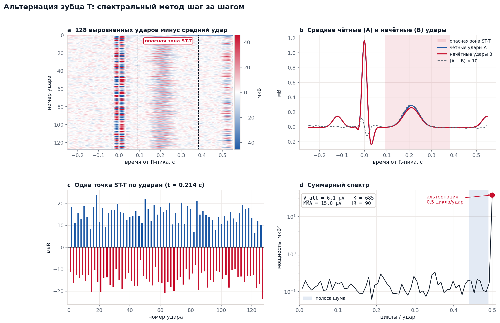

---

## Содержание

1. [Кратко](#1-кратко)
2. [Медицина и биохимия: как антрациклины повреждают сердце](#2-медицина-и-биохимия-как-антрациклины-повреждают-сердце)
3. [Физика: от ионных каналов к напряжению на коже](#3-физика-от-ионных-каналов-к-напряжению-на-коже)
4. [Математика и обработка сигналов](#4-математика-и-обработка-сигналов)
5. [Информатика: мультимодальная нейросеть](#5-информатика-мультимодальная-нейросеть)
6. [Внедрение: носимые устройства, федеративное обучение, больничные системы](#6-внедрение-носимые-устройства-федеративное-обучение-больничные-системы)
7. [Что уже проверено](#7-что-уже-проверено)
8. [Карта репозитория](#8-карта-репозитория)
9. [Как всё запустить](#9-как-всё-запустить)
10. [Что изменилось в версии 0.3](#10-что-изменилось-в-версии-03)
11. [Ограничения и этика](#11-ограничения-и-этика)
12. [Литература](#12-литература)

---

## 1. Кратко

**Проблема.** Антрациклины (доксорубицин, эпирубицин) — одни из самых эффективных противоопухолевых препаратов, но они дозозависимо повреждают сердечную мышцу. При кумулятивной дозе доксорубицина 550 мг/м² сердечная недостаточность развивается примерно у четверти пациентов [1]. Стандартный контроль — эхокардиография. Она замечает повреждение, когда фракция выброса уже снизилась.

**Гипотеза.** Повреждение ионных каналов кардиомиоцитов должно нарушать *реполяризацию* раньше, чем *сокращение*. Один из чувствительных маркеров нестабильной реполяризации — **альтернация зубца T (TWA, T-wave alternans)**: изменение сегмента ST-T через удар на 1–100 мкВ. На бумажной ЭКГ это 0,01–1 мм: глазом не увидеть, но математически измерить можно.

**Что есть в репозитории:**

| Уровень | Что делает | Где |
|---|---|---|
| Физическая модель | Синтетическая 12-канальная ЭКГ от движущегося диполя сердца с управляемой микровольтной альтернацией и реалистичным шумом | `cardioonco/synth.py` |
| Обработка сигнала | Фильтрация без сдвига фазы, поиск R-пиков (Пан–Томпкинс), выравнивание ударов | `cardioonco/preprocess.py` |
| Математика TWA | Спектральный метод (V_alt, K-score) и модифицированное скользящее среднее, покрыто тестами | `cardioonco/twa.py` |
| Нейросеть | 1D-ResNet по 12 отведениям + ветка «возраст/пол», объединение внешним (тензорным) произведением | `cardioonco/model.py` |
| Обучение на реальных ЭКГ | Полный пайплайн PTB-XL (21 799 клинических ЭКГ): разбиение по пациентам, бутстрэп-интервалы, экспорт ONNX | `train_ptbxl.py` |
| Совместимость с больницами | HL7 FHIR R4 `DiagnosticReport` с настоящими кодами LOINC / HL7 | `cardioonco/fhir.py` |
| Веб-лаборатория | Тот же алгоритм TWA на JavaScript, работает прямо в браузере | `ru.html`, `assets/js/dsp.js` |
| Иллюстрации | Все рисунки в этом файле построены кодом | `scripts/make_figures.py` |

---

## 2. Медицина и биохимия: как антрациклины повреждают сердце

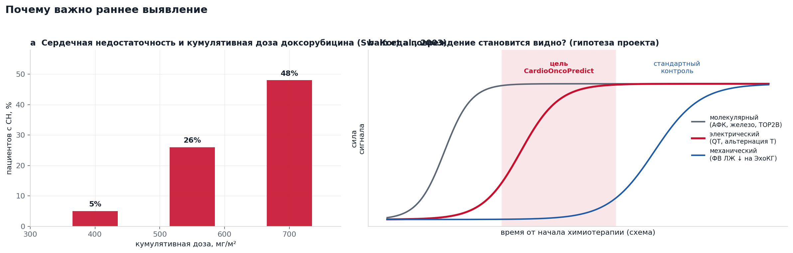

### 2.1 Масштаб проблемы

- Частота сердечной недостаточности круто растёт с кумулятивной дозой доксорубицина: **5 % при 400 мг/м², 26 % при 550 мг/м², 48 % при 700 мг/м²** (ретроспективный анализ трёх исследований, Swain et al. [1]).
- В проспективной когорте из **2625** пациентов, получавших антрациклины, кардиотоксичность возникла примерно у **9 %**, причём **98 %** случаев — в первый год. У большинства пациентов, у которых её выявили рано и начали лечение, функция сердца восстановилась полностью или частично [2].
- Рекомендации ESC 2022 по кардиоонкологии определяют *дисфункцию сердца, связанную с лечением рака*, по снижению фракции выброса ЛЖ, относительному снижению глобальной продольной деформации (GLS) более чем на 15 % или росту тропонина / натрийуретических пептидов [3]. Тонкая структура ЭКГ в этих критериях не используется.

### 2.2 Молекулярные механизмы (химия и биология)

Доксорубицин — антрациклин: плоская четырёхкольцевая **хиноновая** система, связанная с аминосахаром (дауносамином). Противоопухолевое действие — встраивание в ДНК (интеркаляция) и отравление топоизомеразы IIα в делящихся клетках. В сердце одновременно работают несколько механизмов:

1. **Топоизомераза IIβ (TOP2B).** В кардиомиоцитах есть TOP2B. Доксорубицин «замораживает» комплексы TOP2B–ДНК: возникают двуцепочечные разрывы и подавляются гены биогенеза митохондрий. Удаление TOP2B в кардиомиоцитах мышей защищает их [4].
2. **Окислительно-восстановительный цикл хинона.** Одноэлектронное восстановление (митохондриальным комплексом I и другими редуктазами) превращает хинон в семихинон-радикал, который отдаёт электрон кислороду:

   $$\mathrm{Q} + e^- \rightarrow \mathrm{Q}^{\bullet-}, \qquad \mathrm{Q}^{\bullet-} + \mathrm{O_2} \rightarrow \mathrm{Q} + \mathrm{O_2}^{\bullet-}$$

   Супероксид дисмутирует в перекись водорода: $2\,\mathrm{O_2^{\bullet-}} + 2\mathrm{H^+} \rightarrow \mathrm{H_2O_2} + \mathrm{O_2}$. Сердце особенно уязвимо: в нём много митохондрий и относительно мало каталазы.
3. **Железо и реакция Фентона.** Доксорубицин связывает железо и нарушает его обмен; в митохондриях накапливается Fe²⁺. Fe²⁺ превращает перекись в крайне активный гидроксильный радикал:

   $$\mathrm{Fe^{2+}} + \mathrm{H_2O_2} \rightarrow \mathrm{Fe^{3+}} + \mathrm{OH^-} + {}^{\bullet}\mathrm{OH}$$

4. **Ферроптоз.** Гидроксильные радикалы запускают цепное перекисное окисление полиненасыщенных фосфолипидов мембран. Когда глутатионпероксидаза 4 (GPX4) не успевает восстанавливать перекиси липидов, клетка гибнет железозависимым путём — *ферроптозом*. Fang et al. показали, что доксорубициновая кардиомиопатия у мышей во многом ферроптотическая и ослабляется хелаторами железа и ингибиторами ферроптоза [5].
5. **Обмен кальция.** Метаболит доксорубицинол и окислительный стресс нарушают работу SERCA2a и рианодиновых рецепторов (RyR2), поэтому цикл Ca²⁺ становится нестабильным от удара к удару [6].

### 2.3 От молекул к электричеству

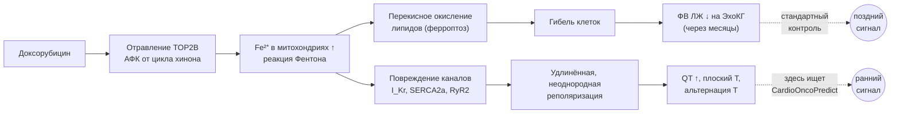

Повреждённые мембраны и окисленные белки каналов меняют ионные токи, которые завершают потенциал действия (раздел 3). В клинике после антрациклинов описаны удлинение QTc, изменения ST-T, снижение вольтажа QRS и аритмии. **Конкретная связь антрациклинов с микровольтной TWA — это гипотеза, для проверки которой создан проект.** Она биологически правдоподобна, но пока не доказана (см. раздел 11).

---

## 3. Физика: от ионных каналов к напряжению на коже

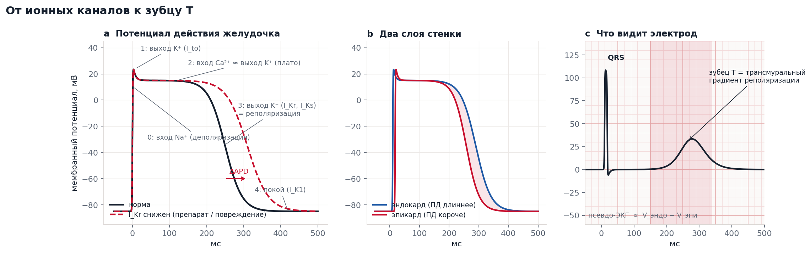

### 3.1 Мембрана — это батарейка

Каждый ион стремится к своему **равновесному потенциалу Нернста**:

$$E_X = \frac{RT}{zF}\ln\frac{[X]_{out}}{[X]_{in}}$$

При температуре тела (310 K) $RT/F \approx 26{,}7$ мВ. Для калия ($[K^+]_{out}=4$ мМ, $[K^+]_{in}=140$ мМ): $E_K = 26{,}7 \cdot \ln(4/140) \approx -95$ мВ. Для натрия (145 и 10 мМ): $E_{Na} \approx +71$ мВ. Кардиомиоцит в покое находится около $E_K$, потому что открыты в основном калиевые каналы (I_K1).

### 3.2 Потенциал действия — это баланс токов

Мембрана — конденсатор $C_m$ (около 1 мкФ/см²), параллельно которому включены ионные каналы. Из закона сохранения заряда (формализм Ходжкина–Хаксли [7]):

$$C_m \frac{dV}{dt} = -\left(I_{Na} + I_{to} + I_{CaL} + I_{Kr} + I_{Ks} + I_{K1} + \dots\right),\qquad I_X = g_X(V,t)\,(V - E_X)$$

Фазы на панели **a** рисунка выше: **0** — вход Na⁺ (деполяризация); **1** — кратковременный выход K⁺ (I_to); **2** — плато, где вход Ca²⁺ уравновешен выходом K⁺; **3** — реполяризация калиевыми токами задержанного выпрямления I_Kr (канал hERG) и I_Ks; **4** — покой. Снижение $g_{Kr}$ (пунктир) замедляет фазу 3 и **удлиняет потенциал действия (ДПД)**. Это клеточная причина удлинения интервала QT.

### 3.3 Откуда вообще берётся зубец T

Эндокард (внутренний слой) реполяризуется позже эпикарда (наружного). В фазе 3 слои находятся под разными потенциалами, и через стенку течёт ток. Удалённый электрод регистрирует приблизительно разность $V_{endo}(t)-V_{epi}(t)$ (панель **c**) — «псевдо-ЭКГ» [8]. **Зубец T — это градиент реполяризации поперёк стенки.** Всё, что меняет реполяризацию неравномерно, меняет зубец T.

### 3.4 Сердце как токовый диполь: треугольник Эйнтховена

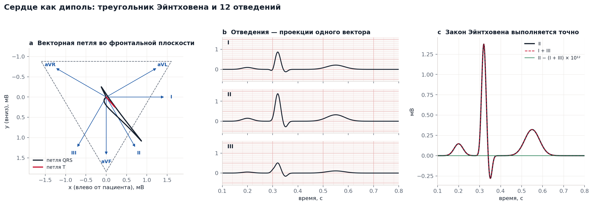

Издалека электрическая активность всего сердца приблизительно описывается одним меняющимся во времени **токовым диполем** $\mathbf{p}(t)$ в проводящей среде (грудная клетка с проводимостью $\sigma$). Потенциал на расстоянии $r$ в направлении $\hat{\mathbf r}$:

$$\varphi(\mathbf r) = \frac{1}{4\pi\sigma}\,\frac{\mathbf p\cdot\hat{\mathbf r}}{r^2}$$

Поэтому каждое отведение ЭКГ измеряет **проекцию** одного и того же вектора: $V_{lead}(t) = \mathbf e_{lead}\cdot\mathbf H(t)$. Отведения Эйнтховена направлены под 0° (I), 60° (II) и 120° (III); усиленные отведения выражаются через них (aVR = −(I+II)/2, aVL = (I−III)/2, aVF = (II+III)/2), а грудные V1–V6 смотрят на сердце в горизонтальной плоскости. Так как $\mathbf e_{II} = \mathbf e_{I} + \mathbf e_{III}$, **закон Эйнтховена II = I + III** выполняется точно. Панель **c** проверяет его численно: невязка на уровне машинной точности (10⁻¹⁶ мВ). Синтетическая 12-канальная ЭКГ проекта (`generate_12lead`) построена именно так.

### 3.5 Почему зубец T чередуется: бифуркация удвоения периода

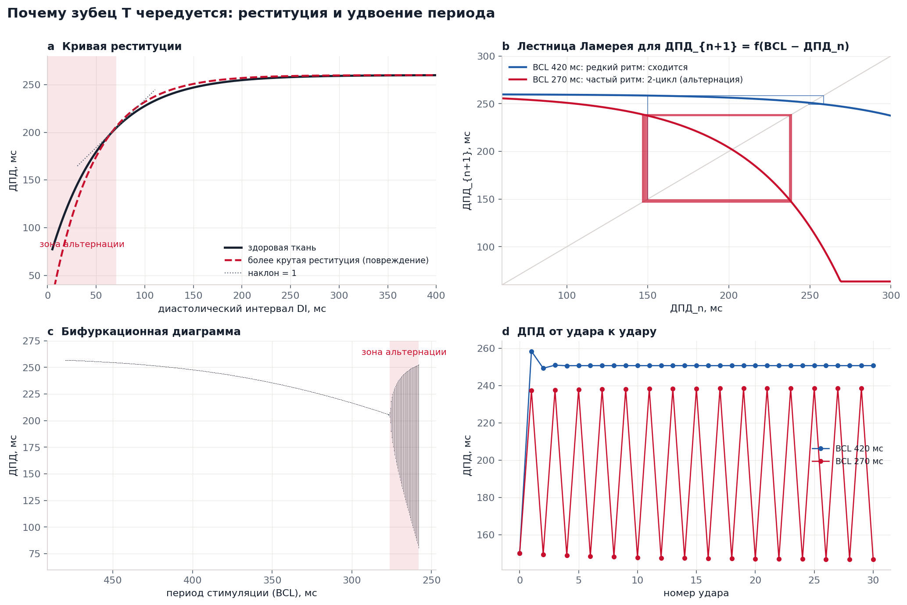

Длительность следующего потенциала действия зависит от того, сколько клетка отдыхала перед ним, — от **диастолического интервала** DI. Эта зависимость (*реституция*) хорошо описывается экспонентой:

$$\text{ДПД}_{n+1} = f(\mathrm{DI}_n) = \text{ДПД}_{max} - A\,e^{-\mathrm{DI}_n/\tau}, \qquad \mathrm{DI}_n = \mathrm{BCL} - \text{ДПД}_n$$

где BCL — длительность цикла (60 000 / ЧСС, мс). Это одномерное **итерационное отображение**. Пусть $\text{ДПД}^*$ — его неподвижная точка, а $\delta_n = \text{ДПД}_n - \text{ДПД}^*$ — малое отклонение. Линеаризуем:

$$\delta_{n+1} \approx -f'(\mathrm{DI}^*)\,\delta_n$$

Знак минус переворачивает отклонение на каждом ударе: длинный, короткий, длинный, короткий. Если наклон реституции $f'(\mathrm{DI}^*) < 1$, колебание затухает; если $f'(\mathrm{DI}^*) > 1$ — нарастает до устойчивого **2-цикла**. Это бифуркация удвоения периода, то есть **альтернация** [9, 10]. На рисунке: (a) кривая реституции и область, где наклон больше 1; (b) лестница Ламерея — сходимость при BCL 420 мс и 2-цикл при BCL 270 мс; (c) бифуркационная диаграмма; (d) ДПД от удара к удару.

Два следствия важны для проекта:

- **Важна частота сердечных сокращений.** Частый ритм укорачивает DI и выводит систему на крутой участок кривой. Поэтому в клинике TWA измеряют на нагрузке при ЧСС около 105–110 уд/мин [11].
- **Повреждение делает кривую круче.** Нарушенный цикл Ca²⁺ и сниженный «резерв реполяризации» увеличивают наклон реституции (красный пунктир), и альтернация появляется при меньшей ЧСС. Чередующаяся ДПД в ткани видна на ЭКГ как чередующийся зубец T.

### 3.6 Физика шума

Электрод записывает не только сердце:

| Источник | Частота | Типичная величина | Как убрать |
|---|---|---|---|
| Дыхание, дрейф электрода | 0,1–0,5 Гц | 0,1–1 мВ | фильтр высоких частот 0,5 Гц |
| Наводка от электросети | 50 Гц (60 Гц в Америке) | 10–500 мкВ | фильтр нижних частот ниже 50 Гц, режекторный фильтр |
| Скелетные мышцы (ЭМГ) | 20–500 Гц, широкополосный | 10–100 мкВ | фильтр 40 Гц, усреднение по ударам |

Искомая альтернация (1–20 мкВ) **меньше любой из этих помех**. Выделить её можно только потому, что у неё есть одно точное свойство, которого нет у шума: она повторяется с периодом ровно 2 удара. Раздел 4.4 превращает это в математику.

---

## 4. Математика и обработка сигналов

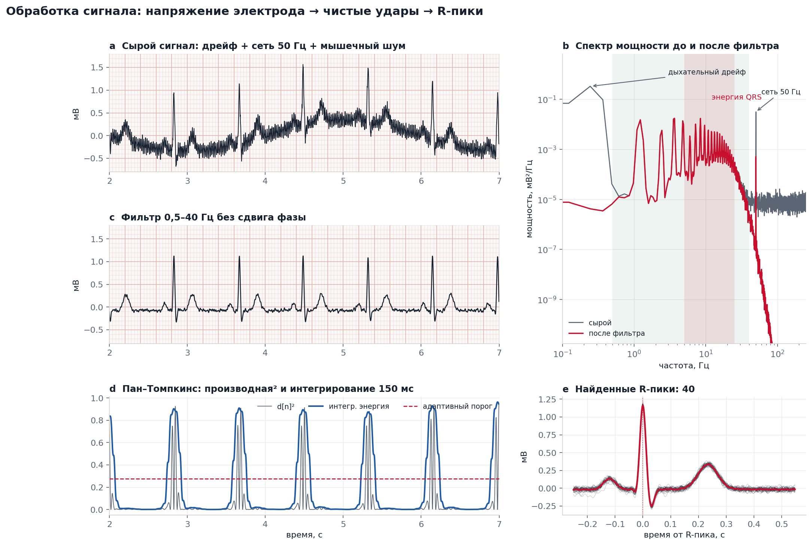

### 4.1 Дискретизация и квантование

АЦП измеряет напряжение с частотой $f_s$: $x[n] = V(n/f_s)$. По теореме Котельникова (Найквиста–Шеннона) нужно $f_s > 2 f_{max}$. Диагностическая полоса ЭКГ — до 150 Гц, поэтому стандарт — 500 Гц; нейросеть использует версию PTB-XL на 100 Гц, так как её классы определяются признаками ниже 50 Гц. PTB-XL хранит 16-битные целые числа с шагом 1 мкВ [12]; физическое значение $V = (X_{raw} - \text{baseline})/\text{gain}$.

### 4.2 Фильтр Баттерворта без сдвига фазы

Фильтр нижних частот Баттерворта порядка $N$ имеет максимально плоскую АЧХ:

$$|H(f)|^2 = \frac{1}{1 + (f/f_c)^{2N}}$$

Он реализуется разностным уравнением $y[n] = \sum_k b_k x[n-k] - \sum_{k\ge1} a_k y[n-k]$. Любой причинный фильтр задерживает разные частоты по-разному и исказил бы форму ST-T, которую мы измеряем. **filtfilt** прогоняет фильтр вперёд, разворачивает результат, прогоняет ещё раз и разворачивает обратно. В частотной области это умножение на $H(e^{j\omega})\,\overline{H(e^{j\omega})} = |H(e^{j\omega})|^2$: действительная неотрицательная характеристика с **нулевой фазой**. Панель **b** показывает спектр мощности до и после фильтра: дыхательный дрейф ниже 0,5 Гц и линия сети 50 Гц убраны, энергия QRS (5–25 Гц) сохранена.

### 4.3 Поиск R-пиков: алгоритм Пана–Томпкинса

По Пану и Томпкинсу [13]: полосовой фильтр 5–15 Гц (там сосредоточена энергия QRS); производная $d[n] = x[n+1]-x[n-1]$; квадрат $e[n] = d[n]^2$ (делает всё положительным и усиливает крутые фронты); интегрирование в скользящем окне 150 мс (примерно ширина QRS); затем выбор пиков выше адаптивного порога (30 % от 99-го перцентиля) с рефрактерным периодом 250 мс (сердце не бьётся чаще ~240 уд/мин). Каждый пик сдвигается к истинному максимуму отфильтрованной ЭКГ в пределах ±60 мс. На тестах детектор находит все удары и воспроизводит ЧСС с точностью 3 % при 55, 75 и 110 уд/мин (`tests/test_twa.py`).

### 4.4 Спектральный метод анализа альтернации зубца T

**Шаг 1: матрица ударов.** Выравниваем $N = 128$ последовательных ударов по R-пикам. Берём окно ST-T $[R + 0{,}10\,\text{с};\; R + 0{,}42\,\text{с}]$, масштабированное на $\sqrt{RR/0{,}8}$, потому что QT укорачивается с ростом ЧСС (формула Базетта). Вычитаем медиану каждого удара, чтобы убрать остаточный дрейф. Получаем матрицу $s_k[n]$: удар $n$, отсчёт $k$ внутри окна.

**Шаг 2: временной ряд для каждой точки зубца T.** При фиксированном $k$ последовательность $s_k[0], s_k[1], \dots, s_k[N-1]$ — это значение одной и той же точки зубца T от удара к удару. Вычитаем среднее и считаем периодограмму:

$$P_k(f) = \left|\frac{1}{N}\sum_{n=0}^{N-1} s_k[n]\,e^{-2\pi i f n}\right|^2,\qquad f = 0, \tfrac{1}{N}, \dots, \tfrac12\ \text{цикла/удар}$$

**Шаг 3: почему альтернация видна ровно на 0,5.** При $f = 1/2$: $e^{-2\pi i n/2} = e^{-i\pi n} = (-1)^n$. Поэтому для чистого чередующегося ряда $s[n] = a(-1)^n$:

$$P(0{,}5) = \left|\frac1N\sum_n a(-1)^n(-1)^n\right|^2 = \left|\frac1N \cdot N a\right|^2 = a^2$$

Вся мощность альтернации собирается в одном частотном бине, и $\sqrt{P(0{,}5)} = a$ точно восстанавливает амплитуду. Это проверяет тест `test_pure_alternating_series_gives_exact_amplitude`.

**Шаг 4: почему 128 ударов побеждают шум.** Для белого шума с дисперсией $\sigma^2$ каждый бин имеет матожидание $\mathbb E[P(f)] = \sigma^2/N$. Уровень шума **падает как 1/N**, а пик альтернации $a^2$ остаётся постоянным. 128 ударов улучшают отношение сигнал/шум по мощности в 128 раз (около 21 дБ) по сравнению с одним ударом. Так сигнал в 5 мкВ извлекается из шума в 30 мкВ.

**Шаг 5: усреднение и решение.** Усредняем спектры по всем $L$ отсчётам окна: $P(f) = \frac1L\sum_k P_k(f)$. Оцениваем шум в опорной полосе $B = [0{,}44;\ 0{,}49]$ цикла/удар:

$$V_{alt} = \sqrt{P(0{,}5) - \mu_B},\qquad K = \frac{P(0{,}5) - \mu_B}{\sigma_B}$$

Общепринятый критерий значимой альтернации: $V_{alt} \ge 1{,}9$ мкВ **и** $K \ge 3$ [11, 14]. В нашей реализации $V_{alt}$ — среднеквадратичная альтернация по всему окну ST-T. Дополнительно выводится `v_alt_peak_uv` — амплитуда альтернации в самой «качающейся» точке; на синтетических данных она восстанавливает заданную амплитуду с точностью 15 %.

На рисунке в начале файла: (a) матрица 128×L минус средний удар — альтернация выглядит как красно-синяя «шахматная доска» внутри опасной зоны ST-T; (b) средние чётные и нечётные удары; (c) одна точка ST-T, прыгающая вверх-вниз от удара к удару; (d) суммарный спектр с острым пиком на 0,5 цикла/удар высоко над полосой шума.

### 4.5 Когда альтернацию можно измерить? Карта обнаружения

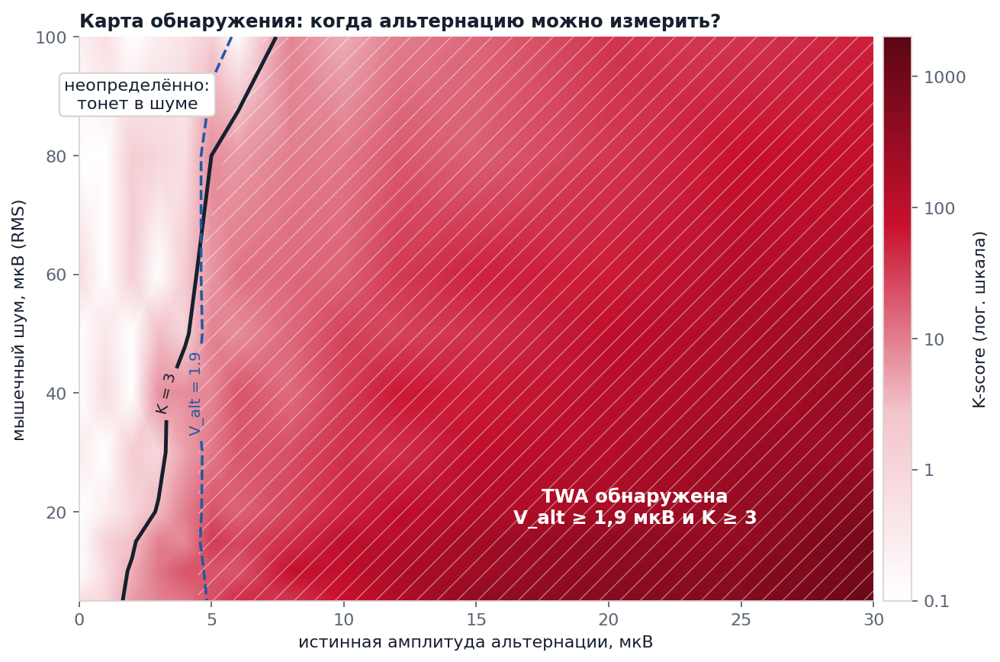

Карта — результат 560 полных анализов (14 амплитуд альтернации × 10 уровней шума × 4 случайные записи, медиана K). Чёрная линия — $K = 3$, синий пунктир — $V_{alt} = 1{,}9$ мкВ; штриховкой отмечена область, где выполнены оба условия. При хорошем контакте электродов (шум ≤ 20 мкВ) надёжно обнаруживается альтернация около 5 мкВ. При сильном мышечном шуме порог растёт. Это количественная оценка чувствительности метода, и она задаёт требование к «железу»: **носимому монитору для этой задачи нужен входной шум не больше ~20 мкВ RMS.**

### 4.6 Модифицированное скользящее среднее (независимая проверка)

Метод MMA [15] хранит два бегущих шаблона — для чётных (A) и нечётных (B) ударов — и обновляет каждый с ограниченным шагом:

$$A_n = A_{n-1} + \operatorname{clip}\!\left(\frac{\text{удар}_n - A_{n-1}}{8},\,\pm 32\ \text{мкВ}\right)$$

Альтернация равна $\max_k |A_k - B_k| / 2$ по окну ST-T. Ограничение шага делает MMA устойчивым к одному зашумлённому или внеочередному удару. Два независимых метода, которые согласуются, дают больше уверенности, чем один.

### 4.7 Время и частота одновременно: комплексный вейвлет Морле

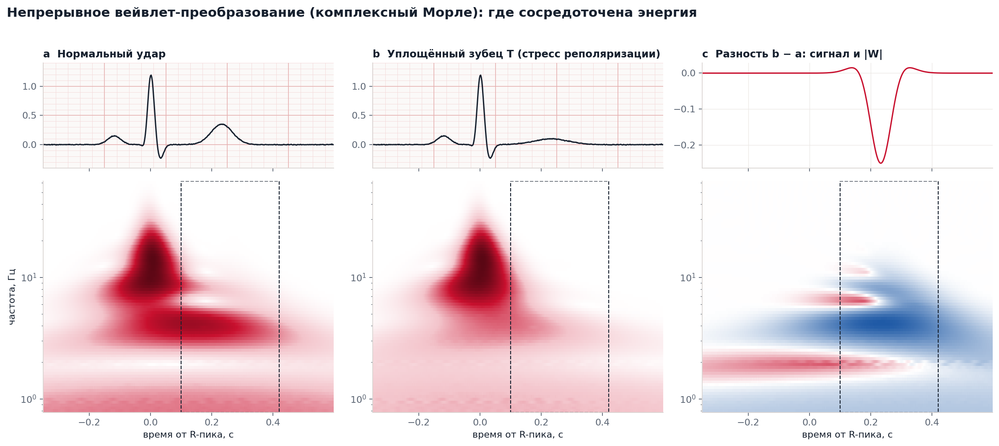

Преобразование Фурье говорит, *какие* частоты есть, но не *когда*. Непрерывное вейвлет-преобразование отвечает на оба вопроса:

$$W(a,b) = \frac{1}{\sqrt a}\int x(t)\,\psi^*\!\left(\frac{t-b}{a}\right)dt,\qquad \psi(t) = \frac{1}{\sqrt{\pi B}}\,e^{2\pi i C t}\,e^{-t^2/B}$$

Это комплексный вейвлет Морле (`cmor1.5-1.0`: B = 1,5, C = 1,0). Гауссова огибающая достигает нижней границы соотношения неопределённостей «время–частота» $\Delta t\,\Delta\omega \ge \tfrac12$, поэтому вейвлеты Морле настолько резкие во времени и по частоте одновременно, насколько позволяет физика. На скалограмме $|W|$ комплекс QRS — вспышка на 8–30 Гц, а зубец T — энергия на 2–6 Гц. Панель **c** показывает, что уплощение зубца T убирает энергию именно в окне ST-T на низких частотах; такой узор нейросеть может выучить.

### 4.8 Статистика для честной оценки

- **ROC-AUC** равна вероятности того, что случайно выбранный больной получит более высокий балл, чем случайно выбранный здоровый (интерпретация Манна–Уитни [16]). 0,5 — угадывание, 1,0 — идеал.
- **95 % доверительные интервалы** считаются бутстрэпом: 1000 перевыборок тестового набора, 2,5-й и 97,5-й перцентили.
- **Порог решения** выбирается на валидационном фолде по максимуму индекса Юдена $J = \text{чувствительность} + \text{специфичность} - 1$ и без изменений применяется к тесту. Подбор порога на тесте завысил бы результат.
- **Разбиение по пациентам.** Фолды PTB-XL никогда не помещают одного пациента одновременно в обучение и тест. Иначе модель могла бы узнавать человека, а не болезнь.

---

## 5. Информатика: мультимодальная нейросеть

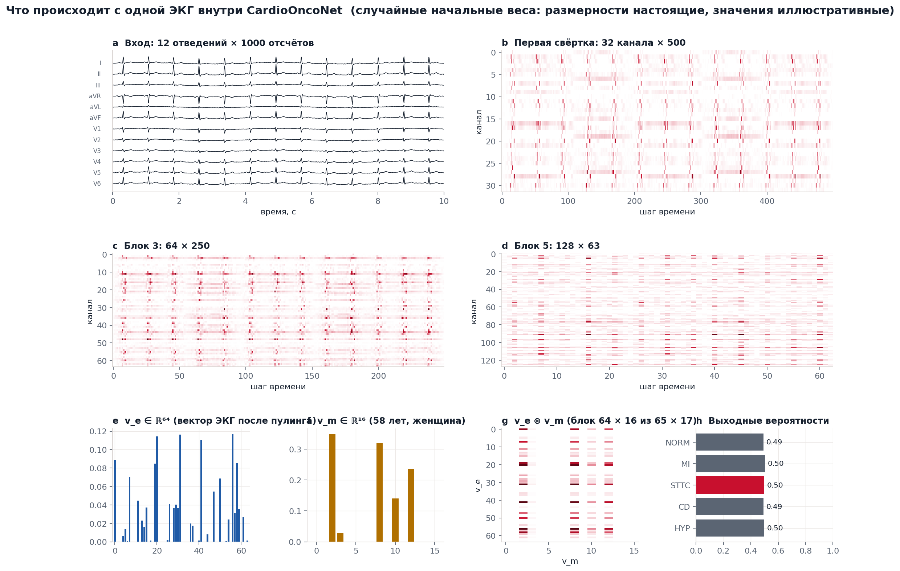

### 5.1 Архитектура

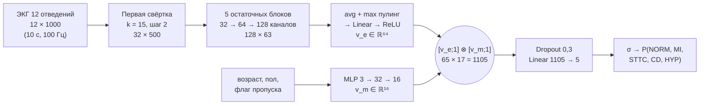

**Одномерная свёртка.** Каждый выходной канал $c$ проходит обучаемым ядром по всем 12 отведениям:

$$y_c[t] = b_c + \sum_{l=1}^{12}\sum_{j=0}^{K-1} w_{c,l,j}\; x_l[s\,t + j - \lfloor K/2\rfloor]$$

Первые слои учат локальные формы (крутизну QRS, кривизну зубца T); глубокие слои с шагом 2 видят более длинный контекст. Пять блоков сжимают ось времени с 1000 до 63 отсчётов, а число каналов растёт с 12 до 128.

**Остаточные блоки** [17] вычисляют $y = \mathrm{ReLU}(x + F(x))$, где $F$ — свёртка → BatchNorm → ReLU → dropout → свёртка → BatchNorm. Прямой путь «x» позволяет градиентам проходить через глубокую сеть. **BatchNorm** нормирует каждый канал к нулевому среднему и единичной дисперсии по батчу и масштабирует обучаемыми $\gamma, \beta$. **Глобальный пулинг** склеивает среднее по времени и максимум по времени каждого канала: вектор описывает и типичную форму, и самое экстремальное событие.

### 5.2 Билинейное (тензорное) слияние: почему умножать, а не склеивать

Одна и та же находка на ЭКГ значит разное у разных пациентов: уплощение зубца T тревожнее у 30-летнего, чем у 80-летнего. При простой склейке $[v_e; v_m]$ и линейном слое итоговый балл — *сумма* вкладов ЭКГ и метаданных, взаимодействия невозможны. Внешнее произведение создаёт **все попарные произведения** $v_{e,i}\,v_{m,j}$. Если перед этим дописать к каждому вектору единицу (приём Tensor Fusion Network [18]), сохраняются и одиночные признаки:

$$z = \begin{bmatrix} v_e \\ 1\end{bmatrix} \otimes \begin{bmatrix} v_m \\ 1\end{bmatrix} = \begin{bmatrix} v_e v_m^\top & v_e \\ v_m^\top & 1 \end{bmatrix} \in \mathbb R^{65\times17}$$

Развёрнутый 1105-мерный вектор содержит взаимодействия, признаки только ЭКГ, признаки только метаданных и константу. Значит, модель со слиянием включает модель со склейкой как частный случай и не может быть менее выразительной.

**Число параметров** (считает `count_parameters`): кодировщик ЭКГ — 567 296; MLP метаданных — 656; голова слияния — 1105 × 5 + 5 = 5530; **итого 573 482** (2,3 МБ в float32).

### 5.3 Обучение

**Функция потерь.** Каждый из 5 классов — отдельный вопрос «да/нет» (на одной ЭКГ могут быть и MI, и изменения ST-T), поэтому используется бинарная кросс-энтропия по логитам $z$:

$$\mathcal L = -\frac1C\sum_{c=1}^{C}\Big[w_c\, y_c \log\sigma(z_c) + (1-y_c)\log\big(1-\sigma(z_c)\big)\Big],\qquad \sigma(z)=\frac{1}{1+e^{-z}}$$

Вес положительного класса $w_c = \sqrt{(1-\pi_c)/\pi_c}$ (с ограничением сверху) компенсирует редкие классы с долей $\pi_c$. Полезное тождество: при $w_c = 1$ градиент $\partial \mathcal L/\partial z_c = \sigma(z_c) - y_c$, то есть «предсказание минус правда». Обратное распространение проносит его через произведение по правилу дифференцирования произведения: $\partial z_{ij}/\partial v_{e,i} = v_{m,j}$.

**Оптимизатор.** AdamW [19] хранит скользящие средние градиента и его квадрата: $m_t = \beta_1 m_{t-1} + (1-\beta_1)g_t$, $v_t = \beta_2 v_{t-1} + (1-\beta_2)g_t^2$, и обновляет веса $\theta \leftarrow \theta - \eta\,\hat m_t/(\sqrt{\hat v_t}+\epsilon) - \eta\lambda\theta$ с отделённым затуханием весов $\lambda = 0{,}01$. Скорость обучения меняется по схеме **one-cycle** (разгон, затем косинусное затухание). Норма градиента ограничена единицей. Обучение останавливается, если macro-AUC на валидации не растёт 8 эпох.

**Физиологичная аугментация.** Во время обучения каждая ЭКГ случайно масштабируется по амплитуде (±10 %, контакт электродов), получает дыхательный дрейф (0,3 Гц) и белый шум (20 мкВ, ЭМГ). Сеть учится игнорировать ровно те артефакты, что перечислены в разделе 3.6.

### 5.4 Данные: PTB-XL

PTB-XL [12] содержит **21 799** клинических 12-канальных ЭКГ по 10 секунд от **18 869** пациентов, размеченных одним-двумя кардиологами по стандарту SCP-ECG. Метки объединяются в 5 диагностических суперклассов: **NORM** (норма), **MI** (инфаркт миокарда), **STTC** (изменения ST/T), **CD** (нарушения проводимости), **HYP** (гипертрофия). Используется официальное разбиение: фолды 1–8 — обучение, 9 — валидация, 10 — тест. Опубликованные нейросетевые решения достигают на этой задаче macro-AUC около 0,93 [20]; это ориентир для корректного пайплайна.

**Зачем PTB-XL, если там нет химиотерапии?** Открытого датасета ЭКГ с меткой антрациклиновой кардиотоксичности такого размера не существует. PTB-XL нужен, чтобы показать: сеть и код обучения работают на реальных клинических ЭКГ. Класс **STTC** (нарушения реполяризации) — ближайший доступный заменитель интересующего нас электрического фенотипа. Затем модель будет дообучена на кардиоонкологических данных, когда их предоставит клинический партнёр (см. [ROADMAP.ru.md](ROADMAP.ru.md)).

> **Статус обучения:** скрипт обучения полностью написан и проверен от начала до конца на миниатюрном датасете в формате PTB-XL (`tests/test_train_smoke.py`). Полный прогон на PTB-XL ещё не выполнен, поэтому **реальные метрики точности здесь не заявляются**. После запуска `train_ptbxl.py` в `runs/ptbxl/metrics.json` и `runs/ptbxl/roc_test.png` появятся AUC на тестовом фолде с 95 % интервалами, и этот раздел будет дополнен.

---

## 6. Внедрение: носимые устройства, федеративное обучение, больничные системы

### 6.1 Носимые устройства: ONNX и INT8

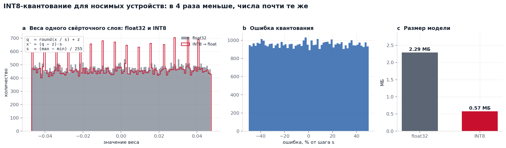

Обученная сеть экспортируется в **ONNX** — открытый формат, который работает на телефонах, в браузерах (onnxruntime-web) и на микроконтроллерах. Затем веса квантуются в 8-битные целые аффинным отображением:

$$q = \operatorname{round}(x/s) + z,\qquad \hat x = (q - z)\,s,\qquad s = \frac{x_{max}-x_{min}}{255}$$

Ошибка округления равномерно распределена в $[-s/2, s/2]$ (панель b), а модель уменьшается с 2,29 МБ до 0,57 МБ [21]. Точность после квантования нужно заново измерить на тесте; это часть плана.

### 6.2 Федеративное обучение

ЭКГ — чувствительные персональные данные, и обычно они не могут покинуть больницу. В **федеративном усреднении** (FedAvg) [22] каждая больница $k$ обучает модель на своих $n_k$ записях и отправляет только веса $W_k$; сервер объединяет их

$$W_{global} = \sum_{k=1}^{K}\frac{n_k}{n}\,W_k,\qquad n = \sum_k n_k$$

и рассылает $W_{global}$ обратно. `federated_fhir_core.py` демонстрирует шаг агрегации. В реальной системе нужны защищённая агрегация и дифференциальная приватность: даже веса могут раскрыть информацию.

### 6.3 HL7 FHIR R4

Результаты записываются в виде FHIR `DiagnosticReport`, чтобы попасть в электронную медицинскую карту. `cardioonco/fhir.py` использует для стандартных понятий только настоящие коды: категорию **EC** (Electrocardiac) из таблицы HL7 v2-0074, код **LOINC 11524-6** «EKG study», единицы UCUM (`uV`). Собственные измерения проекта (K-score, вероятности модели) закодированы в явно названной *локальной* системе кодов, а не выдуманными кодами, похожими на официальные. Каждый отчёт помечен `research-only` и имеет статус `preliminary`.

---

## 7. Что уже проверено

| Утверждение | Доказательство | Статус |
|---|---|---|
| Чистый чередующийся ряд даёт ровно $V_{alt} = a$ | `test_pure_alternating_series_gives_exact_amplitude` | ✅ |
| R-пики находятся верно при 55 / 75 / 110 уд/мин | `test_r_peak_detection` | ✅ |
| Без альтернации нет ложной TWA (K < 3) | `test_no_alternans_is_negative` | ✅ |
| $V_{alt}$ растёт монотонно; пиковая оценка восстанавливает 40 мкВ с точностью 15 % | `test_strong_alternans_is_positive_and_monotonic` | ✅ |
| Браузер (JS) и Python дают одинаковые ЧСС, V_alt (±10 %) и решение | `tests/test_js_parity.py` | ✅ |
| Пайплайн обучения работает целиком и экспортирует ONNX | `tests/test_train_smoke.py` | ✅ |
| В синтетической 12-канальной модели выполняется закон Эйнтховена | рисунок 3c (невязка ≈ 10⁻¹⁶ мВ) | ✅ |
| Точность сети на реальных ЭКГ (тестовый фолд PTB-XL) | `train_ptbxl.py` | ⏳ нужно запустить |
| TWA связана с антрациклиновой кардиотоксичностью | нужна клиническая когорта | ❌ ещё не изучено |

Python и JavaScript на одном и том же синтетическом сигнале (seed 3, наводка 50 Гц 20 мкВ):

| Заданная альтернация | Шум | Python V_alt / K | JavaScript V_alt / K |
|---|---|---|---|
| 0 мкВ | 15 мкВ | 0,00 / −1,2 | 0,00 / −1,8 |
| 5 мкВ | 10 мкВ | 1,91 / 9,8 | 1,93 / 12,3 |
| 20 мкВ | 15 мкВ | 7,97 / 152 | 7,98 / 195 |
| 20 мкВ | 60 мкВ | 7,12 / 52 | 7,27 / 65 |

V_alt совпадает с точностью 2 %. K различается сильнее, потому что делится на разброс всего шести бинов полосы шума, а он чувствителен к мелким различиям фильтров. Решение в обеих реализациях одинаковое во всех случаях.

---

## 8. Карта репозитория

```
cardioonco/            основная библиотека (покрыта тестами)
  synth.py             синтетическая ЭКГ: одно отведение и 12 отведений (диполь), с альтернацией
  preprocess.py        фильтр Баттерворта filtfilt, режекторный фильтр, Пан–Томпкинс
  twa.py               спектральный метод, MMA, полный анализ
  model.py             CardioOncoNet: 1D-ResNet + MLP + тензорное слияние
  fhir.py              HL7 FHIR R4 DiagnosticReport
train_ptbxl.py         обучение и оценка на PTB-XL (бутстрэп-интервалы, экспорт ONNX)
predict.py             анализ одного файла ЭКГ → JSON + FHIR
app.py                 Gradio-лаборатория TWA (python app.py)
scripts/
  download_ptbxl.sh    скачать PTB-XL с PhysioNet (1,7 ГБ)
  make_figures.py      пересобрать все рисунки в docs/figures/{en,ru}
tests/                 pytest: математика, детектор, совпадение JS и Python, обучение
index.html, ru.html    веб-лаборатория (GitHub Pages); assets/js/dsp.js — математика на JS
main_model.py          пошаговый разбор билинейного слияния на NumPy (учебный)
advanced_model.py      ранняя учебная модель на PyTorch, чтение EDF, 3D-сетка
export_edge_onnx.py    ранний пример экспорта ONNX / INT8
federated_fhir_core.py демонстрация FedAvg + пример FHIR
```

---

## 9. Как всё запустить

```bash
git clone https://github.com/podpirovlab/multimodal-cardiotoxicity-ai.git
cd multimodal-cardiotoxicity-ai
python -m venv .venv && source .venv/bin/activate
pip install -r requirements.txt pytest

python -m pytest -q                       # все тесты
python predict.py --demo --alternans 20   # анализ TWA синтетической холтеровской записи
python app.py                             # лаборатория на http://localhost:7860
python scripts/make_figures.py            # пересобрать все рисунки

# реальные данные (скачивание ~1,7 ГБ, обучение 20–60 мин на ноутбуке; на Apple Silicon — GPU через mps)
bash scripts/download_ptbxl.sh
python train_ptbxl.py --data data/ptb-xl --epochs 30 --export-onnx
cp runs/ptbxl/metrics.json assets/metrics.json   # сайт покажет метрики автоматически
python scripts/make_figures.py --only 08 --checkpoint runs/ptbxl/model.pt
```

---

## 10. Что изменилось в версии 0.3

Внутренняя проверка версии 0.2 нашла места, где проект заявлял больше, чем делал. Они исправлены:

| Было | Стало |
|---|---|
| Веб-демо и `app.py` показывали фиксированный «риск 93,42 %», выбранный в выпадающем меню | Каждое число вычисляется из сигнала алгоритмом TWA |
| Демо рекомендовало «снизить дозу доксорубицина на 15 %, начать дексразоксан» | Убрано: исследовательский прототип не должен давать советов по лечению |
| В FHIR-отчёте были выдуманные коды LOINC/SNOMED и категория «генетика» | Настоящие LOINC 11524-6 и HL7 v2-0074 «EC»; локальные коды явно помечены |
| README описывал *комплексный* вейвлет Морле, а код использовал вещественный `morl` | Используется и объяснён комплексный `cmor1.5-1.0` |
| 3D-сердце подсвечивало «очаг ферроптоза» на одной стенке | Теперь учит анатомии отведений и прямо говорит, что поражение диффузное |
| «ROC-AUC» считался на случайных синтетических метках | Заменён настоящим пайплайном оценки на PTB-XL с бутстрэп-интервалами |
| Не было автоматических тестов математики | 10 тестов, включая точную амплитуду и совпадение JS и Python |

---

## 11. Ограничения и этика

- **Главная гипотеза не доказана.** После антрациклинов описаны удлинение QT и изменения ST-T, но микровольтная TWA как *ранний* маркер антрациклиновой кардиотоксичности не установлена. Проект даёт инструменты для проверки, а не готовый ответ.
- **TWA нужна длинная запись.** Спектральному методу нужно около 128 ударов (примерно 2 минуты), лучше при повышенной ЧСС. Обычная 10-секундная ЭКГ содержит около 12 ударов. Для практики нужны холтеровские или нагрузочные записи.
- **Сеть ещё не обучена на реальных данных**, а в PTB-XL нет информации о химиотерапии. Класс STTC — заменитель, а не цель.
- **Синтетические сигналы упрощены.** Дипольная модель не учитывает неоднородность грудной клетки и разброс положения электродов; альтернация задана чистой модуляцией амплитуды, а реальная TWA может меняться по фазе и форме.
- **Не медицинское изделие.** Нет одобрения этического комитета, клинической валидации и регистрации. Любое клиническое исследование потребует одобрения этического комитета, информированного согласия и обезличенных данных.
- **Справедливость.** PTB-XL собран в одном немецком центре. Модель может хуже работать на других популяциях и аппаратах; нужна внешняя проверка.

---

## 12. Литература

1. Swain SM, Whaley FS, Ewer MS. Congestive heart failure in patients treated with doxorubicin: a retrospective analysis of three trials. *Cancer*. 2003;97(11):2869–2879.
2. Cardinale D, Colombo A, Bacchiani G, et al. Early detection of anthracycline cardiotoxicity and improvement with heart failure therapy. *Circulation*. 2015;131(22):1981–1988.
3. Lyon AR, López-Fernández T, Couch LS, et al. 2022 ESC Guidelines on cardio-oncology. *European Heart Journal*. 2022;43(41):4229–4361.
4. Zhang S, Liu X, Bawa-Khalfe T, et al. Identification of the molecular basis of doxorubicin-induced cardiotoxicity. *Nature Medicine*. 2012;18(11):1639–1642.
5. Fang X, Wang H, Han D, et al. Ferroptosis as a target for protection against cardiomyopathy. *PNAS*. 2019;116(7):2672–2680.
6. Octavia Y, Tocchetti CG, Gabrielson KL, et al. Doxorubicin-induced cardiomyopathy: from molecular mechanisms to therapeutic strategies. *J Mol Cell Cardiol*. 2012;52(6):1213–1225.
7. Hodgkin AL, Huxley AF. A quantitative description of membrane current and its application to conduction and excitation in nerve. *J Physiol*. 1952;117(4):500–544.
8. Yan GX, Antzelevitch C. Cellular basis for the normal T wave and the electrocardiographic manifestations of the long-QT syndrome. *Circulation*. 1998;98(18):1928–1936.
9. Nolasco JB, Dahlen RW. A graphic method for the study of alternation in cardiac action potentials. *J Appl Physiol*. 1968;25(2):191–196.
10. Weiss JN, Karma A, Shiferaw Y, et al. From pulsus to pulseless: the saga of cardiac alternans. *Circulation Research*. 2006;98(10):1244–1253.
11. Verrier RL, Klingenheben T, Malik M, et al. Microvolt T-wave alternans: physiological basis, methods of measurement, and clinical utility. *J Am Coll Cardiol*. 2011;58(13):1309–1324.
12. Wagner P, Strodthoff N, Bousseljot RD, et al. PTB-XL, a large publicly available electrocardiography dataset. *Scientific Data*. 2020;7:154. Goldberger AL, et al. PhysioBank, PhysioToolkit, and PhysioNet. *Circulation*. 2000;101(23):e215–e220.
13. Pan J, Tompkins WJ. A real-time QRS detection algorithm. *IEEE Trans Biomed Eng*. 1985;32(3):230–236.
14. Rosenbaum DS, Jackson LE, Smith JM, et al. Electrical alternans and vulnerability to ventricular arrhythmias. *N Engl J Med*. 1994;330(4):235–241. Smith JM, Clancy EA, Valeri CR, et al. Electrical alternans and cardiac electrical instability. *Circulation*. 1988;77(1):110–121.
15. Nearing BD, Verrier RL. Modified moving average analysis of T-wave alternans to predict ventricular fibrillation with high accuracy. *J Appl Physiol*. 2002;92(2):541–549.
16. Hanley JA, McNeil BJ. The meaning and use of the area under a receiver operating characteristic (ROC) curve. *Radiology*. 1982;143(1):29–36.
17. He K, Zhang X, Ren S, Sun J. Deep residual learning for image recognition. *CVPR*. 2016.
18. Zadeh A, Chen M, Poria S, Cambria E, Morency LP. Tensor Fusion Network for multimodal sentiment analysis. *EMNLP*. 2017.
19. Loshchilov I, Hutter F. Decoupled weight decay regularization. *ICLR*. 2019.
20. Strodthoff N, Wagner P, Schaeffter T, Samek W. Deep learning for ECG analysis: benchmarks and insights from PTB-XL. *IEEE J Biomed Health Inform*. 2021;25(5):1519–1528.
21. Jacob B, Kligys S, Chen B, et al. Quantization and training of neural networks for efficient integer-arithmetic-only inference. *CVPR*. 2018.
22. McMahan HB, Moore E, Ramage D, Hampson S, Agüera y Arcas B. Communication-efficient learning of deep networks from decentralized data. *AISTATS*. 2017.
23. McSharry PE, Clifford GD, Tarassenko L, Smith LA. A dynamical model for generating synthetic electrocardiogram signals. *IEEE Trans Biomed Eng*. 2003;50(3):289–294.
24. Torrence C, Compo GP. A practical guide to wavelet analysis. *Bull Am Meteorol Soc*. 1998;79(1):61–78.
25. Attia ZI, Kapa S, Lopez-Jimenez F, et al. Screening for cardiac contractile dysfunction using an artificial intelligence–enabled electrocardiogram. *Nature Medicine*. 2019;25(1):70–74.

---

**Автор:** Петя ([@podpirovlab](https://github.com/podpirovlab)), школьник-исследователь. Код разрабатывался с помощью ИИ-ассистентов для программирования (Claude); каждый результат в этом документе воспроизводится командами из раздела 9 и проверяется тестами.

**Как цитировать:**

```bibtex
@software{cardiooncopredict,
  author = {podpirovlab},
  title  = {CardioOncoPredict: microvolt T-wave alternans and multimodal deep learning
            for early detection of anthracycline cardiotoxicity (research prototype)},
  year   = {2026},
  url    = {https://github.com/podpirovlab/multimodal-cardiotoxicity-ai}
}
```

Распространяется по [лицензии MIT](LICENSE).
